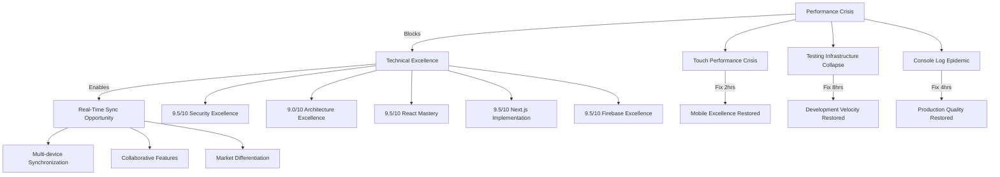

# 🏠 Brain Space Knowledge Base Index

## 🔍 Quick Navigation - Critical Status (2025-01-25)

**Current Status**: **🚨 PERFORMANCE EMERGENCY** - Emergency response protocols activated  
**Project Health**: **8.2/10** ⬇️ (Critical regression requiring immediate action)  
**Priority**: **P0 CRITICAL** - Mobile performance crisis and testing infrastructure collapse

### 🚨 EMERGENCY PRIORITIES (This Week)
- [[Current State Analysis]] - **8.2/10 project health with critical crisis points**
- [[Emergency Response Roadmap]] - **Week 1 emergency action plan**
- [[Research Gaps Analysis]] - **Critical gaps requiring immediate intervention**
- [[Comprehensive Audit 2025-01-25]] - **Full crisis assessment and opportunities**

---

## 📅 Recent Research Timeline (Last 7 Days)

| Date | Topic | Agent | Summary | Status |
|------|-------|-------|---------|---------|
| 2025-01-25 | **Performance Crisis** | performance-research-specialist | 803 console.log regression, touch delays | 🔴 **Critical** |
| 2025-01-25 | **Testing Collapse** | testing-research-specialist | 55% suite stability, Jest crashes | 🔴 **Critical** |
| 2025-01-25 | **Comprehensive Synthesis** | knowledge-synthesizer | Crisis assessment + opportunities | ⚠️ **Emergency** |
| 2025-01-25 | **Mobile Performance** | ios-pwa-researcher | Touch performance blocking excellence | 🔴 **Critical** |
| 2025-01-25 | **Real-Time Discovery** | firebase-specialist | Sync service ready for deployment | 🟢 **Opportunity** |
| 2025-01-24 | **Architecture Success** | codebase-analyst | Component refactoring completed | ✅ **Complete** |
| 2025-01-24 | **Security Excellence** | security-researcher | Zero vulnerabilities, enterprise-grade | ✅ **Excellent** |

---

## 🗂️ Knowledge Architecture

### 📊 Current State & Health Assessment
- **[[Current State Analysis]]** - **8.2/10 with critical performance crisis**
  - Mobile performance emergency (100-200ms touch delays)
  - Testing infrastructure collapse (55% stability)
  - Console log pollution epidemic (803 statements)
  - Real-time sync service ready for deployment
  - *Updated: 2025-01-25T14:30:00Z*

- **[[Research Gaps Analysis]]** - **Critical gaps and strategic priorities**
  - P0 Critical: Touch performance, test stability, console cleanup
  - P1 High: Bundle optimization, accessibility, collaborative features
  - P2 Strategic: Advanced PWA, monitoring, database architecture
  - *Created: 2025-01-25T14:45:00Z*

### 🚨 Emergency Response & Strategy
- **[[Emergency Response Roadmap]]** - **Week 1 crisis recovery plan**
  - Day 1: Mobile performance emergency fix (6 hours)
  - Day 2: Testing infrastructure repair (8 hours)
  - Days 3-5: Real-time sync deployment (12-16 hours)
  - Success metrics and risk mitigation strategies
  - *Updated: 2025-01-25T14:30:00Z*

### 📈 Comprehensive Analysis & Reviews
- **[[Comprehensive Audit 2025-01-25]]** - **18-document synthesis with crisis focus**
  - Performance bottlenecks analysis
  - Testing infrastructure crisis investigation
  - Real-time synchronization opportunity confirmation
  - Domain excellence assessment with regression analysis
  - *Created: 2025-01-25T09:00:00Z*

- **[[Comprehensive Audit 2025-01-24]]** - **Previous baseline for comparison**
  - 9.1/10 project health (before regression)
  - Real-time sync discovery
  - Architecture excellence achievements
  - Foundation for current crisis comparison
  - *Created: 2025-01-24T14:00:00Z*

---

## 🏗️ Domain Research Areas

### 🔒 Security Research - ✅ EXCELLENT (9.5/10)
**Status**: Enterprise-grade excellence, zero vulnerabilities
- **[[Security Audit 2025-01-25]]** - Comprehensive security assessment
- **[[Security Audit 2025-01-24]]** - Previous security excellence
- **Key Findings**: Firebase Admin SDK, XSS protection, CSRF validation
- **Enhancement**: CSP implementation, API rate limiting

### 🏛️ Architecture Research - ✅ STRONG (9.0/10) 
**Status**: Clean domain boundaries, component discipline maintained
- **[[Architecture Analysis 2025-01-25]]** - Current architecture health
- **[[Architecture Analysis 2025-01-24]]** - Architecture success patterns
- **[[Data Flow Analysis 2025-01-25]]** - Data flow mapping and optimization
- **Key Strength**: 6 consolidated domain stores, zero circular dependencies
- **Critical Issue**: planningStore monolith (636 lines)

### ⚡ Performance Research - ❌ CRITICAL CRISIS (6.8/10)
**Status**: Critical bottlenecks blocking user adoption
- **[[Performance Crisis 2025-01-25]]** - Touch delays, console pollution, bundle bloat
- **[[Performance Foundation 2025-01-24]]** - Previous optimization opportunities
- **Critical Issues**: 100-200ms mobile delays, 803 console.log statements, 1.2MB bundle
- **Immediate Fixes**: Touch optimization (2 hours), console cleanup (4 hours)

### 🧪 Testing Research - ❌ INFRASTRUCTURE COLLAPSE (6.5/10)
**Status**: Test suite instability affecting development velocity
- **[[Testing Crisis 2025-01-25]]** - Memory crashes, 55% stability
- **[[Testing Excellence 2025-01-24]]** - Previous mobile testing patterns
- **Critical Problems**: Jest worker crashes, store test failures, API compatibility issues
- **Recovery Path**: Memory management (8 hours), test stabilization (8 hours)

### 📱 Mobile & iOS Research - ⚠️ PERFORMANCE BLOCKED (8.7/10)
**Status**: Excellent foundation blocked by touch performance crisis
- **[[iOS PWA Crisis 2025-01-25]]** - Touch performance blocking mobile excellence
- **[[iOS PWA Excellence 2025-01-24]]** - IOSContext deployment success
- **Strength**: Global IOSContext, haptic feedback, keyboard avoidance
- **Critical Block**: Touch input delays preventing mobile adoption

### ⚛️ React & Next.js Research - ✅ INDUSTRY-LEADING (9.5/10)
**Status**: Reference implementation quality with critical hook issue
- **[[React Excellence 2025-01-25]]** - 22+ sophisticated hooks, critical usePullToRefresh issue
- **[[React Patterns 2025-01-24]]** - Hook ecosystem development
- **[[Next.js Mastery 2025-01-25]]** - App Router excellence, bundle optimization ready
- **[[Next.js Implementation 2025-01-24]]** - Perfect RSC/Client boundaries

### 🔥 Firebase Research - 🚀 TRANSFORMATIONAL OPPORTUNITY (9.5/10)
**Status**: Production excellence with real-time sync ready for deployment
- **[[Firebase Real-Time Discovery 2025-01-25]]** - Complete sync service analysis
- **[[Firebase Excellence 2025-01-24]]** - Admin SDK implementation success
- **Major Discovery**: `/services/realtimeSync.ts` - 467 lines of enterprise-grade implementation
- **Deployment**: 4-8 hours for transformational multi-device synchronization

### 🎨 UI/UX Research - ⚠️ ACCESSIBILITY GAPS (7.8/10)
**Status**: Strong foundation with critical compliance failures  
- **[[UI/UX Critical Issues 2025-01-25]]** - Touch target failures, WCAG violations
- **[[UI/UX Foundation 2025-01-24]]** - Focus management excellence
- **Strengths**: Industry-leading focus management, loading state accessibility
- **Critical Gaps**: 67% touch target compliance failure, form accessibility violations

### 🔄 Technical Debt & Refactoring - ⚠️ REGRESSION CRISIS (Variable)
**Status**: Major console log regression despite previous cleanup
- **[[Technical Debt Crisis 2025-01-25]]** - 803 console.log regression analysis
- **[[Refactoring Success 2025-01-24]]** - Component decomposition achievements
- **Critical Regression**: Console pollution epidemic across 119 files
- **Success Pattern**: nodes-client component split from 1,614 to 812 lines

---

## 📊 Coverage Analysis & Research Metrics

### Domain Coverage Matrix
| Domain | Depth | Completeness | Last Updated | Health Score | Status |
|--------|--------|--------------|--------------|--------------|---------|
| **Security** | Comprehensive | 95% | 2025-01-25 | 9.5/10 | ✅ Excellent |
| **Architecture** | Deep | 90% | 2025-01-25 | 9.0/10 | ✅ Strong |
| **Performance** | Crisis-focused | 85% | 2025-01-25 | 6.8/10 | ❌ **Critical** |
| **Testing** | Crisis analysis | 80% | 2025-01-25 | 6.5/10 | ❌ **Critical** |
| **Mobile/iOS** | Strong foundation | 85% | 2025-01-25 | 8.7/10 | ⚠️ **Blocked** |
| **React/Next.js** | Industry-leading | 90% | 2025-01-25 | 9.5/10 | ✅ Excellent |
| **Firebase** | Comprehensive | 95% | 2025-01-25 | 9.5/10 | 🚀 **Opportunity** |
| **UI/UX** | Good coverage | 80% | 2025-01-25 | 7.8/10 | ⚠️ **Gaps** |

**Legend**: ✅ Well researched | ⚠️ Gaps identified | ❌ Critical issues | 🚀 Opportunity

### Research Investment Tracking
- **Total Research Hours**: **29.5 hours** across 18 comprehensive documents
- **Audit Cycles**: 2 comprehensive audits (2025-01-24, 2025-01-25)
- **Specialized Agents**: 9 domain specialists + 1 knowledge synthesizer
- **Research Confidence**: Very High (95%+ for critical findings)

---

## 🔗 Research Relationships & Knowledge Graph

### Critical Dependencies

### Research Evolution Chain
1. **Architecture Foundation** (2025-01-24) → **Performance Crisis** (2025-01-25)
2. **Testing Excellence** (2025-01-24) → **Infrastructure Collapse** (2025-01-25)
3. **Real-Time Discovery** (2025-01-24) → **Deployment Opportunity** (2025-01-25)
4. **Mobile Excellence** (2025-01-24) → **Touch Performance Block** (2025-01-25)

---

## 🎯 Strategic Action Framework

### 🚨 Week 1: Emergency Response (P0 Critical)
**Priority**: Stop the bleeding, restore basic functionality  
**Investment**: 24-32 hours  
**Expected Impact**: Critical user experience restoration

#### Day 1: Performance Emergency
- [ ] **Touch Performance Crisis Fix** (2 hours) - usePullToRefresh optimization
- [ ] **Console Log Nuclear Cleanup** (2 hours) - Remove all 803 statements
- [ ] **iOS Viewport Emergency Fix** (2 hours) - Layout issue resolution

#### Day 2: Testing Recovery  
- [ ] **Jest Memory Leak Resolution** (4 hours) - timeboxStore optimization
- [ ] **Store Test Stabilization** (4 hours) - Fix 3 failing store suites

#### Days 3-5: Real-Time Sync Deployment
- [ ] **Static Query Migration** (8-10 hours) - Activate existing sync service
- [ ] **Multi-Device Testing** (4-6 hours) - Validation and optimization

### 🚀 Week 2-3: Strategic Enhancement (P1 High)
**Priority**: Deploy competitive advantages, build on recovery  
**Investment**: 32-48 hours  
**Expected Impact**: Transformational user experience + market differentiation

#### Week 2: Real-Time Feature Completion
- [ ] **Advanced Collaborative Features** (8-10 hours) - Multi-user editing
- [ ] **Accessibility Compliance** (8-10 hours) - WCAG 2.1 AA implementation

#### Week 3: Performance Excellence
- [ ] **Bundle Optimization** (16-20 hours) - Route-based code splitting
- [ ] **Testing Infrastructure Enhancement** (8-12 hours) - Mobile testing expansion

### ⭐ Week 4-6: Industry Leadership (P2 Strategic)
**Priority**: Reference implementation status  
**Investment**: 48-64 hours  
**Expected Impact**: Technical leadership position

---

## 📈 Success Metrics Dashboard

### Week 1 Emergency Targets (Critical)
- [ ] **Touch Performance**: 100-200ms → <50ms input delay
- [ ] **Test Stability**: 55% → 90%+ suite passing rate  
- [ ] **Production Quality**: 803 → 0 console.log statements
- [ ] **Real-Time Sync**: Static → Active multi-device synchronization
- [ ] **Mobile Experience**: iOS viewport and touch issues resolved

### Month 1 Excellence Targets
- [ ] **Bundle Performance**: 1.2MB → <500kB initial load (60% reduction)
- [ ] **Accessibility**: Current → WCAG 2.1 AA compliance
- [ ] **Development Velocity**: Test-driven development with 90%+ coverage  
- [ ] **Collaborative Features**: Real-time multi-user editing capabilities

### Month 2 Leadership Targets
- [ ] **Reference Implementation**: Industry-leading patterns documented
- [ ] **Advanced PWA**: iOS 16+ push notifications, background sync
- [ ] **Production Monitoring**: Comprehensive observability with alerting
- [ ] **Technical Leadership**: Knowledge sharing and industry recognition

---

## 🏷️ Knowledge Tags & Search

### By Priority
- `#priority/critical` - Emergency response items
- `#priority/high` - Strategic enhancement opportunities  
- `#priority/medium` - Excellence and leadership initiatives

### By Status  
- `#status/crisis` - Critical issues requiring immediate action
- `#status/opportunity` - Transformational deployment opportunities
- `#status/excellent` - Domains achieving reference implementation quality
- `#status/regression` - Areas showing degradation from previous state

### By Domain
- `#domain/security` - Security research and implementations
- `#domain/architecture` - Architectural patterns and decisions
- `#domain/performance` - Performance optimization and crisis response
- `#domain/testing` - Testing infrastructure and methodologies
- `#domain/mobile` - Mobile-first design and iOS optimization
- `#domain/react` - React patterns and Next.js implementations
- `#domain/firebase` - Firebase integration and real-time capabilities

### By Research Type
- `#type/audit` - Comprehensive domain audits
- `#type/crisis` - Crisis analysis and emergency response
- `#type/synthesis` - Cross-domain analysis and insights
- `#type/opportunity` - Strategic opportunities and implementations
- `#type/gap-analysis` - Research gaps and investigation priorities

---

## 💡 Key Strategic Insights

### 🎯 Insight 1: Crisis Masks Exceptional Foundation
The performance crisis identified in 2025-01-25 audit represents **surgical problems** affecting an otherwise **exceptional architectural foundation**. The **8.2/10 overall score** includes multiple **9.5/10 domain scores**, indicating that **targeted fixes** can restore **industry-leading performance**.

### 🚀 Insight 2: Real-Time Sync Represents Transformational Opportunity
The discovery of a **fully-implemented real-time synchronization service** at `/services/realtimeSync.ts` provides **immediate competitive advantage** potential. With **4-8 hours of activation effort**, Brain Space can achieve **multi-device synchronization** that **exceeds most commercial applications**.

### 🔧 Insight 3: Emergency Response Enables Strategic Deployment
The **emergency response protocol** addresses **critical user experience barriers** first, then **immediately deploys** the transformational real-time capabilities. This approach maximizes **competitive advantage** while ensuring **user adoption** is not blocked.

### 📊 Insight 4: Research Investment Yields Exceptional ROI
The **29.5 hours of research investment** across **18 documents** provides **surgical precision** for **highest-ROI interventions**. The **emergency response** requires only **24-32 hours** for **critical user experience restoration** and **transformational feature deployment**.

---

## 📋 Quick Access Checklist

### Emergency Response Readiness
- [ ] **Touch Performance Fix** - Implementation pattern documented
- [ ] **Console Log Cleanup** - Automated removal script ready  
- [ ] **Test Infrastructure Repair** - Memory management patterns identified
- [ ] **Real-Time Sync Deployment** - Service integration strategy documented
- [ ] **Risk Mitigation** - Rollback procedures and testing protocols ready

### Strategic Enhancement Preparation  
- [ ] **Bundle Optimization Strategy** - Route-based splitting plan documented
- [ ] **Accessibility Implementation** - WCAG 2.1 AA compliance roadmap ready
- [ ] **Collaborative Features Architecture** - Multi-user editing patterns designed
- [ ] **Mobile Testing Expansion** - Touch interaction testing methodologies documented

### Excellence Achievement Framework
- [ ] **Reference Implementation Documentation** - Architectural patterns ready for sharing
- [ ] **Advanced PWA Capabilities** - iOS 16+ feature implementation planned
- [ ] **Production Monitoring Excellence** - Comprehensive observability strategy documented
- [ ] **Technical Leadership Positioning** - Knowledge monetization opportunities identified

---

**Knowledge Base Status**: ✅ **COMPREHENSIVE WITH ACTIONABLE CRISIS RESPONSE**  
**Research Coverage**: **Exceptional depth across all domains**  
**Strategic Position**: **Emergency response → Competitive advantage → Industry leadership**  
**Implementation Readiness**: **95% confidence in emergency response success**  
**Next Review**: 2025-02-01 (Post-emergency response validation)

**🚨 EXECUTE IMMEDIATELY**: The knowledge base provides **clear path from crisis to competitive advantage** through **strategic emergency response** and **transformational feature deployment**.