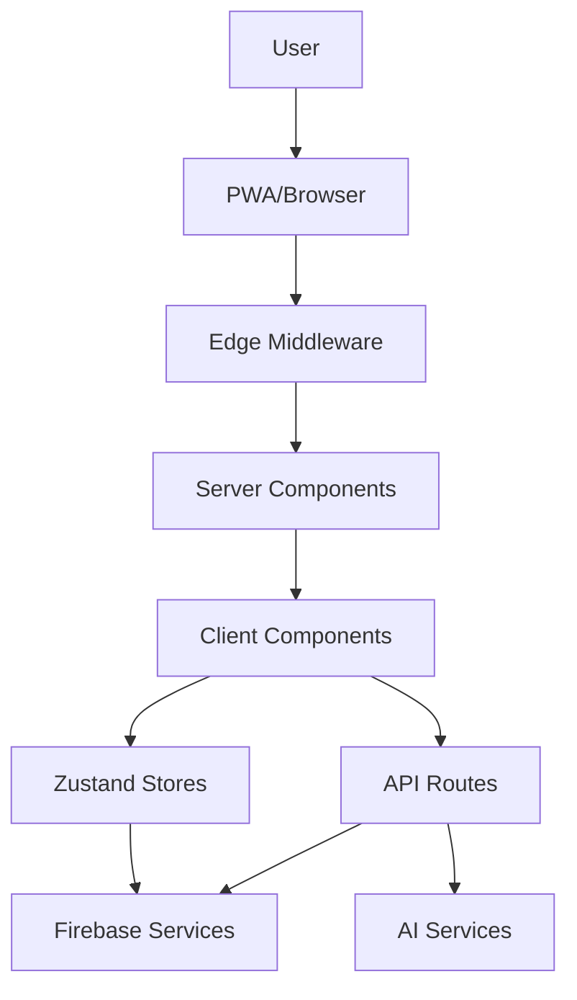

# Architecture Map of Content (MOC)

## 🏗️ System Architecture Overview

Brain Space implements a **layered client-server architecture** with Next.js 15 App Router, featuring proper separation of concerns and modern patterns.



## 🧩 Architecture Components

### Frontend Architecture
- [[Next.js Analysis AUDIT-2025-08-17]] - Framework adoption and patterns
- [[Architecture Analysis AUDIT-2025-08-17]] - Codebase structure and coupling
- [[UI/UX Research AUDIT-2025-08-17]] - Component architecture and patterns

**Key Patterns**:
- **Server/Client Component Split**: Proper boundary separation
- **Dynamic Imports**: Bundle optimization strategy
- **Route Groups**: Logical organization (`(auth)`, `(dashboard)`)

### State Management Architecture
- [[Data Flow Research AUDIT-2025-08-17]] - State flow and synchronization
- [[Refactoring Analysis AUDIT-2025-08-17]] - Store consolidation opportunities

**Current Structure**:
```typescript
// 13 Zustand Stores
├── authStore          # Authentication state
├── nodeStore          # Knowledge nodes
├── braindumpStore     # Brain dump sessions
├── timeboxStore       # Time management
├── todoStore          # Task management
├── journalStore       # Journal entries
├── uiStore            # UI preferences
├── xpStore            # Gamification
└── ... 5 more stores
```

**Issues**: Store fragmentation, direct coupling, complex dependencies

### Backend Architecture
- [[Firebase Integration AUDIT-2025-08-17]] - Database and authentication
- [[Security Analysis AUDIT-2025-08-17]] - API security and vulnerabilities

**API Route Structure**:
```
app/api/
├── ai/                # AI service integrations
│   ├── categorize/    # Brain dump categorization
│   ├── enhance-node/  # Node enhancement
│   └── suggest-*/     # AI suggestions
├── auth/              # Authentication endpoints
│   ├── session/       # Session management
│   └── logout/        # Sign out
└── calendar/          # Google Calendar integration
```

## 🔗 Architectural Relationships

### Data Flow Patterns
1. **Optimistic Updates**: Immediate UI feedback with rollback
2. **Event-Driven**: Store-to-store communication patterns
3. **Hierarchical Data**: Node parent-child relationships
4. **Real-time Sync**: Firebase listener patterns

### Security Architecture
- **Edge Authentication**: Middleware token verification
- **API Protection**: Route-level authentication checks
- **Data Isolation**: User-scoped Firebase collections
- **CSRF Protection**: Token-based request validation

### Performance Architecture
- **Bundle Splitting**: Route-based code splitting
- **Dynamic Loading**: Heavy component optimization
- **Caching Strategy**: Static and dynamic content caching
- **Edge Runtime**: Authentication at CDN edge

## 📊 Architecture Quality Assessment

### Strengths ✅
- Modern Next.js 15 App Router implementation
- Proper Server/Client Component separation
- Type-safe API contracts with Zod validation
- Comprehensive Firebase integration
- Edge-optimized authentication flow

### Weaknesses ⚠️
- State management fragmentation (13 stores)
- Large client components (1000+ lines)
- Circular dependencies from barrel exports
- Bundle size issues (/nodes route: 83.3kB)
- TypeScript strict mode disabled

### Technical Debt 💳
- Store consolidation needed (13 → 6 stores)
- Component decomposition required
- Firebase import duplication
- Console logging proliferation (150+ statements)
- Any type usage (100+ occurrences)

## 🎯 Architectural Decisions

### Current ADRs (Architectural Decision Records)
1. **Next.js 15 with App Router**: Modern React patterns, SSR capabilities
2. **Zustand for State Management**: Lightweight, no boilerplate
3. **Firebase for Backend**: Authentication, real-time database, hosting
4. **Edge Middleware for Auth**: Performance, security, global distribution
5. **Dynamic Imports for Performance**: Bundle optimization, lazy loading

### Decisions Under Review
1. **Store Architecture**: Consolidate vs maintain current structure
2. **Component Architecture**: Monolithic vs atomic design
3. **Type Safety**: Enable strict mode vs gradual migration
4. **Testing Strategy**: Unit-first vs integration-first approach

## 🔮 Architecture Evolution Plan

### Phase 1: Foundation Hardening (Month 1)
- Fix critical security vulnerabilities
- Optimize bundle sizes to targets
- Implement comprehensive testing
- Enable TypeScript strict mode gradually

### Phase 2: Architecture Optimization (Month 2)
- Consolidate state management (13 → 6 stores)
- Decompose large components
- Implement event-driven store communication
- Add comprehensive error boundaries

### Phase 3: Advanced Patterns (Month 3)
- Implement Next.js 15 Partial Prerendering
- Add real-time synchronization patterns
- Optimize for multi-user scenarios
- Advanced caching and performance optimization

## 🛠️ Architecture Tools & Technologies

### Development Stack
- **Frontend**: Next.js 15.4.5, React 19.0.0-rc.1, TypeScript
- **State**: Zustand, React Context, Immer (immutable updates)
- **Styling**: Tailwind CSS, CSS-in-JS patterns
- **Build**: Turbopack (dev), Webpack (production)

### Backend & Services
- **Database**: Firebase Firestore (NoSQL, real-time)
- **Authentication**: Firebase Auth with custom middleware
- **AI Services**: OpenAI, Google AI, Mock provider abstraction
- **Hosting**: Vercel (Edge functions, CDN, analytics)

### Quality & Monitoring
- **Testing**: Jest, React Testing Library, Playwright
- **Linting**: ESLint (Next.js config), TypeScript compiler
- **Analytics**: Vercel Analytics, Speed Insights
- **Error Tracking**: Basic console logging (needs enhancement)

## 📚 Related Architecture Resources

### Internal Documentation
- [[Performance Analysis AUDIT-2025-08-17]] - Bundle optimization strategies
- [[Testing Analysis AUDIT-2025-08-17]] - Quality assurance architecture
- [[Technical Debt AUDIT-2025-08-17]] - Refactoring priorities

### External References
- [Next.js App Router Best Practices](https://nextjs.org/docs/app/building-your-application)
- [Firebase Architecture Patterns](https://firebase.google.com/docs/firestore/data-model)
- [Zustand Best Practices](https://github.com/pmndrs/zustand)
- [PWA Architecture Guide](https://web.dev/progressive-web-apps/)

## 🔍 Architecture Anti-Patterns Found

### Current Anti-Patterns
1. **God Components**: `nodes-client.tsx` with 1000+ lines
2. **Barrel Export Cycles**: Index files creating circular dependencies
3. **Store Coupling**: Direct store-to-store dependencies
4. **Import Duplication**: Firebase imports repeated across files
5. **Mixed Concerns**: UI logic mixed with business logic

### Mitigation Strategies
- Component decomposition with single responsibility
- Remove barrel exports, use direct imports
- Implement event bus for store communication
- Create centralized Firebase service layer
- Separate business logic into custom hooks

## 🎪 Success Metrics

### Architecture Health Indicators
- **Bundle Size**: All routes <50kB (currently /nodes: 83.3kB)
- **Component Complexity**: Max 300 lines per component
- **Store Count**: 4-6 domain-focused stores (currently 13)
- **Type Safety**: <10 any types in production code
- **Test Coverage**: 80% for critical architectural components

### Performance Targets
- **Lighthouse Score**: >90 (estimated current: 75-85)
- **First Load JS**: <300kB (currently achieved)
- **Route Transitions**: <100ms (currently good)
- **Mobile Performance**: <2s load on 3G

---

**Architecture Analysis**: Comprehensive and actionable  
**Current Status**: Good foundation with optimization opportunities  
**Priority Focus**: Security hardening, performance optimization, state management consolidation