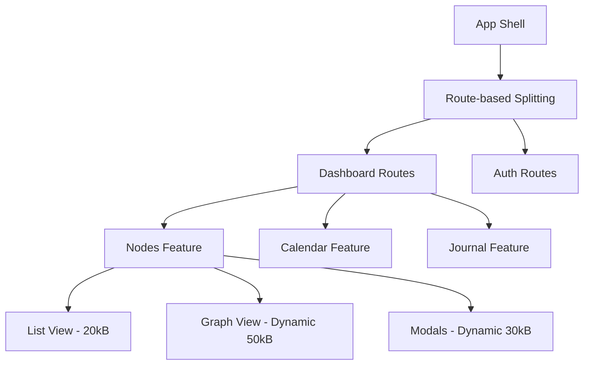

# Performance Map of Content (MOC)

## ⚡ Performance Overview

Brain Space demonstrates **strong foundational performance** with modern Next.js patterns, but has **critical bundle size regression** requiring immediate attention.

**Current Performance Rating**: 7.5/10 - Good foundation with optimization opportunities

## 🎯 Critical Performance Issues

### 🔴 Bundle Size Regression
**Issue**: /nodes route at 83.3kB vs target <50kB  
**Expected**: ~14.4kB based on previous optimizations  
**Impact**: 5-6x larger than expected  
**Source**: [[Performance Analysis AUDIT-2025-08-17#Bundle Size Regression]]

**Root Causes Under Investigation**:
- Static @xyflow/react imports instead of dynamic
- Date library duplication (date-fns + dayjs in 15 files)
- Firebase SDK fragmented imports
- Possible measurement methodology differences

## 📊 Performance Metrics

### Current Bundle Analysis
| Route | Current Size | Target | Status |
|-------|-------------|--------|---------|
| /nodes | 83.3kB | <50kB | 🔴 Critical |
| /dashboard | ~20kB | <20kB | ✅ Good |
| /calendar | ~15kB | <20kB | ✅ Good |
| /journal | ~18kB | <20kB | ✅ Good |
| First Load JS | ~300kB | <300kB | ✅ Good |

### Performance Targets
- **Lighthouse Score**: >90 (estimated current: 75-85)
- **Mobile 3G Load**: <2s (current: 2-4s)
- **Desktop Load**: <1s (current: 1-2s)
- **Route Transitions**: <100ms (currently good)

## 🔍 Bundle Composition Analysis

### Heavy Dependencies Identified
**Source**: [[Performance Analysis AUDIT-2025-08-17#Bundle Analysis]]

| Dependency | Size (kB) | Usage | Optimization Status |
|------------|-----------|-------|-------------------|
| **@xyflow/react** | 50-80 | /nodes only | ❌ Needs dynamic loading |
| **date-fns** | 30-45 | 15 files | ❌ Needs migration to dayjs |
| **Firebase SDK** | 40-60 | Multiple routes | ⚠️ Needs tree-shaking |
| **@tanstack/react-query** | 25-35 | 7 files | ✅ Acceptable usage |
| **lucide-react** | 10-15 | Centralized | ✅ Well optimized |

### Date Library Duplication Crisis
**Files affected**: 15 components using both libraries
```typescript
// Problem pattern found in 15 files:
import { format } from 'date-fns'        // +30kB
import dayjs from '@/lib/dayjs'          // +2kB (redundant)
```

**Files needing migration**:
- `components/ScheduleSettingsDialog.tsx`
- `components/calendar/CalendarStatusDialog.tsx`
- `components/QuickAddModal.tsx`
- `components/StandupSummaryDialog.tsx`
- `components/timebox/TimeboxHeader.tsx`
- ... and 10 more files

## 🚀 Optimization Strategies

### Immediate Actions (High Impact, Low Effort)

#### 1. Complete Date-fns Migration
**Expected Savings**: 25-30kB per affected route
```typescript
// BEFORE: Mixed usage
import { format } from 'date-fns'
import dayjs from '@/lib/dayjs'

// AFTER: Consistent dayjs usage
import dayjs from '@/lib/dayjs'
const formatted = dayjs(date).format('YYYY-MM-DD')
```

#### 2. Dynamic Graph View Loading  
**Expected Savings**: 50-80kB on /nodes route
```typescript
// CURRENT: Static import loads @xyflow on every /nodes visit
import { ReactFlow } from '@xyflow/react'

// PROPOSED: Conditional dynamic loading
const [GraphComponent, setGraphComponent] = useState(null)
useEffect(() => {
  if (viewMode === 'graph' && !GraphComponent) {
    import('@/components/nodes/NodeGraphView').then(mod => {
      setGraphComponent(() => mod.NodeGraphView)
    })
  }
}, [viewMode])
```

#### 3. Firebase SDK Consolidation
**Expected Savings**: 15-25kB per route
```typescript
// CURRENT: Repeated imports across stores
const { db } = await import('@/lib/firebase')
const { collection, query } = await import('firebase/firestore')

// PROPOSED: Centralized service
export const firestoreService = {
  async query(path: string, constraints: any[]) {
    const { db } = await import('@/lib/firebase')
    const { collection, query } = await import('firebase/firestore')
    // Centralized logic
  }
}
```

## 📈 Performance Architecture

### Next.js Optimization Patterns
**Source**: [[Next.js Analysis AUDIT-2025-08-17#Performance]]

**Current Optimizations** ✅:
- Server Components reduce client bundle
- Dynamic imports for heavy components
- Edge runtime for authentication
- Proper static/dynamic rendering separation

**Missing Optimizations** ❌:
- Partial Prerendering (Next.js 15 feature)
- Advanced image optimization
- Streaming for AI responses
- Enhanced caching strategies

### Bundle Splitting Strategy


## 🛠️ Performance Testing & Monitoring

### Current Testing Status
**Gap**: [[Testing Analysis AUDIT-2025-08-17#Performance Testing]]

**Missing Performance Tests**:
- Bundle size monitoring in CI/CD
- Lighthouse CI integration
- Bundle regression detection
- Performance budget enforcement

### Recommended Testing Setup
```javascript
// Bundle size budget in package.json
"bundlesize": [
  {
    "path": ".next/static/chunks/pages/nodes-*.js",
    "maxSize": "20kB"
  },
  {
    "path": ".next/static/chunks/pages/*.js", 
    "maxSize": "15kB"
  }
]
```

## 📱 Mobile Performance

### iOS PWA Optimization
**Source**: [[UI/UX Research AUDIT-2025-08-17#iOS Performance]]

**Current Mobile Performance**:
- Safe area implementation: ✅ Excellent
- Touch target sizes: ✅ Good (44px+)
- Viewport handling: ✅ Proper
- Bundle impact on mobile: ❌ Needs optimization

**Mobile-Specific Issues**:
- Large bundles affect mobile 3G loading
- No gesture optimizations
- Missing iOS keyboard avoidance
- Bundle size impacts older devices

## 🔄 Performance Workflow

### Development Performance
- **Hot reload**: Excellent with Turbopack
- **Build time**: Fast with Next.js 15
- **Dev bundle analysis**: Available with `pnpm run analyze`

### Production Performance  
- **SSR performance**: Good with Server Components
- **CDN distribution**: Excellent with Vercel Edge
- **Caching strategy**: Basic, needs enhancement

## 🎯 Performance Roadmap

### Week 1: Emergency Optimization
**Priority**: 🔴 Critical
- [ ] Bundle analysis to identify regression source
- [ ] Complete date-fns migration (15 files)
- [ ] Implement dynamic @xyflow/react loading
- [ ] Firebase service consolidation

**Expected Impact**: /nodes route 83.3kB → <30kB

### Week 2-3: Foundation Optimization
**Priority**: 🟡 High  
- [ ] Component decomposition (NodeDetailModal)
- [ ] Advanced dynamic imports
- [ ] Bundle monitoring CI/CD setup
- [ ] Performance regression testing

**Expected Impact**: All routes meet <20kB targets

### Month 2: Advanced Optimization
**Priority**: 🟢 Medium
- [ ] Next.js 15 Partial Prerendering
- [ ] Advanced caching strategies
- [ ] Image optimization
- [ ] Service Worker optimization

**Expected Impact**: Lighthouse score >90

## 📊 Performance Metrics & KPIs

### Core Web Vitals Targets
- **First Contentful Paint (FCP)**: <1.5s
- **Largest Contentful Paint (LCP)**: <2.5s
- **First Input Delay (FID)**: <100ms
- **Cumulative Layout Shift (CLS)**: <0.1

### Bundle Size KPIs
- **Individual Routes**: <20kB JavaScript
- **First Load JS**: <300kB (currently achieved)
- **Dynamic Imports**: >50% of heavy components
- **Tree Shaking**: <5% dead code

### User Experience Metrics
- **Route Transition**: <100ms
- **PWA Install**: <3 seconds
- **Offline Performance**: <1s cached content
- **Mobile Performance**: 3G load <2s

## 🛠️ Performance Tools & Analysis

### Bundle Analysis Tools
```bash
# Primary analysis
pnpm run analyze

# Detailed analysis
npx @next/bundle-analyzer
npx webpack-bundle-analyzer .next/static/chunks/

# Dependency analysis  
npx depcheck
npx bundlephobia-cli
```

### Performance Monitoring
```typescript
// Add performance monitoring
import { getCLS, getFID, getFCP, getLCP } from 'web-vitals'

getCLS(console.log)
getFID(console.log)  
getFCP(console.log)
getLCP(console.log)
```

## 📚 Performance Resources

### Internal Documentation
- [[Performance Analysis AUDIT-2025-08-17]] - Comprehensive performance audit
- [[Architecture Analysis AUDIT-2025-08-17]] - Bundle optimization patterns
- [[Next.js Analysis AUDIT-2025-08-17]] - Framework optimization opportunities

### External Performance Guides
- [Next.js Performance Best Practices](https://nextjs.org/docs/basic-features/built-in-css-support)
- [Web.dev Performance](https://web.dev/performance/)
- [Bundle Analysis Techniques](https://web.dev/reduce-javascript-payloads-with-code-splitting/)
- [PWA Performance Guidelines](https://web.dev/pwa-performance/)

## 🎪 Success Criteria

### Short-term Success (Week 1)
- [ ] /nodes route <30kB (from 83.3kB)
- [ ] Date-fns completely removed
- [ ] Bundle regression analysis complete
- [ ] Dynamic loading implemented for heavy components

### Medium-term Success (Month 1)
- [ ] All routes <20kB
- [ ] Lighthouse score >85
- [ ] Mobile 3G load <2.5s
- [ ] Bundle monitoring in CI/CD

### Long-term Success (Month 3)
- [ ] Lighthouse score >90
- [ ] Mobile performance <2s on 3G
- [ ] Advanced Next.js 15 features implemented
- [ ] Comprehensive performance monitoring

---

**Performance Status**: Good foundation with critical optimization needed  
**Next Performance Review**: Weekly during optimization phase  
**Priority Focus**: Bundle size regression resolution and systematic optimization