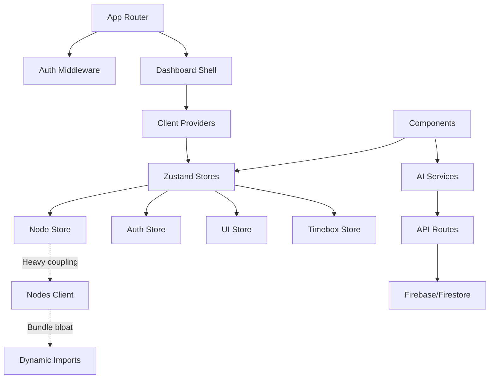

# Codebase Analysis: Brain Space Next.js Architecture

## 🎯 Analysis Scope
Complete architectural analysis of the Brain Space Next.js PWA, focusing on patterns, coupling, cohesion, and architectural quality across the entire codebase including frontend, backend, state management, and data flow.

## 📋 Executive Summary
Brain Space exhibits a **hybrid architecture with strong separation of concerns but concerning coupling issues**. The project successfully implements modern Next.js 15 patterns with App Router, but suffers from state management complexity, circular dependencies, and oversized components that impact maintainability and performance.
^summary

## 📊 Project Structure

### Directory Organization
```
brain-space-nextjs/
├── app/                    # Next.js App Router (Pages & API Routes)
│   ├── (auth)/            # Authentication pages group
│   ├── (dashboard)/       # Protected dashboard pages group  
│   ├── api/               # Server-side API routes
│   └── __/                # Special Firebase routes
├── components/            # React components (97 files)
│   ├── ui/               # Base UI components
│   ├── nodes/            # Node-specific components
│   ├── calendar/         # Calendar components
│   └── [feature]/        # Feature-specific components
├── store/                 # Zustand state stores (13 stores)
├── hooks/                 # Custom React hooks
├── lib/                   # Utility functions & configs
├── types/                 # TypeScript type definitions
├── services/              # Business logic layer
└── _knowledge/           # Documentation & analysis
```

### Key Metrics
| Metric | Value | Assessment |
|--------|-------|------------|
| Total Files | ~400+ | Large but organized |
| React Components | 97 | High component count |
| Zustand Stores | 13 | Potentially over-segmented |
| API Routes | 16 | Well-structured |
| TypeScript Files | ~90% | Good type coverage |

## 🏗️ Architecture Patterns

### Identified Pattern: **Layered Client-Server Architecture with Feature Slicing**

**Evidence**:
- Clear separation between client (`'use client'`) and server components
- API routes in `/app/api/` handling server-side logic
- Feature-based component organization
- Zustand stores for client-side state management

**Strengths**:
- ✅ Clean separation of client/server concerns
- ✅ Next.js App Router patterns correctly implemented
- ✅ Feature-based component organization
- ✅ Type-safe API contracts with Zod validation

**Weaknesses**:
- ⚠️ State management fragmented across 13 stores
- ⚠️ Heavy client components impacting bundle size
- ⚠️ Inconsistent data flow patterns

### Pattern: **Server-Side Authentication with Edge Middleware**

**Evidence**:
```typescript
// middleware.ts - Edge runtime auth
export async function middleware(request: NextRequest) {
  const token = request.cookies.get(AUTH_COOKIE_NAME)?.value
  const decoded = decodeAuthToken(token)
  // Add user info to headers for server components
  requestHeaders.set('x-user-id', decoded.uid)
}

// server-auth.ts - Server component auth
export async function getUserFromHeaders() {
  const userId = headersList.get('x-user-id')
  return userId ? { uid: userId, email: userEmail } : null
}
```

**Assessment**: ✅ **Excellent** - Modern, secure authentication flow

### Pattern: **Dynamic Imports for Bundle Optimization**

**Evidence**:
```typescript
// Aggressive dynamic imports in nodes-client.tsx
const NodeRelationshipModal = dynamic(() => import('@/components/nodes/NodeRelationshipModal'))
const NodeHierarchyView = dynamic(() => import('@/components/nodes/NodeHierarchyView'))
const NodeGraphView = dynamic(() => import('@/components/nodes/NodeGraphView'))
```

**Assessment**: ✅ **Good** - Reduces initial bundle size, but may indicate component coupling issues

## 🔗 Dependency Analysis

### Dependency Graph


### Critical Dependencies

1. **Firebase**: Core infrastructure dependency
   - Usage: Authentication, Firestore, Storage
   - Risk: ⚠️ Vendor lock-in, complex initialization

2. **Zustand**: State management across 13 stores
   - Usage: Global state, persistence, derived state
   - Risk: ⚠️ State fragmentation, potential memory leaks

3. **Dynamic Imports**: Bundle size management
   - Usage: Code splitting heavy components
   - Risk: ⚠️ Runtime loading complexity

### Circular Dependencies
- ❌ **Store Index Barrel Export**: `/store/index.ts` creates import cycles
- ❌ **Component Cross-References**: Components importing each other through barrel exports
- ❌ **Type Circular References**: Node types referencing store types

## 🏥 Code Health Assessment

### Positive Indicators
✅ **Clean API Design**: Well-structured API routes with consistent patterns
✅ **Type Safety**: Comprehensive TypeScript usage with proper type definitions
✅ **Security**: Robust authentication flow with middleware validation
✅ **Modern Patterns**: Proper use of Next.js 15 App Router features
✅ **Bundle Optimization**: Strategic use of dynamic imports

### Areas of Concern

⚠️ **Store Fragmentation**: 13 separate Zustand stores create complex state management
- Location: `/store/` directory
- Impact: Difficult state debugging, potential inconsistencies
- Effort: High - requires state architecture redesign

⚠️ **Component Size**: Large client components (nodes-client.tsx ~1000+ lines)
- Location: `app/(dashboard)/*/` client components
- Impact: Bundle size, maintainability issues
- Effort: Medium - component decomposition needed

⚠️ **Barrel Export Anti-Pattern**: Index files creating import cycles
- Location: `/store/index.ts`, `/components/*/index.ts`
- Impact: Bundle analyzer confusion, potential circular deps
- Effort: Low - remove barrel exports

## 💡 Patterns Discovered

### Pattern: **Client-Server Component Split**
```typescript
// Server Component (page.tsx)
export default async function NodesPage() {
  const user = await getUserFromHeaders()
  if (!user) redirect('/login')
  return <NodesClient />
}

// Client Component (nodes-client.tsx)
'use client'
export default function NodesClient() {
  const { nodes, loadNodes } = useNodesStore()
  // Heavy client-side logic
}
```
**Assessment**: ✅ **Good** - Proper Next.js pattern, but client components too heavy

### Pattern: **Dynamic AI Provider Selection**
```typescript
// services/ai.ts - Runtime provider switching
class AIService {
  constructor(provider: string = 'mock') {
    this.provider = provider
  }
  
  async enhanceNode(text: string): Promise<EnhanceNodeResult> {
    const provider = this.provider === 'gemini' ? 'google' : this.provider
    const response = await fetch('/api/ai/enhance-node', {
      body: JSON.stringify({ text, provider })
    })
  }
}
```
**Assessment**: ✅ **Excellent** - Flexible, testable design

### Pattern: **Store-to-Store Communication**
```typescript
// Stores calling other stores directly
const userPrefsStore = useUserPreferencesStore()
const nodeStore = useNodesStore()
// Direct store coupling
```
**Assessment**: ❌ **Poor** - Creates tight coupling between stores

## 🎯 Recommendations

### Immediate Actions

1. **Consolidate Store Architecture**
   - Combine related stores (auth + user preferences)
   - Implement store composition pattern
   - Impact: Reduced complexity, better performance

2. **Decompose Large Client Components**
   - Split nodes-client.tsx into smaller components
   - Extract business logic to custom hooks
   - Impact: Better bundle splitting, maintainability

3. **Remove Barrel Exports**
   - Replace index.ts files with direct imports
   - Eliminate circular dependency risks
   - Impact: Cleaner dependency graph

### Refactoring Opportunities

1. **State Management Consolidation**:
   - Current: 13 fragmented stores
   - Proposed: 4-6 domain-focused stores with composition
   - Impact: Simplified debugging, better performance

2. **Component Architecture**:
   - Current: Monolithic client components
   - Proposed: Atomic design with smart/dumb component separation
   - Impact: Better reusability, testing, performance

3. **API Route Organization**:
   - Current: Flat API structure
   - Proposed: Nested routes by domain (ai/, auth/, calendar/)
   - Impact: Better organization, clearer boundaries

### Architecture Improvements

1. **Implement Event-Driven Architecture**
   - Add event bus for store communication
   - Reduce direct store coupling
   - Enable better testing and debugging

2. **Add Service Layer Abstraction**
   - Abstract Firebase operations behind services
   - Enable easier testing and provider switching
   - Improve separation of concerns

3. **Implement Proper Error Boundaries**
   - Add React error boundaries at route level
   - Implement proper error logging
   - Improve user experience

## 📈 Complexity Analysis

### Most Complex Areas

1. **`app/(dashboard)/nodes/nodes-client.tsx`**: 
   - Lines: 1000+
   - Complexity: High (multiple state interactions, dynamic imports)
   - Dependencies: 13+ imports

2. **`store/nodeStore.ts`**: 
   - Complexity: High (40+ methods, Firebase integration)
   - Dependencies: Multiple Firebase imports, type dependencies

3. **`app/api/ai/categorize/route.ts`**: 
   - Complexity: Medium (multiple AI providers, complex prompts)
   - Dependencies: AI provider APIs, validation schemas

### Simplification Opportunities

- **Nodes Client**: Extract hooks for node operations, modals, and UI state
- **Node Store**: Split into NodeRepository (data) and NodeState (UI state)
- **AI Routes**: Extract provider logic to dedicated service classes

## 🔍 Deep Dive Areas

### Store Architecture Analysis
**Purpose**: Global state management across the application
**Dependencies**: React, Zustand, Firebase, various type definitions
**Dependents**: All client components, hooks, services
**Issues**: 
- 13 stores create complexity
- Direct store-to-store coupling
- Inconsistent patterns across stores
**Recommendations**: 
- Consolidate to 4-6 domain stores
- Implement store composition
- Add event-driven communication

### Client Component Pattern
**Purpose**: Interactive UI components with state management
**Dependencies**: Multiple stores, services, dynamic imports
**Dependents**: Pages, other components
**Issues**:
- Components too large (1000+ lines)
- Bundle size impact
- Difficult to test and maintain
**Recommendations**:
- Extract custom hooks for business logic
- Split into smaller, focused components
- Implement proper lazy loading

### API Route Architecture
**Purpose**: Server-side business logic and data operations
**Dependencies**: Firebase Admin, AI providers, validation schemas
**Dependents**: Client services, components
**Issues**:
- Some routes are monolithic
- Inconsistent error handling
- Limited middleware usage
**Recommendations**:
- Add route-level middleware for common operations
- Implement consistent error handling
- Extract business logic to service classes

## 📚 Related Documentation
- [[Project Architecture Overview]]
- [[Performance Analysis AUDIT-2025-08-17]]
- [[Testing Strategy]]
- [[Bundle Optimization]]
- [[State Management Patterns]]

## 🏷️ Tags
#type/analysis #architecture/next-app-router #architecture/client-server #pattern/zustand #pattern/dynamic-imports #debt/store-fragmentation #debt/component-size #quality/mixed #security/good

---
*Analysis conducted by codebase-analyst on 2025-08-17*

## Architectural Quality Score: 7.2/10

**Strengths**: Modern Next.js patterns, secure authentication, type safety
**Weaknesses**: State management complexity, component coupling, bundle size issues
**Priority Focus**: Store consolidation, component decomposition, dependency cleanup