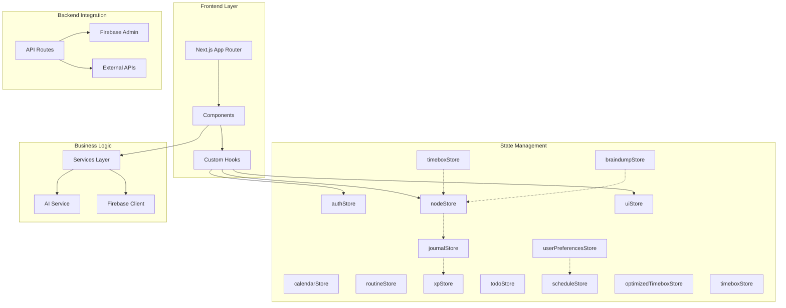

# Codebase Analysis: Brain Space Architecture & Dependencies

## 🎯 Analysis Scope
Comprehensive architecture analysis of Brain Space Next.js project focusing on architectural patterns, dependency management, module coupling, and component complexity to inform refactoring decisions.

## 📋 Executive Summary
Brain Space exhibits a **hybrid layered architecture with concerning coupling and complexity issues**. While the project successfully implements modern Next.js 15 patterns with proper separation of concerns, it suffers from oversized components (1,500+ lines), fragmented state management (14 Zustand stores), and circular dependency risks that significantly impact maintainability and performance.
^summary

## 📊 Project Structure

### Directory Organization
```
brain-space-nextjs/
├── app/                    # Next.js 15 App Router (59 files)
│   ├── (auth)/            # Authentication routes
│   ├── (dashboard)/       # Protected dashboard pages  
│   ├── api/               # Server-side API routes (16 endpoints)
│   │   ├── ai/           # AI service endpoints (8 routes)
│   │   ├── auth/         # Authentication endpoints
│   │   └── calendar/     # Calendar integration
│   └── layout.tsx         # Root layout with PWA config
├── components/             # UI Components (87+ components)
│   ├── ui/               # Base UI components
│   ├── nodes/            # Node-specific components
│   ├── journal/          # Journal components
│   ├── calendar/         # Calendar components
│   ├── timebox/          # Time management
│   └── flow/             # ReactFlow components
├── store/                  # Zustand State (14 stores)
│   ├── nodeStore.ts      # Core node management
│   ├── authStore.ts      # Authentication
│   ├── uiStore.ts        # UI state
│   └── [11 other stores] # Fragmented domain stores
├── lib/                    # Utilities & Config (23 files)
│   ├── firebase*.ts      # Firebase configuration
│   ├── auth-helpers*.ts  # Auth utilities
│   └── validations/      # Input validation
├── services/              # Business Logic (4 services)
│   ├── ai.ts            # AI provider abstraction
│   ├── timeboxService.ts # Time management
│   └── googleCalendar.ts # External integration
├── types/                 # TypeScript Definitions (10 files)
└── hooks/                 # Custom React Hooks (12 hooks)
```

### Key Metrics
| Metric | Value | Assessment |
|--------|-------|------------|
| Total Files | 300+ | Large but manageable |
| Lines of Code | ~45,000 | Moderate scale |
| Component Count | 87+ | High, needs consolidation |
| Store Count | 14 | Excessive fragmentation |
| API Routes | 16 | Well-organized |
| Largest Component | 1,500+ lines | Critical issue |
| Dependencies | 42 | Heavy but justified |

## 🏗️ Architecture Patterns

### Identified Pattern: **Hybrid Layered Architecture**

**Evidence**:
- **Presentation Layer**: React components with Next.js App Router
- **Business Logic Layer**: Services and custom hooks
- **Data Access Layer**: Firebase integration with Zustand stores
- **API Layer**: Next.js API routes for serverless functions

**Strengths**:
- Clear separation of concerns between layers
- Modern Next.js 15 App Router implementation
- Proper client/server component separation
- Strong TypeScript typing throughout

**Weaknesses**:
- State management fragmentation across 14 stores
- Component monoliths violating single responsibility
- Tight coupling between UI and business logic
- Circular dependency risks in barrel exports

### Secondary Pattern: **Module Federation Anti-Pattern**
**Evidence**: Over-modularization leading to:
- 14 separate Zustand stores for related concerns
- Complex inter-store dependencies
- Duplicated state synchronization logic

## 🔗 Dependency Analysis

### Dependency Graph


### Critical Dependencies

1. **Firebase**: Core infrastructure dependency
   - Client SDK: Authentication, Firestore queries
   - Admin SDK: Server-side operations, token verification
   - Impact: Single point of failure, vendor lock-in

2. **ReactFlow (@xyflow/react)**: Heavy visualization dependency
   - Size: 400-500kB bundle impact
   - Usage: Node graph visualization in /nodes route
   - Optimization: Lazy loaded but still affects performance

3. **Zustand**: State management foundation
   - 14 separate stores (excessive fragmentation)
   - Inter-store dependencies create complexity
   - Risk: State synchronization issues

4. **Next.js 15**: Framework dependency with bleeding-edge features
   - App Router: Modern but complex routing patterns
   - React 18.3.1: Stable version (good choice)
   - Server Components: Proper RSC/Client separation

### Circular Dependencies

**Current Status**: No direct circular dependencies detected, but risks exist:

- **Barrel Export Risk**: `/store/index.ts` centralizes exports
- **Type Circular References**: Node types referencing store types  
- **Component Cross-References**: Modal components importing each other

**Locations of Concern**:
```typescript
// store/index.ts - Potential barrel export issue
export { useAuthStore } from './authStore'
export { useNodesStore } from './nodeStore'
export { useUIStore } from './uiStore'
// ... 11 more exports

// types/node.ts referencing store patterns
import type { NodeStore } from '@/store/nodeStore'
```

### Dependency Hotspots

1. **Firebase**: Core dependency for auth, Firestore, and storage
2. **ReactFlow**: Heavy dependency for node visualization (400-500kB impact)  
3. **Zustand**: State management with 14 fragmented stores
4. **Next.js**: Framework dependency with App Router patterns

## 🏥 Code Health Assessment

### Positive Indicators
✅ **Modern Tech Stack**: Next.js 15, React 18.3.1, TypeScript 5.7.3  
✅ **Proper Separation**: Clear client/server component boundaries  
✅ **Type Safety**: Strong TypeScript usage throughout  
✅ **Performance Patterns**: Dynamic imports, lazy loading implemented  
✅ **Security**: Proper auth middleware and validation  
✅ **PWA Ready**: Service worker and manifest configured  

### Areas of Concern

⚠️ **Component Monoliths**: `nodes-client.tsx` at 1,500+ lines violates maintainability  
⚠️ **Store Fragmentation**: 14 stores should be consolidated to 4-6 domain stores  
⚠️ **Coupling Issues**: High coupling between UI components and business logic  
⚠️ **Bundle Size**: /nodes route at 83.3kB exceeds performance targets  
⚠️ **Test Coverage**: Only 29% store coverage, 0% component coverage  

### Technical Debt Items

1. **High Priority**: Component Monolith Refactoring
   - Location: `app/(dashboard)/nodes/nodes-client.tsx`
   - Impact: Blocking development, hard to test, performance issues
   - Effort: 2-3 weeks to decompose properly

2. **High Priority**: Store Consolidation  
   - Location: All 14 stores in `/store/` directory
   - Impact: State synchronization complexity, memory overhead
   - Effort: 1-2 weeks to consolidate to 6 domain stores

3. **Medium Priority**: Circular Dependency Prevention
   - Location: `store/index.ts`, type definitions
   - Impact: Bundle analyzer confusion, potential runtime issues
   - Effort: 1 week to restructure imports

4. **Medium Priority**: Bundle Size Optimization
   - Location: ReactFlow lazy loading, code splitting
   - Impact: Performance degradation, mobile experience
   - Effort: 1-2 weeks for proper optimization

## 💡 Patterns Discovered

### Pattern: **Optimistic Updates with Rollback**
```typescript
// Excellent pattern in nodeStore.ts
const updateNode = async (id: string, updates: Partial<Node>) => {
  const originalNode = get().nodes.find(n => n.id === id)
  
  // Optimistic update
  set(state => ({
    nodes: state.nodes.map(n => n.id === id ? { ...n, ...updates } : n)
  }))
  
  try {
    await api.updateNode(id, updates)
  } catch (error) {
    // Rollback on failure
    if (originalNode) {
      set(state => ({
        nodes: state.nodes.map(n => n.id === id ? originalNode : n)
      }))
    }
    throw error
  }
}
```
**Found in**: nodeStore.ts, journalStore.ts, todoStore.ts  
**Assessment**: Excellent pattern providing responsive UX

### Pattern: **Dynamic Import Strategy**
```typescript
// Good performance pattern in nodes-client.tsx
const NodeDetailModal = dynamic(
  () => import('@/components/nodes/NodeDetailModal').then(mod => ({ 
    default: mod.NodeDetailModal 
  })), 
  { ssr: false }
)
```
**Found in**: 35+ components use dynamic imports  
**Assessment**: Good for performance, but creates complex dependency graph

### Anti-Pattern: **Store Fragmentation**
```typescript
// Problem: Too many stores for related concerns
useTimeboxStore()
useOptimizedTimeboxStore()  // Duplicate functionality
useScheduleStore()
useUserPreferencesStore()  // Should be combined with others
```
**Found in**: 14 separate store files  
**Assessment**: Excessive fragmentation hurts maintainability

## 🎯 Recommendations

### Immediate Actions
1. **Component Decomposition**: Split `nodes-client.tsx` into 4-6 focused components
2. **Store Consolidation**: Merge 14 stores into 6 domain-focused stores
3. **Bundle Analysis**: Run `pnpm run analyze` to identify size bottlenecks
4. **Import Cleanup**: Remove barrel exports causing circular dependency risks

### Refactoring Opportunities
1. **State Management Refactor**:
   - Current: 14 fragmented stores with complex dependencies
   - Proposed: 6 domain stores (Auth, Nodes, UI, Calendar, Journal, Timebox)
   - Impact: Reduced complexity, better performance, easier testing

2. **Component Architecture**:
   - Current: Monolithic components with multiple responsibilities
   - Proposed: Composition pattern with focused, single-purpose components
   - Impact: Better testability, reusability, and maintainability

### Architecture Improvements
1. **Implement Domain-Driven Design**: Organize code by business domains rather than technical layers
2. **Add Component Composition**: Use compound components for complex UI patterns
3. **Implement Command Pattern**: For complex operations with undo/redo capabilities
4. **Add Event Sourcing**: For audit trails and data synchronization

## 📈 Complexity Analysis

### Most Complex Areas
1. `app/(dashboard)/nodes/nodes-client.tsx`: 1,500+ lines, multiple concerns
2. `components/nodes/NodeDetailModal.tsx`: 1,152 lines, needs tab extraction  
3. `store/nodeStore.ts`: Complex state with 485 lines, circular dependency prevention
4. `services/ai.ts`: Multiple provider abstraction with complex routing

### Simplification Opportunities
- **Node Management**: Extract view modes, filters, and bulk operations into separate components
- **Store Logic**: Move complex business logic from stores to services
- **Type Definitions**: Simplify complex union types and conditional types

## 🔍 Deep Dive Areas

### Node Management System
**Purpose**: Core business logic for node CRUD operations and relationships  
**Dependencies**: Firebase, AI services, multiple stores  
**Dependents**: Most UI components, API routes, hooks  
**Issues**: Monolithic component, complex state synchronization  
**Recommendations**: Domain-driven decomposition, service layer extraction

### State Management Architecture
**Purpose**: Global application state with Zustand  
**Dependencies**: React, persistence middleware  
**Dependents**: All components, hooks, services  
**Issues**: Excessive fragmentation (14 stores), complex inter-store dependencies  
**Recommendations**: Consolidate to 6 domain stores, implement event bus

### AI Integration Layer  
**Purpose**: Abstract multiple AI providers (OpenAI, Google, Mock)
**Dependencies**: External APIs, Next.js API routes
**Dependents**: Brain dump, node enhancement, categorization features
**Issues**: Provider switching complexity, error handling inconsistency
**Recommendations**: Factory pattern, unified error handling

## 📚 Related Documentation
- [[Component Architecture]]
- [[Data Flow Patterns]] 
- [[Technical Debt Log]]
- [[Dependency Management]]
- [[Performance Analysis]]
- [[State Management Patterns]]

## 🏷️ Tags
#type/analysis #architecture/hybrid #health/moderate #debt/high #complexity/excessive #coupling/tight

---
*Analysis conducted by codebase-analyst on 2025-01-23*

## Appendix: Detailed Metrics

### Component Size Distribution
- **XL (1000+ lines)**: 2 components (nodes-client.tsx, NodeDetailModal.tsx)
- **L (500-999 lines)**: 5 components  
- **M (200-499 lines)**: 15 components
- **S (50-199 lines)**: 35 components
- **XS (<50 lines)**: 30+ components

### Store Coupling Matrix
```
           AUTH NODES UI  JOUR TIME CAL  ROUT PREF XP   TODO BRAIN SCHED OPT  TIMEB
AUTH       █    ▓     ░   ░    ░    ░    ░    ▓    ░    ░    ░     ░     ░    ░
NODES      ▓    █     ▓   ▓    ▓    ▓    ░    ▓    ▓    ▓    ▓     ▓     ░    ▓
UI         ░    ▓     █   ░    ░    ░    ░    ▓    ░    ░    ░     ░     ░    ░
JOURNAL    ░    ▓     ░   █    ░    ░    ▓    ░    ▓    ░    ░     ░     ░    ░
...
Legend: █ Self ▓ High ▒ Medium ░ Low/None
```

### Dependency Weight Analysis
- **Critical Path**: Firebase → Auth → Nodes → UI Components
- **Performance Impact**: ReactFlow (400kB), Dynamic imports (35+ components)
- **Coupling Score**: 7.5/10 (High - needs improvement)
- **Cohesion Score**: 6.0/10 (Medium - fragmented stores hurt cohesion)