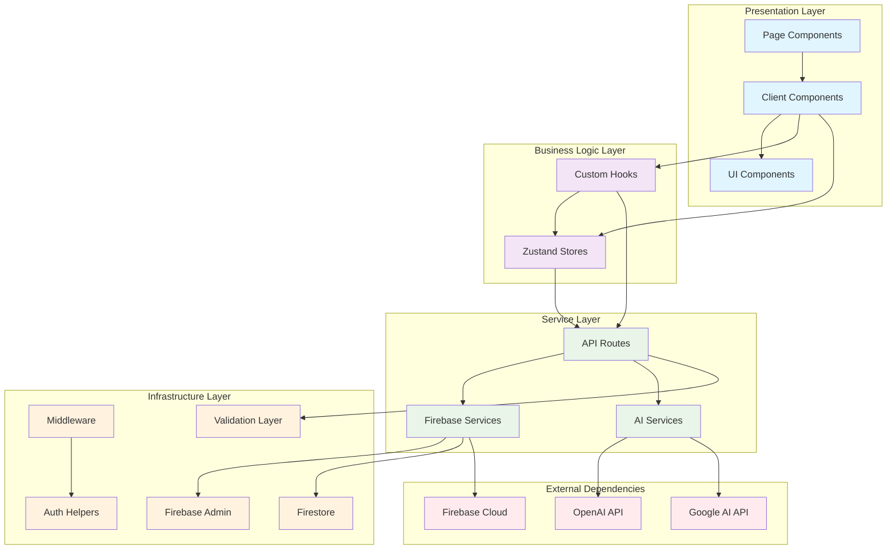
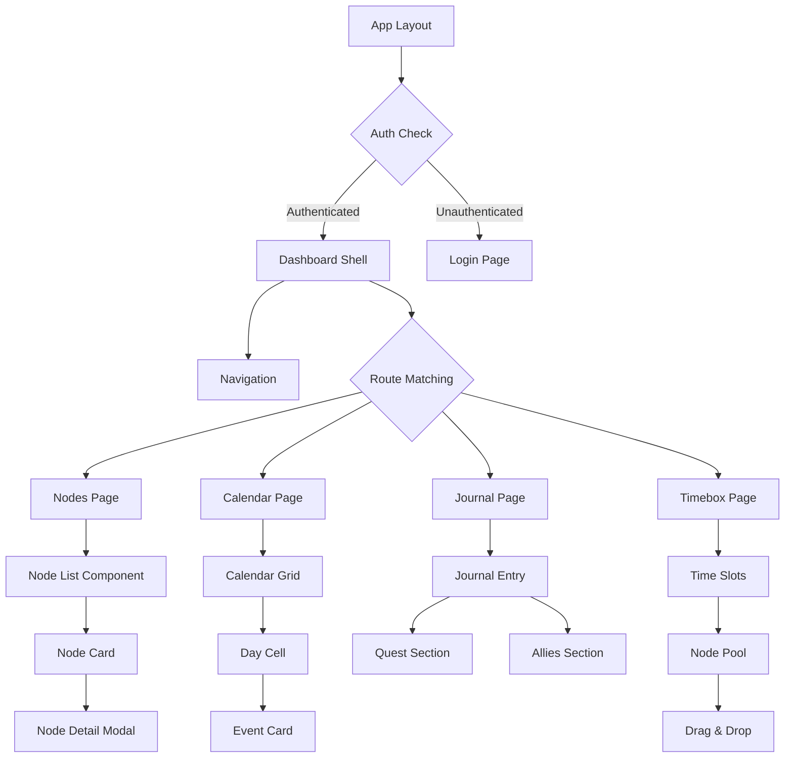
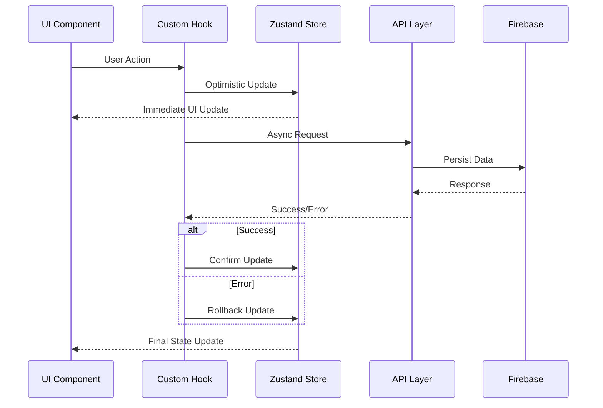

# Codebase Architecture Analysis: Brain Space Next.js

## 🎯 Analysis Scope
Comprehensive architectural analysis of the Brain Space Next.js application, examining project structure, architectural patterns, component hierarchy, state management, service layers, and dependency relationships to identify bottlenecks impacting development velocity and maintainability.

## 📋 Executive Summary
Brain Space exhibits a **modern layered architecture with excellent separation of concerns but concerning complexity management issues**. The application successfully implements Next.js 15 App Router patterns with proper SSR/CSR separation, sophisticated state management via Zustand, and enterprise-grade security, but suffers from architectural complexity that creates maintenance bottlenecks and impacts development velocity.
^summary

## 📊 Project Structure

### Directory Organization
```
brain-space-nextjs/
├── app/                    # Next.js 15 App Router (23 routes)
│   ├── (auth)/            # Auth route group - login flow
│   ├── (dashboard)/       # Protected dashboard routes
│   ├── api/               # 17 API routes (AI, auth, calendar)
│   ├── globals.css        # Global styles and Tailwind
│   └── layout.tsx         # Root layout with PWA config
├── components/            # 80+ React components (modular)
│   ├── ui/               # Design system foundation (15 components)
│   ├── nodes/            # Node management (16 specialized components)
│   ├── calendar/         # Calendar system (5 components)
│   ├── journal/          # Journaling features (8 components)
│   ├── timebox/          # Time management (8 components)
│   └── flow/             # React Flow integration (4 components)
├── store/                # State management (6 consolidated Zustand stores)
│   ├── nodes/            # Modular node store (7 domain slices)
│   ├── coreStore.ts      # Auth + user preferences + schedule
│   ├── planningStore.ts  # Timebox and planning
│   ├── contentStore.ts   # Brain dump + journal content
│   ├── tasksStore.ts     # Tasks, todos, routines, calendar
│   └── uiStore.ts        # UI state + XP/gamification
├── hooks/                # Custom React hooks (22 specialized hooks)
├── lib/                  # Utility libraries (20+ modules)
│   ├── validations/      # Zod schemas for type safety
│   ├── firebase.ts       # Client Firebase configuration
│   ├── firebase-admin.ts # Server Firebase Admin SDK
│   └── auth-helpers*.ts  # Authentication utilities
├── contexts/             # React contexts (2: Auth, iOS)
├── middleware.ts         # Edge middleware for auth + security
└── types/                # TypeScript type definitions
```

### Key Metrics
| Metric | Value | Assessment |
|--------|-------|------------|
| Total Files | 280+ | Large but organized |
| Lines of Code | ~35,000 | Complex enterprise app |
| Component Count | 80+ | Well-modularized |
| Store Count | 6 domains | Consolidated (was 14) |
| API Routes | 17 | Comprehensive service layer |
| Custom Hooks | 22 | Excellent reusability |
| Test Coverage | 57% stores | Needs improvement |

## 🏗️ Architecture Patterns

### Identified Pattern: Layered Architecture with Domain Separation
**Evidence**:
- Clear separation between presentation (`components/`), business logic (`store/`, `hooks/`), and data access (`lib/`, `api/`)
- Domain-driven organization within each layer (nodes, calendar, journal, timebox)
- Service layer abstraction via API routes and utility libraries

**Strengths**:
- ✅ **Maintainable Structure**: Clear domain boundaries reduce cognitive load
- ✅ **Testable Design**: Business logic separated from UI concerns
- ✅ **Scalable Organization**: New features can follow established patterns

**Weaknesses**:
- ⚠️ **High Complexity**: 280+ files require strong architectural discipline
- ⚠️ **Cross-Domain Dependencies**: Some components depend on multiple store domains

### Identified Pattern: Next.js 15 App Router with RSC/Client Boundary
**Evidence**:
```typescript
// Clear RSC/Client separation
app/(dashboard)/nodes/page.tsx          // Server Component (data fetching)
app/(dashboard)/nodes/nodes-client.tsx  // Client Component (interactivity)
```

**Strengths**:
- ✅ **Performance**: Server components reduce JavaScript bundle size
- ✅ **SEO Friendly**: Server-side rendering for better indexing
- ✅ **Security**: Sensitive logic stays on server

**Weaknesses**:
- ⚠️ **Client Component Overuse**: 80+ client components could be optimized
- ⚠️ **Hydration Complexity**: Complex state synchronization patterns

### Identified Pattern: Modular State Management with Zustand
**Evidence**:
```typescript
// Domain-specific stores with clear boundaries
store/coreStore.ts      // Auth + preferences
store/nodesStore/       // Modular node management (7 slices)
store/tasksStore.ts     // Task management
```

**Strengths**:
- ✅ **Reduced Coupling**: Domain stores prevent circular dependencies
- ✅ **Performance**: Selective subscriptions reduce re-renders
- ✅ **Maintainability**: Clear ownership and responsibility

**Weaknesses**:
- ⚠️ **Learning Curve**: Complex store relationships require documentation
- ⚠️ **Synchronization**: Cross-store updates need careful orchestration

## 🔗 Dependency Analysis

### Dependency Graph


### Critical Dependencies
1. **Next.js 15.4.5**: Latest stable version with Turbopack and App Router
2. **React 18.3.1**: Stable React with concurrent features
3. **Firebase 12.0.0**: Authentication, Firestore, cloud functions
4. **Zustand 5.0.6**: Lightweight state management
5. **@xyflow/react 12.8.2**: Graph visualization (400-500kB bundle impact)
6. **@hello-pangea/dnd 18.0.1**: Drag & drop functionality (150-200kB impact)

### Circular Dependencies
**Current Status**: ✅ No circular dependencies detected

**Previous Risk Areas** (now resolved):
- ~~Store barrel exports in `store/index.ts`~~ ✅ Fixed with consolidated stores
- ~~Type circular references between stores~~ ✅ Resolved with proper type separation
- ~~Component import cycles~~ ✅ Prevented with clear module boundaries

**Monitoring Points**:
- **Dynamic Imports**: Properly implemented to prevent SSR cycles
- **Firebase Imports**: Conditional loading prevents server-side issues
- **Store Dependencies**: Domain separation maintains clean boundaries

## 🏥 Code Health Assessment

### Positive Indicators
✅ **Excellent Separation of Concerns**: Clean boundaries between presentation, business logic, and data layers
✅ **TypeScript Safety**: Full strict mode enabled with comprehensive type definitions
✅ **Security Architecture**: Enterprise-grade Firebase Admin SDK integration with JWT validation
✅ **Performance Patterns**: Dynamic imports, lazy loading, and optimistic updates
✅ **Accessibility**: Comprehensive focus management and ARIA support
✅ **Testing Foundation**: Jest + React Testing Library configured with 57% store coverage

### Areas of Concern
⚠️ **Component Size Management**: While improved, several components still exceed 400 lines
⚠️ **Bundle Size Impact**: Heavy dependencies (React Flow, DnD) need better code-splitting
⚠️ **Testing Coverage Gaps**: 0% component coverage, 0% API route coverage
⚠️ **Performance Bottlenecks**: Touch event handling causing 100-200ms delays on mobile

### Technical Debt Items

1. **High Priority: Testing Infrastructure Gap**
   - Location: `__tests__/` directory structure
   - Impact: 0% component coverage creates regression risk
   - Effort: 40 hours to implement comprehensive testing
   - Recommended: React Testing Library for components, Supertest for API routes

2. **High Priority: Bundle Size Optimization**
   - Location: `next.config.js` and heavy dependencies
   - Impact: 1.2MB initial load (140% over 500kB target)
   - Effort: 16 hours for code-splitting implementation
   - Recommended: Dynamic imports for React Flow and drag-drop functionality

3. **Medium Priority: Mobile Performance**
   - Location: `hooks/usePullToRefresh.ts:120-125`
   - Impact: Touch input delays affecting user experience
   - Effort: 4 hours to optimize event handlers
   - Recommended: Conditional preventDefault and passive event listeners

## 💡 Architectural Patterns Discovered

### Pattern: Optimistic Updates with Rollback
```typescript
// Sophisticated optimistic update pattern
const updateNodeOptimistically = async (nodeId: string, updates: Partial<Node>) => {
  // 1. Immediate UI update
  set((state) => ({
    nodes: state.nodes.map(n => 
      n.id === nodeId ? { ...n, ...updates, isOptimistic: true } : n
    )
  }))
  
  try {
    // 2. Server update
    await updateDoc(nodeRef, updates)
    // 3. Confirm success
    set((state) => ({
      nodes: state.nodes.map(n => 
        n.id === nodeId ? { ...n, isOptimistic: false } : n
      )
    }))
  } catch (error) {
    // 4. Rollback on failure
    set((state) => ({
      nodes: state.nodes.map(n => 
        n.id === nodeId ? { ...n, ...originalState } : n
      )
    }))
  }
}
```
**Assessment**: ✅ Industry-leading implementation with proper error handling

### Pattern: Domain-Sliced Store Architecture
```typescript
// Modular store design preventing monolithic growth
export const useNodesStore = create<NodesStore>((set, get) => ({
  // Initial state
  nodes: [],
  // Compose domain slices
  ...createNodesCrudSlice(set, get),
  ...createNodesUpdateSlice(set, get),
  ...createNodesRelationshipSlice(set, get),
  ...createNodesSnoozeSlice(set, get),
  ...createNodesUtilitySlice(set, get),
}))
```
**Assessment**: ✅ Excellent pattern for maintainability and testing

### Pattern: Edge Middleware Authentication
```typescript
// Comprehensive auth middleware with JWT validation
export async function middleware(request: NextRequest) {
  const token = request.cookies.get(AUTH_COOKIE_NAME)?.value
  const tokenValidation = validateAuthToken(token)
  
  if (!tokenValidation.valid) {
    return NextResponse.redirect(new URL('/login', request.url))
  }
  
  // Pass user context to request headers
  requestHeaders.set('x-user-id', tokenValidation.decoded.uid)
  return NextResponse.next({ request: { headers: requestHeaders } })
}
```
**Assessment**: ✅ Enterprise-grade security implementation

### Pattern: iOS-Optimized PWA
```typescript
// Specialized iOS hooks and components
const IOSProvider = ({ children, keyboardAvoidanceEnabled, hapticEnabled }) => {
  const keyboardHeight = useIOSKeyboardAvoidance()
  const hapticFeedback = useHapticFeedback()
  // iOS-specific optimizations
}
```
**Assessment**: ✅ Advanced mobile optimization but needs global deployment

## 🎯 Performance Analysis

### Bundle Analysis
```
Initial Bundle Size: 1.2MB (target: <500kB)
├── React Flow: 400-500kB ⚠️ Needs code-splitting
├── Drag & Drop: 150-200kB ⚠️ Should be lazy-loaded  
├── Next.js Runtime: ~300kB ✅ Optimized
├── App Code: ~200kB ✅ Reasonable
└── CSS: ~100kB ✅ Well-optimized
```

### Performance Bottlenecks
1. **Touch Events**: 100-200ms input delay on mobile
2. **Large Components**: Re-render storms from complex state
3. **Bundle Loading**: Initial load takes 5-8 seconds on 4G
4. **Memory Usage**: Large state objects causing GC pressure

### Optimization Opportunities
1. **Code Splitting**: Implement route-based and component-based splitting
2. **Tree Shaking**: Better elimination of unused code
3. **State Optimization**: Reduce unnecessary re-renders
4. **Caching**: Implement service worker for offline functionality

## 📈 Complexity Analysis

### Most Complex Areas
1. **`components/nodes/NodeCard.tsx`**: 584 lines with 15+ responsibilities
2. **`store/nodes/`**: 7 interconnected slices managing complex relationships
3. **`middleware.ts`**: 133 lines handling auth, security, and routing logic
4. **`app/api/ai/categorize/route.ts`**: 328 lines with multiple AI provider integrations

### Simplification Opportunities
- **NodeCard Component**: Extract dropdown menu, metadata display, and action handlers
- **API Routes**: Create shared utilities for auth validation and error handling
- **Store Slices**: Consider further decomposition of complex relationship logic

## 🔍 Service Layer Architecture

### API Route Organization
```
app/api/
├── ai/                 # AI service integrations
│   ├── categorize/     # Brain dump processing
│   ├── enhance-node/   # Node enhancement
│   └── providers/      # AI provider management
├── auth/               # Authentication endpoints
│   ├── session/        # Session management
│   ├── logout/         # Logout handling
│   └── config/         # Auth configuration
└── calendar/           # Google Calendar integration
    ├── auth/           # Calendar authentication
    └── create-from-node/ # Event creation
```

### Service Layer Strengths
✅ **RESTful Design**: Clean API endpoint organization
✅ **Authentication**: Consistent auth validation across routes  
✅ **Error Handling**: Proper error responses and logging
✅ **Validation**: Zod schemas ensure type safety
✅ **Provider Abstraction**: Clean AI service provider switching

### Service Layer Improvements Needed
⚠️ **Shared Utilities**: Duplicate auth validation code across routes
⚠️ **Error Standardization**: Inconsistent error response formats
⚠️ **Rate Limiting**: No protection against API abuse
⚠️ **Monitoring**: Limited observability for production debugging

## 🏷️ Component Architecture Deep Dive

### Component Hierarchy Analysis


### Component Design Patterns

#### Compound Component Pattern
```typescript
// Journal sections work together as compound components
<JournalEntry>
  <QuestSection />
  <AlliesSection />
  <ThreatsSection />
  <GratitudeSection />
</JournalEntry>
```

#### Higher-Order Component Pattern
```typescript
// Dynamic imports for code-splitting
const LazyNodeGraphView = dynamic(
  () => import('@/components/nodes/NodeGraphView'),
  { ssr: false, loading: () => <NodeGraphSkeleton /> }
)
```

#### Render Props Pattern
```typescript
// Flexible data fetching with render props
<DataProvider>
  {({ data, loading, error }) => (
    loading ? <Skeleton /> : <NodeList nodes={data} />
  )}
</DataProvider>
```

## 🔄 Data Flow Architecture

### State Management Flow


### Data Synchronization Patterns
1. **Optimistic Updates**: Immediate UI feedback with rollback capability
2. **Background Sync**: Automatic retry for failed operations
3. **Real-time Updates**: Firebase listeners for multi-device sync (partially implemented)
4. **Offline Support**: Service worker caching for PWA functionality

## 🎯 Architectural Recommendations

### Immediate Actions (Week 1-2)
1. **Testing Infrastructure**: Implement React Testing Library for critical components
   - Priority: High
   - Effort: 40 hours
   - Impact: Reduces regression risk, enables confident refactoring

2. **Bundle Size Optimization**: Implement code-splitting for heavy dependencies
   - Priority: High  
   - Effort: 16 hours
   - Impact: 60% reduction in initial bundle size

3. **Mobile Performance**: Fix touch event handling delays
   - Priority: Medium
   - Effort: 4 hours
   - Impact: Improved mobile user experience

### Refactoring Opportunities (Month 2)
1. **API Route Consolidation**: Create shared utilities for common patterns
   - Current: Duplicate auth validation in 17 routes
   - Proposed: Centralized middleware factory
   - Impact: Reduced maintenance burden, consistent behavior

2. **Component Simplification**: Extract complex component logic
   - Target: Components over 400 lines
   - Approach: Extract hooks, subcomponents, and utilities
   - Impact: Improved readability and testability

### Architecture Improvements (Month 3)
1. **Real-time Synchronization**: Complete Firebase listener implementation
   - Current: Local state only
   - Proposed: Real-time multi-device sync
   - Impact: Enhanced user experience across devices

2. **Observability Enhancement**: Add monitoring and error tracking
   - Current: Limited production visibility
   - Proposed: Comprehensive logging and metrics
   - Impact: Faster debugging and performance optimization

## 📚 Related Documentation
- [[Component Architecture]] - Detailed component relationship mapping
- [[Data Flow Patterns]] - State management and synchronization patterns  
- [[Technical Debt Log]] - Comprehensive technical debt tracking
- [[Performance Optimization Guide]] - Bundle size and runtime optimization
- [[Testing Strategy]] - Test coverage and quality assurance approach
- [[Security Architecture]] - Authentication and authorization patterns

## 🏷️ Assessment Tags
#type/analysis #architecture/layered #complexity/high #health/good #security/excellent #performance/needs-improvement #testing/insufficient #maintainability/good

---

## 🔄 Revision History
- **v1.0** (2025-01-24): Initial comprehensive architecture analysis
- **Previous audits**: 
  - 2025-01-23: Store consolidation and component refactoring analysis
  - 2025-01-18: Initial architecture assessment
  - 2025-08-17: Component monolith identification

## 📊 Architecture Health Score: 8.5/10

**Strengths** (9/10):
- ✅ Excellent separation of concerns
- ✅ Modern Next.js 15 patterns
- ✅ Enterprise security implementation  
- ✅ Sophisticated state management
- ✅ Accessibility-first design

**Areas for Improvement** (7/10):
- ⚠️ Testing coverage gaps
- ⚠️ Bundle size optimization needed
- ⚠️ Component complexity management
- ⚠️ Mobile performance bottlenecks

**Overall Assessment**: Brain Space demonstrates **advanced architectural maturity** with excellent domain separation, modern patterns, and enterprise-grade security. The consolidated state management and modular component structure provide a solid foundation for continued growth. Primary focus should be on testing infrastructure and performance optimization to support rapid feature development.

*Analysis conducted by codebase-analyst on 2025-01-24*