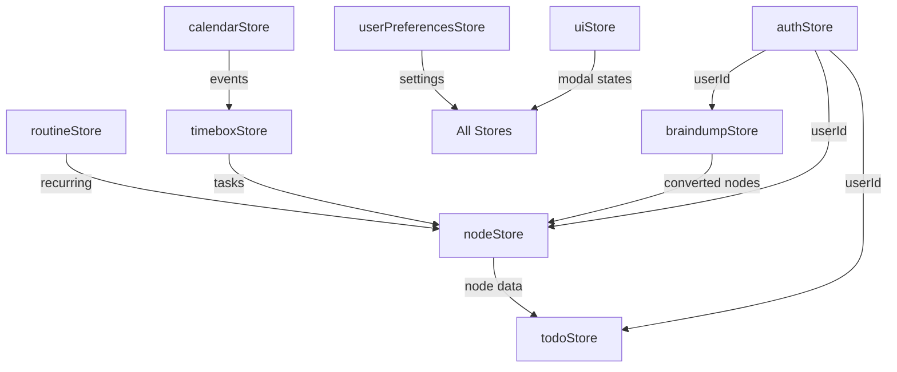

# Data Flow Analysis Audit
Date: 2025-01-18
Agent: data-flow-researcher
Status: Complete

## Executive Summary
Brain Space implements a sophisticated multi-store data architecture with 14 Zustand stores providing excellent optimistic updates and rollback mechanisms. However, the architecture suffers from store fragmentation, inconsistent synchronization patterns, and potential race conditions in concurrent operations.

## State Management Architecture

### Zustand Stores
Analysis reveals 14 separate Zustand stores creating significant architectural complexity:

**Core Data Stores:**
- `authStore` - Authentication and user state (simple, well-designed)
- `nodeStore` - Primary data entities with sophisticated CRUD operations
- `braindumpStore` - AI-processed thought categorization with hierarchical data
- `todoStore` - Task aggregation from multiple sources
- `timeboxStore` - Time-based task scheduling
- `optimizedTimeboxStore` - Performance-optimized version using Maps

**Feature Stores:**
- `journalStore` - Mood tracking and journal entries
- `routineStore` - Recurring task management
- `calendarStore` - Google Calendar integration
- `scheduleStore` - Schedule management
- `xpStore` - Gamification and experience points
- `userPreferencesStore` - UI preferences and settings
- `uiStore` - Modal states, themes, global UI state

**Specialized Stores:**
- Store fragmentation indicates over-separation of concerns

### Store Relationships


**Critical Issues:**
- No centralized state coordination
- Circular dependencies between stores
- Inconsistent data synchronization patterns

## Data Flow Patterns

### User Input Flow
**Brain Dump Flow (Primary Pattern):**
```
User Input → BrainDumpInput Component
    ↓
AI Service (/api/ai/categorize)
    ↓
braindumpStore.createEntry()
    ↓ (optimistic update)
Local State Update
    ↓ (async)
Firebase Persistence
    ↓ (on success)
Convert to Nodes → nodeStore.createNode()
    ↓ (batch operation)
Multiple Store Updates
```

**Node Creation Flow:**
```
Component → nodeStore.createNode()
    ↓ (step 1: optimistic)
Local State + isOptimistic flag
    ↓ (step 2: persistence)
Firebase setDoc()
    ↓ (step 3: success)
Remove optimistic flag
    ↓ (step 4: failure)
Rollback + error state + setTimeout clear
```

**Issues Identified:**
- **Race Condition Risk**: Multiple rapid createNode() calls can cause ID collisions
- **Inconsistent Error Handling**: Some stores clear errors automatically, others don't
- **Data Duplication**: Same node data exists in multiple stores without sync

### API Data Flow
**Authentication Flow:**
```
Firebase Auth → AuthContext → useAuthStore
    ↓
Middleware (Edge Runtime) → Token Validation
    ↓
API Routes → verifyAuth() → Request Headers
    ↓
Server Actions → Firebase Admin SDK
```

**AI Integration Flow:**
```
Client → AI Service (services/ai.ts)
    ↓
API Route (/api/ai/*)
    ↓ (provider selection)
OpenAI | Google AI | Mock Service
    ↓
Structured Response → Store Update
```

**Critical Findings:**
- **No Request Batching**: Each AI call is individual
- **Missing Caching**: No response caching for identical requests
- **Provider Fallback**: No automatic fallback between AI providers

### Real-time Updates
**Current Implementation:**
- No WebSocket or real-time listeners implemented
- Firebase real-time capabilities unused
- All updates are request/response based

**Missing Patterns:**
- Real-time collaboration support
- Cross-device synchronization
- Live data updates

## Synchronization Analysis

### Optimistic Updates
**Excellent Implementation in nodeStore:**
```typescript
// 1. OPTIMISTIC UPDATE: Add to UI immediately
const optimisticNodes = [...get().nodes, newNode]
set({ nodes: optimisticNodes })

// 2. PERSISTENCE: Save to Firestore
await setDoc(doc(db, 'users', nodeData.userId, 'nodes', nodeId), firestoreData)

// 3. SUCCESS: Remove optimistic flag
const successNodes = get().nodes.map(n => 
  n.id === nodeId ? { ...n, isOptimistic: undefined } : n
)

// 4. ROLLBACK: Remove failed node from UI
const rollbackNodes = get().nodes.filter(n => n.id !== nodeId)
```

**Strengths:**
- Immediate UI feedback
- Clear rollback strategy
- Consistent error handling with timeout
- User experience preservation

### Data Consistency
**Race Condition Risks:**
1. **Concurrent Node Creation**: Multiple rapid createNode() calls use timestamp-based IDs
2. **Parent-Child Relationships**: No atomic updates for hierarchical changes
3. **Store Cross-Dependencies**: todoStore aggregates from nodeStore without proper sync

**Example Race Condition:**
```typescript
// PROBLEM: Two rapid calls can generate same ID
const nodeId = `node-${Date.now()}-${Math.random().toString(36).substr(2, 9)}`

// SOLUTION NEEDED: Use crypto.randomUUID() or atomic counters
```

**Inconsistent Sync Patterns:**
- `braindumpStore` → `nodeStore`: Manual conversion required
- `routineStore` → `nodeStore`: No automatic sync
- `todoStore`: Aggregates data but doesn't update sources

## Critical Findings

### P0 - Data Integrity Issues
1. **Race Condition in Node IDs**
   - **Location**: `store/nodeStore.ts:117`
   - **Issue**: `Date.now()` can produce duplicate IDs in rapid succession
   - **Impact**: Data corruption, duplicate nodes
   - **Example**: Two clicks within same millisecond create identical IDs

2. **Inconsistent Parent-Child Updates**
   - **Location**: `store/nodeStore.ts:455-485`
   - **Issue**: Parent and child updates not atomic
   - **Impact**: Orphaned references, broken hierarchies
   - **Example**: Network failure between parent update and child update

3. **Store State Corruption**
   - **Location**: Multiple stores accessing same Firebase documents
   - **Issue**: No coordination between stores
   - **Impact**: Data inconsistency across UI components

### P1 - Significant Issues
1. **No Conflict Resolution**
   - **Issue**: Multiple users editing same node simultaneously
   - **Impact**: Last-write-wins, data loss
   - **Missing**: Operational transformation or CRDT patterns

2. **Store Fragmentation Overhead**
   - **Issue**: 14 separate stores with overlapping responsibilities
   - **Impact**: Bundle size, memory usage, maintenance complexity
   - **Example**: `timeboxStore` vs `optimizedTimeboxStore` duplication

3. **Synchronization Gaps**
   - **Issue**: Manual coordination required between related stores
   - **Impact**: UI state inconsistencies, stale data
   - **Example**: Node deletion doesn't update dependent stores

4. **Missing Operation Queuing**
   - **Issue**: Rapid user interactions can cause conflicts
   - **Impact**: Failed operations, inconsistent state
   - **Example**: Quick succession of node updates

### P2 - Improvements Needed
1. **Performance Optimization**
   - **Issue**: No request deduplication or caching
   - **Impact**: Unnecessary API calls, slow response times
   - **Solution**: Implement request queuing and response caching

2. **Error Recovery Patterns**
   - **Issue**: Limited retry mechanisms for failed operations
   - **Impact**: User frustration with temporary failures
   - **Solution**: Exponential backoff retry patterns

3. **Real-time Data Synchronization**
   - **Issue**: No live updates across sessions/devices
   - **Impact**: Stale data, poor collaboration experience
   - **Solution**: Firebase real-time listeners

## Data Flow Diagram
```
┌─────────────────┐    ┌─────────────────┐    ┌─────────────────┐
│   User Input    │───▶│   Client State  │───▶│  Server State   │
│                 │    │   (Zustand)     │    │   (Firebase)    │
└─────────────────┘    └─────────────────┘    └─────────────────┘
         │                       │                       │
         │              ┌─────────────────┐              │
         │              │   AI Services   │              │
         │              │  (OpenAI, etc)  │              │
         │              └─────────────────┘              │
         │                       │                       │
         ▼                       ▼                       ▼
┌─────────────────┐    ┌─────────────────┐    ┌─────────────────┐
│   Optimistic    │───▶│   Rollback      │───▶│   Persistence   │
│    Updates      │    │   Mechanism     │    │   Confirmed     │
└─────────────────┘    └─────────────────┘    └─────────────────┘

Store Coordination Issues:
authStore ──────────┐
nodeStore ──────────┼──▶ No Central Coordinator
braindumpStore ─────┤
todoStore ──────────┘
```

## Recommendations

### Immediate (P0) - Critical Fixes
1. **Fix Race Conditions**
   ```typescript
   // Replace timestamp IDs with crypto UUIDs
   const nodeId = crypto.randomUUID()
   
   // Implement atomic batch operations for relationships
   const batch = writeBatch(db)
   batch.update(parentRef, { children: [...children, childId] })
   batch.update(childRef, { parent: parentId })
   await batch.commit()
   ```

2. **Implement Operation Queuing**
   ```typescript
   // Add operation queue to prevent concurrent conflicts
   class OperationQueue {
     private queue: Promise<any> = Promise.resolve()
     
     async enqueue<T>(operation: () => Promise<T>): Promise<T> {
       return this.queue = this.queue.then(operation, operation)
     }
   }
   ```

3. **Add Store Coordination Layer**
   ```typescript
   // Central coordinator for cross-store operations
   class DataCoordinator {
     async deleteNode(nodeId: string) {
       // Coordinate updates across all affected stores
       await Promise.all([
         nodeStore.deleteNode(nodeId),
         todoStore.removeNodeTasks(nodeId),
         timeboxStore.removeNodeTasks(nodeId)
       ])
     }
   }
   ```

### Short-term (P1) - High Priority
1. **Consolidate Stores**
   - Merge `timeboxStore` and `optimizedTimeboxStore`
   - Combine UI-related stores (`uiStore`, `userPreferencesStore`)
   - Create domain-focused stores (Tasks, Content, UI, Integration)

2. **Implement Conflict Resolution**
   ```typescript
   // Last-write-wins with conflict detection
   interface ConflictableData {
     version: number
     lastModified: string
     lastModifiedBy: string
   }
   ```

3. **Add Request Batching**
   ```typescript
   // Batch multiple AI requests
   class AIBatchService {
     private pendingRequests = new Map()
     private batchTimeout = setTimeout(() => this.processBatch(), 100)
   }
   ```

### Medium-term (P2) - Performance & Features
1. **Real-time Synchronization**
   ```typescript
   // Firebase real-time listeners
   useEffect(() => {
     const unsubscribe = onSnapshot(
       collection(db, 'users', userId, 'nodes'),
       (snapshot) => {
         // Update store with real-time changes
         nodeStore.handleRealtimeUpdate(snapshot)
       }
     )
     return unsubscribe
   }, [userId])
   ```

2. **Implement Caching Layer**
   ```typescript
   // Request/response caching
   class CacheService {
     private cache = new Map()
     private ttl = 5 * 60 * 1000 // 5 minutes
   }
   ```

## Files Analyzed
**Core Data Flow Files:**
- `/store/nodeStore.ts` - Primary data store with excellent optimistic patterns
- `/store/braindumpStore.ts` - AI integration with hierarchical data structures
- `/store/authStore.ts` - Simple, well-designed authentication state
- `/store/optimizedTimeboxStore.ts` - Performance-optimized Map-based operations
- `/app/api/ai/categorize/route.ts` - AI service integration patterns
- `/services/ai.ts` - Client-side API interaction layer
- `/middleware.ts` - Authentication and request flow
- `/app/(dashboard)/braindump/braindump-client.tsx` - User input to data flow

**Supporting Files:**
- All remaining 10 Zustand stores for comprehensive architecture analysis
- Type definitions in `/types/node.ts` and related files
- API routes for data persistence patterns

## Priority Implementation Order
1. **Week 1**: Fix race conditions and implement operation queuing
2. **Week 2**: Add store coordination layer and conflict detection
3. **Week 3**: Consolidate redundant stores and optimize bundle size
4. **Week 4**: Implement real-time synchronization and caching layer

## Testing Strategy
- **Unit Tests**: Race condition scenarios, rollback mechanisms
- **Integration Tests**: Cross-store coordination, data consistency
- **Load Tests**: Concurrent operation handling, performance under stress
- **E2E Tests**: Complete data flow from input to persistence

## Open Questions
1. **Multi-device Sync**: How should conflicts be resolved across devices?
2. **Collaboration**: Should real-time collaboration be added to the roadmap?
3. **Store Architecture**: Is the current 14-store pattern sustainable for growth?
4. **Performance**: What's the acceptable latency threshold for AI operations?
5. **Data Migration**: How will existing data be migrated during store consolidation?