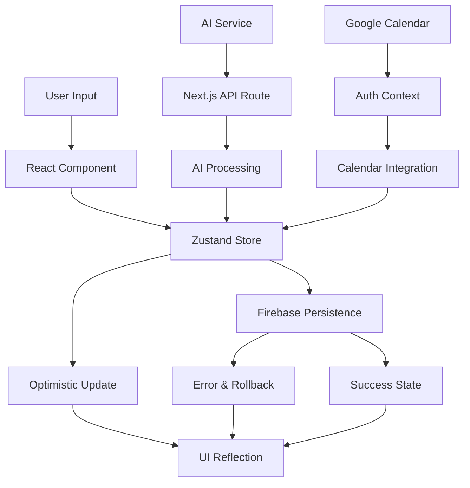

# Data Flow Research: Brain Space Next.js Application
Date: 2025-08-17
Agent: data-flow-researcher

## Executive Summary
Brain Space implements a complex multi-layered data flow architecture with Zustand for state management, Firebase for persistence, and optimistic UI updates. The application demonstrates sophisticated patterns including hierarchical relationships, real-time synchronization, and AI integration. However, it suffers from data consistency issues, synchronization gaps, and excessive bundle sizes.

## Context
- Project: Brain Space - Personal Knowledge Management PWA
- Current architecture: Next.js 15 + React 19 + Zustand + Firebase
- Complexity level: Complex
- Related research: PWA implementation, AI integration patterns

## Current Data Flow Analysis

### Data Sources
- APIs: 15+ Next.js API routes for AI processing and auth
- Databases: Firestore with user-scoped collections
- Local storage: Zustand persist middleware for UI preferences
- Third-party services: OpenAI, Google AI, Google Calendar
- AI Services: Brain dump categorization and enhancement

### State Locations
```
Application State Map:
├── Global State (Zustand Stores)
│   ├── Auth Store (user, loading, auth status)
│   ├── Node Store (nodes, relationships, operations)
│   ├── Brain Dump Store (entries, current entry, visualization)
│   ├── Timebox Store (time slots, tasks, drag state)
│   ├── Todo Store (todos, filters, source tracking)
│   ├── UI Store (theme, modals, toasts, AI settings)
│   ├── Journal Store (entries, mood tracking)
│   ├── Calendar Store (events, integration status)
│   ├── Routine Store (recurring tasks, schedules)
│   └── User Preferences Store (view modes, filters)
├── Component State
│   ├── Form data (React useState)
│   ├── Modal states (open/close)
│   ├── Loading states (per-operation)
│   └── UI interactions (hover, drag)
├── Server State (Firebase)
│   ├── User profiles (/users/{uid}/profile)
│   ├── Nodes (/users/{uid}/nodes)
│   ├── Brain dumps (/users/{uid}/braindumps)
│   ├── Timeboxes (/users/{uid}/timeboxes)
│   ├── Journals (/users/{uid}/journals)
│   └── Settings (/users/{uid}/settings)
└── Context State
    └── AuthContext (Firebase auth, Google Calendar)
```

### Data Flow Paths


## Key Findings

### Finding 1: Optimistic Update Pattern (Strong Implementation)
**Current Implementation**:
```javascript
// Node Store - Create Node with Optimistic Updates
createNode: async (nodeData: Partial<Node>) => {
  // 1. OPTIMISTIC UPDATE: Add to UI immediately
  const optimisticNodes = [...get().nodes, newNode]
  set({ nodes: optimisticNodes })
  
  try {
    // 2. PERSISTENCE: Save to Firestore
    await setDoc(doc(db, 'users', nodeData.userId, 'nodes', nodeId), firestoreData)
    
    // 3. SUCCESS: Remove optimistic flag
    const successNodes = get().nodes.map(n => 
      n.id === nodeId ? { ...n, isOptimistic: undefined } : n
    )
    set({ nodes: successNodes })
  } catch (error) {
    // 4. ROLLBACK: Remove failed node from UI
    const rollbackNodes = get().nodes.filter(n => n.id !== nodeId)
    set({ nodes: rollbackNodes, error: `Failed to create node: ${error.message}` })
  }
}
```

**Analysis**:
- Strengths: Immediate UI feedback, comprehensive error handling, clear rollback strategy
- Weaknesses: Complex state transitions, potential race conditions
- Scalability: Good for individual operations, may struggle with bulk operations

**Recommended Approach**:
Continue current pattern but add request deduplication and operation queuing for better reliability.

### Finding 2: Data Synchronization Gaps (Critical Issue)
**Current Implementation**:
```javascript
// Multiple stores operate independently without coordination
// Brain Dump Store creates nodes
const newEntry = await createEntry(title, rawText, userId)

// Node Store operates separately
await createNode(nodeData)

// No automatic synchronization between related data
```

**Analysis**:
- Strengths: Clear separation of concerns
- Weaknesses: Data can become inconsistent between stores, no automatic sync
- Scalability: Will cause increasing consistency issues as app grows

**Recommended Approach**:
```javascript
// Implement cross-store synchronization
interface DataSyncService {
  syncBrainDumpToNodes(brainDumpId: string): Promise<void>
  syncNodeToTimebox(nodeId: string): Promise<void>
  syncCalendarToNodes(eventId: string): Promise<void>
}
```

### Finding 3: Hierarchical Relationship Management (Complex but Robust)
**Current Implementation**:
```javascript
// Node Store - Complex relationship management
linkAsChild: async (parentId: string, childId: string) => {
  // Prevent circular dependencies
  const ancestors = get().getNodeAncestors(parentId)
  if (ancestors.some(a => a.id === childId)) {
    set({ error: 'Cannot create circular dependency' })
    return
  }
  
  // Update parent and child atomically
  await get().updateNode(parentId, {
    children: [...(parent.children || []), childId]
  })
  await get().updateNode(childId, { parent: parentId })
}
```

**Analysis**:
- Strengths: Circular dependency prevention, atomic updates, comprehensive utility functions
- Weaknesses: No cascade deletion handling, potential orphaned references
- Scalability: Good foundation but needs cleanup mechanisms

**Recommended Approach**:
Add automatic cleanup for orphaned relationships and cascade operations.

### Finding 4: Firebase Integration Pattern (Inconsistent)
**Current Implementation**:
```javascript
// Dynamic imports everywhere
const { db } = await import('@/lib/firebase')
const { collection, query, orderBy, getDocs } = await import('firebase/firestore')

// Inconsistent error handling
try {
  await operation()
} catch (error) {
  set({ error: (error as Error).message }) // Sometimes
  console.error('Error:', error) // Sometimes
  throw error // Sometimes
}
```

**Analysis**:
- Strengths: Reduced bundle size via dynamic imports
- Weaknesses: Inconsistent error handling, repeated import patterns
- Scalability: Will become maintenance burden as codebase grows

**Recommended Approach**:
```javascript
// Centralized Firebase service
class FirebaseService {
  static async withFirestore<T>(operation: (firestore: FirestoreModule) => Promise<T>): Promise<T> {
    const { db } = await import('@/lib/firebase')
    const firestore = await import('firebase/firestore')
    return operation({ db, ...firestore })
  }
}
```

## State Management Analysis

### Current Solution
- Technology: Zustand with persist middleware
- Complexity: High - 15+ stores with complex interdependencies
- Performance: Good for individual stores, coordination issues

### Store Architecture
```typescript
// Store Pattern Used Throughout
interface StorePattern<T> {
  // State
  data: T[]
  isLoading: boolean
  error: string | null
  
  // CRUD Operations
  load: (userId: string) => Promise<void>
  create: (data: Partial<T>) => Promise<string | null>
  update: (id: string, updates: Partial<T>) => Promise<void>
  delete: (id: string) => Promise<void>
  
  // Utilities
  getById: (id: string) => T | undefined
  clear: () => void
}
```

### Recommendations
1. **Short-term**: Implement store coordination middleware
2. **Medium-term**: Add request deduplication and caching layer
3. **Long-term**: Consider consolidated state management for related entities

## API Integration Patterns

### Current Approach
```javascript
// API Route Pattern
export async function POST(request: NextRequest) {
  // 1. Auth verification
  const { user, error } = await verifyAuth(authHeader)
  
  // 2. Input validation with Zod
  const { data, error: validationError } = await validateBody(request, schema)
  
  // 3. AI provider selection
  switch (provider) {
    case 'openai': return await callOpenAI(text)
    case 'google': return await callGoogleAI(text)
    default: return await mockCategorize(text)
  }
  
  // 4. Error handling with fallback
  catch (error) {
    return fallbackResponse()
  }
}
```

### Suggested Improvements
```javascript
// Improved API client with caching and retries
class APIClient {
  static async post<T>(
    endpoint: string, 
    data: any, 
    options: { retry?: number; cache?: boolean } = {}
  ): Promise<T> {
    // Implement retry logic, caching, and consistent error handling
  }
}
```

## Data Validation Strategy
- Input validation: Zod schemas for API routes
- Schema validation: TypeScript interfaces for type safety
- Type safety: Comprehensive TypeScript usage throughout
- Error boundaries: React Error Boundaries in key components

## Performance Considerations
- Bundle size impact: 83.3kB for /nodes route (CRITICAL - target <50kB)
- Runtime performance: Good with optimistic updates
- Memory usage: Potential leaks from event listeners and timeouts
- Network efficiency: No request deduplication or caching

## Migration Path

### Phase 1: Immediate Fixes (1-2 weeks)
1. Implement request deduplication
2. Add consistent error handling patterns
3. Fix data synchronization between brain dumps and nodes
4. Bundle size optimization for /nodes route

### Phase 2: Core Improvements (2-4 weeks)
1. Centralized Firebase service layer
2. Cross-store coordination middleware
3. Implement proper cleanup for relationships
4. Add offline-first capabilities

### Phase 3: Architecture Evolution (1-2 months)
1. Consolidated state management for related entities
2. Real-time synchronization with Firestore listeners
3. Advanced caching and performance optimization
4. Comprehensive testing coverage

## Testing Strategies
- Unit testing state: Only 1/15 stores currently tested
- Integration testing data flows: Missing
- Mocking strategies: Basic mock AI service exists
- E2E data scenarios: Not implemented

## Sources
- Documentation reviewed: Firebase docs, Zustand patterns, Next.js data fetching
- Codebase files analyzed: 15+ store files, 15+ API routes, service layers
- Patterns researched: Optimistic updates, hierarchical data, state synchronization

## Related Research
- Framework state management: Next.js App Router patterns
- Performance research: Bundle optimization strategies
- API/Backend research: Firebase best practices

## Recommendations Priority

### Critical (Fix Immediately)
1. **Bundle Size**: /nodes route at 83.3kB needs optimization
2. **Data Consistency**: Sync between brain dumps and nodes
3. **Error Handling**: Standardize error handling across stores

### Important (Next Sprint)
1. **Request Deduplication**: Prevent duplicate API calls
2. **Cleanup Mechanisms**: Handle orphaned relationships
3. **Testing Coverage**: Increase from 6.7% to 80%

### Nice to Have (Future Releases)
1. **Real-time Sync**: Firestore listeners for live updates
2. **Advanced Caching**: Smart cache invalidation
3. **Performance Monitoring**: Data flow metrics

## Open Questions
1. Should we implement real-time collaboration features?
2. How to handle conflicting updates from multiple devices?
3. What's the long-term strategy for AI service integration?
4. Should we consider migrating to a more centralized state solution?
5. How to implement proper offline-first architecture?

## Data Flow Integrity Issues

### Identified Problems
1. **Orphaned References**: Deleted nodes may leave dangling parent/child references
2. **Race Conditions**: Simultaneous updates can cause inconsistent state
3. **Memory Leaks**: Event listeners and timeouts not properly cleaned up
4. **Stale Data**: No automatic refresh mechanisms for long-running sessions

### Mitigation Strategies
1. Implement referential integrity checks
2. Add operation queuing for conflicting updates
3. Proper cleanup in useEffect hooks
4. Background sync and data validation