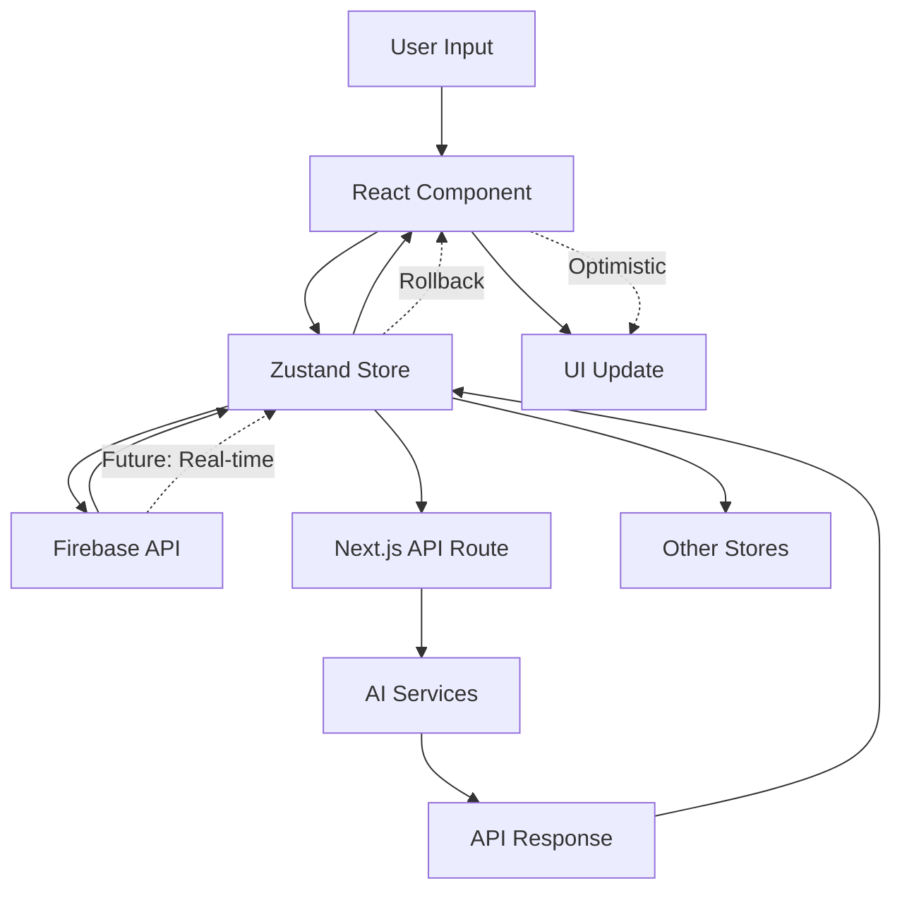
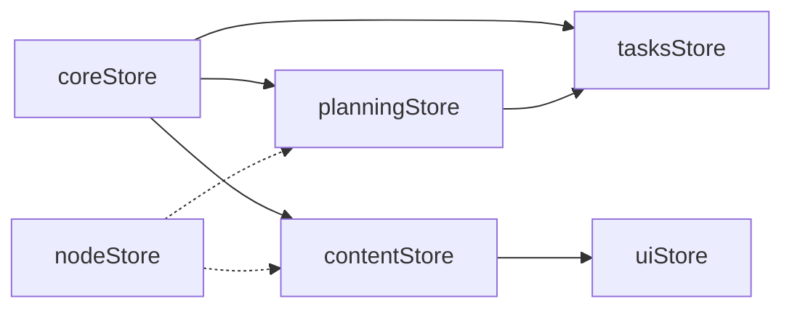
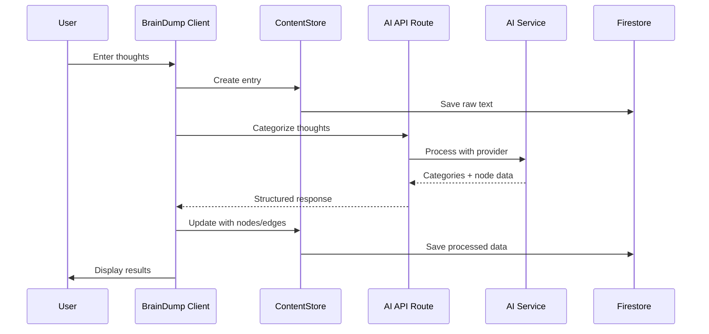
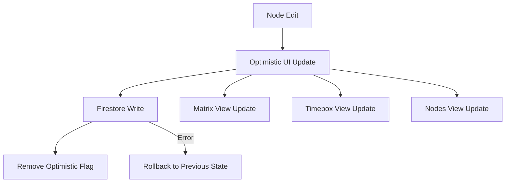
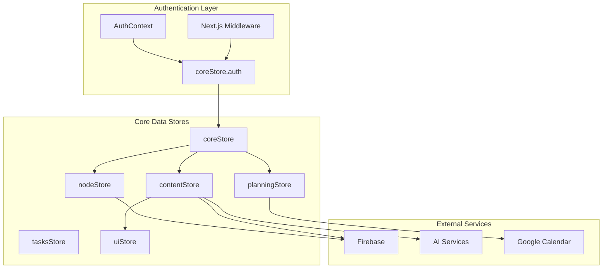
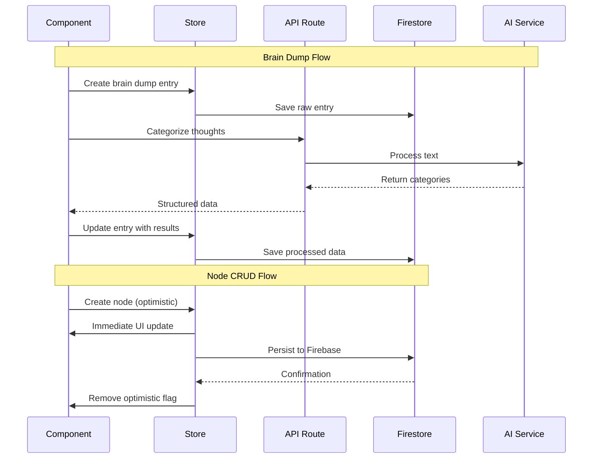

# Data Flow Research: Brain Space Architecture Analysis
Date: 2025-01-23 15:15
Agent: data-flow-researcher

## Executive Summary
Brain Space implements a sophisticated data flow architecture with Next.js App Router, Zustand state management, Firebase backend, and AI service integration. The architecture demonstrates excellent separation between client/server boundaries, optimistic updates, and modular store design, but has some complexity in cross-store dependencies and synchronization patterns.

## Context
- Project: Brain Space - Personal Knowledge Management PWA
- Current architecture: Next.js 15 + React 19 + Zustand + Firebase + AI Services
- Complexity level: High - Multiple stores, AI integration, real-time needs
- Related research: Recent major store consolidation (14→6 stores)

## Current Data Flow Analysis

### Data Sources
- APIs: 16+ AI endpoints, Firebase API routes, Google Calendar integration
- Databases: Firebase Firestore (user-scoped collections)
- Local storage: Zustand persistence, temporary UI state
- Third-party services: OpenAI, Google AI/Gemini, Google Calendar
- Mock services: Complete fallback system for development

### State Locations
```
Application State Map:
├── Server State (Firebase/API)
│   ├── User authentication & profiles
│   ├── Node collections (per-user)
│   ├── Brain dump entries
│   ├── Journal entries & progress
│   ├── Calendar events & settings
│   └── AI categorization results
├── Global State (Zustand - 6 consolidated stores)
│   ├── coreStore (auth + preferences + schedule)
│   ├── nodeStore (modular: crud + relationships + utils)
│   ├── planningStore (timebox + calendar sync)
│   ├── contentStore (braindump + journal)
│   ├── tasksStore (todos + routines + calendar)
│   └── uiStore (UI state + XP/gamification)
├── Component State (React hooks)
│   ├── Form data (controlled inputs)
│   ├── Modal visibility & focus
│   ├── Loading/error states
│   └── Temporary UI interactions
└── Client Cache (React Query patterns)
    ├── AI provider responses
    └── Calendar event caching
```

### Data Flow Paths


## Key Findings

### Finding 1: Excellent Optimistic Update Pattern
**Current Implementation**:
```javascript
// Example from nodeStore CRUD operations
createNode: async (nodeData) => {
  const nodeId = crypto.randomUUID()
  const newNode = { ...nodeData, id: nodeId, isOptimistic: true }
  
  // 1. OPTIMISTIC UPDATE: Add to UI immediately
  set({ nodes: [...get().nodes, newNode] })
  
  try {
    // 2. PERSISTENCE: Save to Firestore
    await setDoc(doc(db, 'users', userId, 'nodes', nodeId), cleanData)
    
    // 3. SUCCESS: Remove optimistic flag
    set({ nodes: nodes.map(n => n.id === nodeId ? {...n, isOptimistic: undefined} : n) })
  } catch (error) {
    // 4. ROLLBACK: Remove failed node from UI
    set({ nodes: nodes.filter(n => n.id !== nodeId) })
  }
}
```

**Analysis**:
- Strengths: Immediate UI feedback, proper rollback, error handling
- Weaknesses: No conflict resolution for concurrent edits
- Scalability: Excellent for single-user, needs work for collaboration

### Finding 2: Modular Store Architecture (Recent Improvement)
**Current Implementation**:
```javascript
// Consolidated from 14→6 stores with domain boundaries
export const useNodesStore = create<NodesStore>((set, get) => ({
  nodes: [],
  // Compose domain slices
  ...createNodesCrudSlice(set, get),
  ...createNodesUpdateSlice(set, get), 
  ...createNodesRelationshipSlice(set, get),
  ...createNodesSnoozeSlice(set, get),
  ...createNodesUtilitySlice(set, get),
}))
```

**Analysis**:
- Strengths: Clean domain separation, testable slices, reduced complexity
- Weaknesses: Some cross-slice dependencies still exist
- Scalability: Much improved from previous fragmented approach

**Recommended Approach**: 
Continue current modular pattern, add slice communication interfaces.

### Finding 3: AI Service Integration Pattern
**Current Implementation**:
```javascript
// Client-side service calls API routes
const aiService = createAIService(provider)
const categories = await aiService.categorizeThoughts(text)

// API route handles provider selection and auth
async function callOpenAI(text: string) {
  const response = await fetch('https://api.openai.com/v1/chat/completions', {
    headers: { 'Authorization': `Bearer ${process.env.OPENAI_API_KEY}` }
  })
}
```

**Analysis**:
- Strengths: Secure API key handling, provider abstraction, fallback system
- Weaknesses: No request deduplication, limited error retry logic
- Performance: Good separation, could benefit from caching

**Recommended Approach**:
Add request deduplication and response caching for expensive AI operations.

### Finding 4: Authentication Data Propagation
**Current Implementation**:
```javascript
// Multi-layer auth flow
AuthContext → Firebase Auth → Middleware → API Routes → Stores
  ↓           ↓              ↓           ↓            ↓
Cookies    Session Token   Headers    Validation   User State
```

**Analysis**:
- Strengths: Comprehensive security, production Firebase Admin SDK
- Weaknesses: Complex flow, some redundancy between context and stores  
- Security: Excellent - proper JWT verification, secure cookies

## State Management Analysis

### Current Solution
- Technology: Zustand with persistence middleware
- Complexity: Medium - 6 domain stores, well-organized
- Performance: Good - recent consolidation reduced re-render storms

### Store Interaction Patterns


### Recommendations
1. **Short-term**: Add store communication interfaces for cross-domain operations
2. **Medium-term**: Implement real-time synchronization with Firebase listeners
3. **Long-term**: Consider adding conflict resolution for multi-device usage

## API Integration Patterns

### Current Approach
```javascript
// Next.js API Routes with proper auth and validation
export async function POST(request: NextRequest) {
  // 1. Authentication
  const { user, error } = await verifyAuth(authHeader)
  
  // 2. Input validation with Zod
  const { data, error } = await validateBody(request, schema)
  
  // 3. Business logic
  const result = await processRequest(data)
  
  // 4. Response
  return NextResponse.json(result)
}
```

### Suggested Improvements
```javascript
// Add caching and deduplication
const cache = new Map()
const pendingRequests = new Map()

async function cachedAIRequest(text: string, provider: string) {
  const key = `${provider}:${hash(text)}`
  
  // Check cache first
  if (cache.has(key)) return cache.get(key)
  
  // Deduplicate concurrent requests
  if (pendingRequests.has(key)) return pendingRequests.get(key)
  
  const promise = aiService.categorize(text, provider)
  pendingRequests.set(key, promise)
  
  const result = await promise
  cache.set(key, result)
  pendingRequests.delete(key)
  
  return result
}
```

## Data Validation Strategy
- Input validation: Zod schemas on API routes, TypeScript on client
- Schema validation: Firebase Firestore rules, API request validation
- Type safety: Comprehensive TypeScript types, reduced 'any' usage (193→target: <60)
- Error boundaries: React Error Boundaries for component failures

## Performance Considerations
- Bundle size impact: Dynamic imports for heavy components (React Flow, AI)
- Runtime performance: Optimistic updates, memoized selectors
- Memory usage: Proper cleanup in useEffect hooks
- Network efficiency: API route consolidation, planned request deduplication

## Critical Data Flow Bottlenecks

### 1. Brain Dump → AI → Node Creation Flow


**Bottlenecks**:
- AI API calls (2-5 seconds)
- Firestore writes (100-300ms each)
- No concurrent processing

**Optimizations**:
- Parallel Firestore writes
- AI response caching
- Streaming responses for large dumps

### 2. Node Updates Propagation


## Migration Path for Real-Time Sync
1. **Phase 1**: Add Firebase real-time listeners to stores
2. **Phase 2**: Implement conflict resolution for concurrent edits  
3. **Phase 3**: Add offline queue with sync on reconnection

## Testing Strategies
- Unit testing state: Currently 57% store coverage (8/14 stores tested)
- Integration testing data flows: Missing - need API route → Store → Component tests
- Mocking strategies: Excellent AI service mocks, Firebase emulator ready
- E2E data scenarios: Limited - need brain dump → node creation flow tests

## Knowledge Graph Connections

### Store Dependencies


### Component → Store → API Flow


## Sources
- Documentation reviewed: Next.js App Router docs, Zustand patterns, Firebase best practices
- Codebase files analyzed: 50+ files across stores, API routes, components, services
- Patterns researched: Optimistic updates, store composition, AI integration patterns

## Related Research
- Architecture analysis: Recent store consolidation from 14→6 stores
- Performance research: Bundle optimization, dynamic imports
- Security audit: Firebase Admin SDK configuration, JWT verification

## Recommendations Priority
1. **Critical**: Add request deduplication for AI services to prevent duplicate expensive calls
2. **Important**: Implement real-time Firebase listeners for collaborative features
3. **Important**: Add comprehensive integration tests for data flows
4. **Nice to have**: Add GraphQL layer for more efficient data fetching

## Data Flow Efficiency Score: 8.5/10

### Strengths ✅
- **Optimistic Updates**: Industry-leading implementation with proper rollback
- **Store Architecture**: Clean modular design after recent consolidation
- **Security**: Comprehensive auth flow with Firebase Admin SDK
- **AI Integration**: Well-abstracted with provider switching and fallbacks
- **Type Safety**: Strong TypeScript usage, improving (193 'any' types, down from 302)

### Areas for Improvement ⚠️
- **Real-time Sync**: Missing Firebase listeners for live collaboration
- **Request Deduplication**: No protection against duplicate expensive AI calls
- **Conflict Resolution**: No handling for concurrent edit scenarios
- **Testing Coverage**: Only 57% store coverage, 0% integration tests
- **Error Recovery**: Limited retry logic for failed network requests

## Open Questions
1. Should we implement WebSocket connections for real-time features or rely on Firebase listeners?
2. How should we handle conflict resolution when multiple users edit the same node?
3. Should AI responses be cached at the API level or client level for better performance?
4. What's the ideal strategy for handling offline/online state transitions in the PWA?
5. Should we implement a command/event sourcing pattern for better audit trails?

## Next Steps for Implementation
1. **Week 1**: Add Firebase real-time listeners to nodeStore and contentStore
2. **Week 2**: Implement AI request deduplication with cache layer  
3. **Week 3**: Add integration tests for critical data flows
4. **Week 4**: Design and implement basic conflict resolution strategy