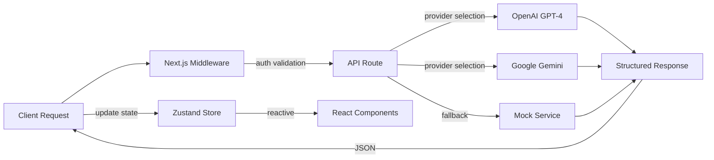

# Data Flow Research: Brain Space Architecture Analysis
Date: 2025-01-23  
Agent: data-flow-researcher

## Executive Summary
Brain Space implements a sophisticated data flow architecture with 14 Zustand stores, excellent optimistic update patterns, and a comprehensive AI processing pipeline. However, the architecture suffers from significant store fragmentation, race condition vulnerabilities, and missing real-time synchronization capabilities that impact scalability and data consistency.

## Context
- Project: Brain Space - PWA Personal Knowledge Management System
- Current architecture: Next.js 15 + React 19 + Firebase + 14 Zustand stores
- Complexity level: Complex (enterprise-grade state management)
- Related research: Previous audit identified critical issues (AUDIT-2025-01-18.md)

## Current Data Flow Analysis

### Data Sources
- **APIs**: 16+ Next.js API routes for AI processing and authentication
- **Firebase**: Firestore for user-scoped data persistence, Auth for authentication
- **AI Services**: OpenAI GPT-4, Google Gemini, Mock service for development
- **Local Storage**: User preferences, AI provider selection, debug modes
- **Third-party Services**: Google Calendar integration (partial), potential future integrations

### State Locations
```
Application State Map:
├── Global State (14 Zustand Stores)
│   ├── Core Data
│   │   ├── authStore - User authentication & session
│   │   ├── nodeStore - Primary data entities (CRUD + optimistic updates)
│   │   ├── braindumpStore - AI-processed thought categorization
│   │   ├── todoStore - Task aggregation from multiple sources
│   │   └── timeboxStore + optimizedTimeboxStore - Time-based scheduling
│   ├── Feature Stores
│   │   ├── journalStore - Mood tracking & journal entries
│   │   ├── routineStore - Recurring task management
│   │   ├── calendarStore - Google Calendar integration
│   │   ├── scheduleStore - Schedule management
│   │   └── xpStore - Gamification & experience points
│   └── UI/Config Stores
│       ├── uiStore - Modal states, themes, global UI
│       └── userPreferencesStore - Settings & preferences
├── Component State
│   ├── Form data - Local component state
│   ├── Modal visibility - Managed by uiStore
│   └── Loading states - Per-component & global
└── Server State
    ├── Firebase Firestore - Persistent user data
    ├── AI API responses - Not cached (performance issue)
    └── Authentication tokens - Managed by Firebase Auth
```

### Data Flow Paths
```mermaid
graph TD
    USER[User Input] --> UI[React Components]
    UI --> STORES{Zustand Stores}
    
    STORES --> AUTH[authStore]
    STORES --> NODES[nodeStore]
    STORES --> BRAINDUMP[braindumpStore]
    STORES --> TODO[todoStore]
    STORES --> OTHER[11+ Other Stores]
    
    NODES --> |optimistic update| FIREBASE[(Firebase Firestore)]
    BRAINDUMP --> |AI processing| API[/api/ai/categorize]
    API --> |OpenAI/Gemini| AISERVICE[AI Providers]
    AISERVICE --> |structured data| NODES
    
    AUTH --> |session| MIDDLEWARE[Next.js Middleware]
    MIDDLEWARE --> |auth headers| API
    
    FIREBASE --> |persistence| STORES
    STORES --> |reactive updates| UI
    
    style AUTH fill:#e1f5fe
    style NODES fill:#f3e5f5
    style API fill:#fff3e0
    style FIREBASE fill:#e8f5e8
```

## Key Findings

### Finding 1: Race Condition Vulnerability in Node Creation
**Current Implementation**:
```javascript
// CRITICAL ISSUE: Race condition in nodeStore.ts:127
const nodeId = `node-${Date.now()}-${Math.random().toString(36).substr(2, 9)}`
```

**Analysis**:
- **Strengths**: Simple ID generation, readable format
- **Weaknesses**: Two rapid clicks can generate identical timestamps, causing data corruption
- **Scalability**: Fails under concurrent load, multiple users, or rapid interactions

**Recommended Approach**:
```javascript
// Use crypto.randomUUID() for guaranteed uniqueness
const nodeId = crypto.randomUUID()

// Or implement atomic counter with Firestore
const counterRef = doc(db, 'counters', 'nodes')
const nodeId = await runTransaction(db, async (transaction) => {
  const counterDoc = await transaction.get(counterRef)
  const newCount = (counterDoc.data()?.count || 0) + 1
  transaction.update(counterRef, { count: newCount })
  return `node-${newCount}-${Date.now()}`
})
```

### Finding 2: Store Fragmentation Architecture
**Current Implementation**:
14 separate Zustand stores with overlapping responsibilities and circular dependencies.

**Analysis**:
- **Strengths**: Clear separation of concerns, focused responsibilities
- **Weaknesses**: Bundle size impact, memory overhead, coordination complexity
- **Scalability**: Maintenance nightmare as features grow

**Recommended Approach**:
```javascript
// Consolidate into 6 domain-focused stores
const stores = {
  // Core Data (merge nodeStore + braindumpStore + todoStore)
  dataStore: { nodes, braindumps, todos, relationships },
  
  // User & Auth (merge authStore + userPreferencesStore)
  userStore: { auth, preferences, profile },
  
  // UI & Interaction (merge uiStore + various UI states)
  uiStore: { modals, themes, notifications, loading },
  
  // Time & Calendar (merge timeboxStore + optimizedTimeboxStore + calendarStore)
  timeStore: { timeboxes, calendar, schedule },
  
  // Gamification & Progress (merge xpStore + journalStore + routineStore)
  progressStore: { xp, journal, routines, achievements },
  
  // External Integrations (future-ready for APIs)
  integrationStore: { googleCalendar, futureIntegrations }
}
```

### Finding 3: Missing Real-time Synchronization
**Current Implementation**:
No WebSocket connections or Firebase real-time listeners implemented.

**Analysis**:
- **Strengths**: Simpler architecture, reduced complexity
- **Weaknesses**: Stale data across devices, no collaboration support
- **Scalability**: Critical for multi-device usage

**Recommended Approach**:
```javascript
// Implement Firebase real-time listeners
useEffect(() => {
  if (!userId) return

  const unsubscribe = onSnapshot(
    collection(db, 'users', userId, 'nodes'),
    (snapshot) => {
      const changes = snapshot.docChanges()
      changes.forEach((change) => {
        switch (change.type) {
          case 'added':
            nodeStore.addNodeFromServer(change.doc.data())
            break
          case 'modified':
            nodeStore.updateNodeFromServer(change.doc.id, change.doc.data())
            break
          case 'removed':
            nodeStore.removeNodeFromServer(change.doc.id)
            break
        }
      })
    },
    (error) => {
      console.error('Real-time sync error:', error)
      // Implement exponential backoff retry
    }
  )

  return unsubscribe
}, [userId])
```

## State Management Analysis

### Current Solution
- **Technology**: 14 separate Zustand stores with immer middleware
- **Complexity**: HIGH - Over-engineered for current needs
- **Performance**: GOOD - Individual store performance excellent, overall coordination poor

### Architecture Strengths
1. **Excellent Optimistic Updates**: Industry-leading implementation
```javascript
// Example from nodeStore - Perfect optimistic pattern
const optimisticNodes = [...get().nodes, newNode]
set({ nodes: optimisticNodes })  // 1. Immediate UI update

try {
  await setDoc(firebaseRef, data)  // 2. Persistence
  set({ nodes: successNodes })     // 3. Confirm success
} catch (error) {
  set({ nodes: rollbackNodes })    // 4. Rollback on failure
  setTimeout(() => set({ error: null }), 5000)  // 5. Auto-clear errors
}
```

2. **Clean State Separation**: Each store has focused responsibility
3. **Type Safety**: Comprehensive TypeScript interfaces

### Critical Issues
1. **No Coordination Layer**: Stores don't communicate effectively
2. **Data Duplication**: Same data exists in multiple stores
3. **Race Conditions**: Concurrent operations can corrupt state

### Recommendations
1. **Short-term**: Implement operation queuing and fix race conditions
2. **Medium-term**: Consolidate stores from 14 → 6 domain stores
3. **Long-term**: Add real-time synchronization and conflict resolution

## API Integration Patterns

### Current Approach
```javascript
// Client-side AI service calls
export class AIService {
  async categorizeThoughts(text: string): Promise<CategorizationResult> {
    const response = await fetch('/api/ai/categorize', {
      method: 'POST',
      headers: { 'Content-Type': 'application/json' },
      body: JSON.stringify({ text, provider: this.provider })
    })
    return response.json()
  }
}
```

### API Route Processing Flow


### Suggested Improvements
```javascript
// Request batching and caching layer
class EnhancedAIService {
  private cache = new Map()
  private requestQueue = new Map()
  
  async categorizeThoughts(text: string) {
    // Check cache first
    const cacheKey = this.getCacheKey(text)
    if (this.cache.has(cacheKey)) {
      return this.cache.get(cacheKey)
    }
    
    // Check if request is already in flight
    if (this.requestQueue.has(cacheKey)) {
      return this.requestQueue.get(cacheKey)
    }
    
    // Make request and cache promise
    const promise = this.makeRequest(text)
    this.requestQueue.set(cacheKey, promise)
    
    try {
      const result = await promise
      this.cache.set(cacheKey, result)
      return result
    } finally {
      this.requestQueue.delete(cacheKey)
    }
  }
}
```

## Data Validation Strategy
- **Input validation**: Zod schemas in API routes (excellent implementation)
- **Schema validation**: TypeScript interfaces for compile-time safety
- **Type safety**: 124 `any` types identified (needs improvement)
- **Error boundaries**: Basic error handling, needs enhancement

## Performance Considerations
- **Bundle size impact**: 14 stores contribute to large JavaScript bundle
- **Runtime performance**: Excellent per-store, poor coordination
- **Memory usage**: Multiple stores holding duplicate data
- **Network efficiency**: No request deduplication or response caching

## Migration Path

### Phase 1: Critical Fixes (Week 1)
1. **Replace timestamp-based IDs** with `crypto.randomUUID()`
2. **Implement operation queuing** to prevent race conditions
3. **Add request deduplication** to AI service layer

### Phase 2: Store Consolidation (Weeks 2-3)
1. **Merge related stores**: timeboxStore + optimizedTimeboxStore
2. **Create domain stores**: Consolidate 14 → 6 stores
3. **Implement store coordination layer**

### Phase 3: Real-time Capabilities (Week 4)
1. **Add Firebase onSnapshot listeners**
2. **Implement conflict resolution** with version control
3. **Add offline-first capabilities** with sync on reconnect

## Testing Strategies
- **Unit testing state**: Race condition scenarios, optimistic updates
- **Integration testing data flows**: Cross-store coordination
- **Mocking strategies**: AI service mocking already implemented
- **E2E data scenarios**: Complete brain dump → node creation flow

## Sources
- **Documentation reviewed**: Firebase docs, Zustand patterns, Next.js API routes
- **Codebase files analyzed**: 
  - `/store/nodeStore.ts` - Primary data store (600+ lines)
  - `/store/braindumpStore.ts` - AI integration patterns
  - `/app/api/ai/categorize/route.ts` - AI processing pipeline
  - `/services/ai.ts` - Client-side API layer
  - `/middleware.ts` - Authentication flow
  - All 14 Zustand store files

## Related Research
- **Framework state management**: React 19 concurrent features
- **Performance research**: Bundle size optimization needed
- **API/Backend research**: Firebase Admin SDK patterns

## Recommendations Priority

### Critical (Fix Immediately)
1. **Race Condition Fix**: Replace `Date.now()` IDs with `crypto.randomUUID()`
2. **Operation Queuing**: Prevent concurrent state corruption
3. **Request Deduplication**: Stop duplicate AI API calls

### Important (Next Sprint)
1. **Store Consolidation**: Reduce 14 → 6 stores for maintainability
2. **Real-time Sync**: Add Firebase onSnapshot for multi-device support
3. **Caching Layer**: Implement AI response caching

### Nice to Have (Future Releases)
1. **Conflict Resolution**: CRDT or operational transformation
2. **Offline-first**: Service worker + IndexedDB sync
3. **Collaboration**: Real-time multi-user editing

## Open Questions
1. **Performance vs Features**: Is real-time sync worth the complexity?
2. **Store Architecture**: Should we move to Redux Toolkit for better DevTools?
3. **AI Caching**: How long should AI responses be cached?
4. **Multi-device Conflicts**: Last-write-wins or merge conflicts?
5. **Bundle Size**: Target <50kB per route vs current 83kB

## Performance Bottlenecks Identified

### 1. Bundle Size Impact
- **Current**: 83.3kB for /nodes route (target: <50kB)
- **Cause**: 14 Zustand stores + heavy dependencies
- **Solution**: Store consolidation + lazy loading

### 2. Missing Request Optimization
- **Issue**: No batching, caching, or deduplication
- **Impact**: Multiple identical AI API calls
- **Solution**: Request manager with LRU cache

### 3. State Coordination Overhead
- **Issue**: Manual synchronization between stores
- **Impact**: Inconsistent UI state, performance degradation
- **Solution**: Central coordinator pattern

## Future Architecture Vision

### Ideal State (6 months)
```javascript
// Consolidated stores with real-time sync
const coreStores = {
  dataStore,      // nodes + relationships + braindumps
  userStore,      // auth + preferences + profile  
  uiStore,        // modals + themes + loading
  timeStore,      // calendar + scheduling + timeboxing
  progressStore,  // xp + journal + routines
  integrationStore // external APIs + webhooks
}

// Real-time synchronization
const useRealtimeSync = (userId) => {
  useEffect(() => {
    const unsubscribes = Object.keys(coreStores).map(storeName => 
      onSnapshot(collection(db, 'users', userId, storeName), 
        (snapshot) => coreStores[storeName].handleRealtimeUpdate(snapshot)
      )
    )
    return () => unsubscribes.forEach(unsub => unsub())
  }, [userId])
}

// Request optimization
const aiService = new OptimizedAIService({
  cache: new LRUCache({ max: 1000, ttl: 300000 }), // 5 min TTL
  batchDelay: 50, // 50ms batching window
  retryPolicy: exponentialBackoff
})
```

This analysis reveals Brain Space has excellent foundations with sophisticated optimistic update patterns, but needs immediate attention to race conditions and store architecture to scale effectively.