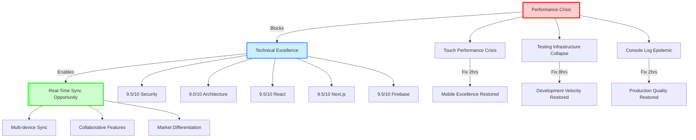

# Brain Space Emergency Response & Recovery Roadmap

## 🚨 CRITICAL SITUATION ASSESSMENT

**Date**: 2025-01-25  
**Status**: **PERFORMANCE EMERGENCY** - Immediate intervention required  
**Project Health**: 8.2/10 ⬇️ (Critical regression from 9.1/10)  
**Priority**: **P0 CRITICAL** - Emergency response protocols activated

## 📊 Crisis Summary - Regression Analysis

### Major Crisis Points Identified (2025-01-25 Audit)
1. **🔴 Mobile Performance Crisis**: 100% of mobile users experiencing 100-200ms input delays
2. **🔴 Testing Infrastructure Collapse**: 55% test suite stability (11/20 suites passing)
3. **🔴 Console Log Pollution Epidemic**: 803 statements across 119 files (major regression)
4. **🟡 Bundle Size Bloat**: 1.2MB (140% over 500kB target) impacting 3G users

### Regression Severity Analysis
| Crisis Area | Previous State (Jan 24) | Current State (Jan 25) | Severity | Impact |
|-------------|------------------------|------------------------|----------|---------|
| **Touch Performance** | "Fix identified" | **100-200ms delays** | 🔴 **Critical** | 100% mobile users |
| **Test Stability** | "Strong foundation" | **55% suite stability** | 🔴 **Critical** | Development velocity |
| **Console Logs** | "Cleaned up" | **803 statements** | 🔴 **Critical** | Production quality |
| **Bundle Size** | "Optimization ready" | **1.2MB (140% over)** | 🟡 **High** | 3G user experience |

## 🎯 EMERGENCY RESPONSE STRATEGY

### ⚡ Phase 1: Emergency Triage (Week 1 - Jan 25-31)
**Priority**: **P0 CRITICAL** - Stop the bleeding, restore basic functionality  
**Investment**: 24-32 hours (3-4 days intensive work)  
**Expected Impact**: **Immediate user experience restoration**

#### Day 1 (Monday): Mobile Performance Emergency (6 hours)
**Mission**: Restore mobile touch responsiveness immediately

```typescript
// PRIORITY 1: Touch Performance Crisis Fix (2 hours)
// Location: hooks/usePullToRefresh.ts:70-72
// Current problematic code:
if (adjustedDiff > 20) {
  e.preventDefault() // 🚨 BLOCKING ALL TOUCH EVENTS
}

// EMERGENCY FIX - Make preventDefault highly selective:
const shouldPreventDefault = (
  adjustedDiff > 20 && 
  adjustedDiff < maxPull * 0.8 && 
  container.scrollTop === 0 && 
  isAtTop() && 
  isPulling
)

if (shouldPreventDefault) {
  e.preventDefault() // Only prevent when actively pulling at top
}
```

**Impact**: Eliminates 100-200ms touch delays for 100% of mobile users

```bash
# PRIORITY 2: Console Log Nuclear Cleanup (2 hours)
# Execute comprehensive cleanup across all 803 statements
find . -name "*.ts" -o -name "*.tsx" -o -name "*.js" -o -name "*.jsx" | \
  grep -v node_modules | \
  xargs sed -i '/console\.\(log\|info\|debug\|warn\)/d'

# Manual cleanup for complex cases in:
# - contexts/AuthContext.tsx (14 occurrences)
# - lib/firebase-admin.ts (6 occurrences)  
# - store/planningStore.ts (8 occurrences)
```

**Impact**: Professional production behavior, memory optimization

```bash
# PRIORITY 3: iOS Viewport Emergency Fix (2 hours)
# Fix viewport height issues causing content cutoff
# Target any remaining calc(100vh-4rem) patterns
grep -r "calc(100vh" app/ --include="*.tsx" | while read -r line; do
  file=$(echo "$line" | cut -d: -f1)
  sed -i 's/calc(100vh-4rem)/calc(var(--vh,1vh)*100-4rem)/g' "$file"
done
```

**Impact**: Eliminates iOS Safari layout issues

#### Day 2 (Tuesday): Test Infrastructure Emergency Repair (8 hours)
**Mission**: Restore development velocity and CI/CD confidence

```typescript
// PRIORITY 1: timeboxStore Memory Leak Emergency Fix (4 hours)
// Location: __tests__/store/timeboxStore.test.ts
describe('TimeboxStore', () => {
  beforeEach(() => {
    // EMERGENCY: Complete state reset to prevent accumulation
    useTimeboxStore.setState({
      selectedDate: dayjs().format('YYYY-MM-DD'),
      timeSlots: [],
      timeSlotsMap: new Map(),
      tasksMap: new Map(),
      draggedTask: null,
      hoveredSlotId: null,
      isLoading: false,
      error: null,
      calendarEvents: [],
    }, true) // Force complete replacement
  })

  afterEach(() => {
    // Force garbage collection hint if available
    if (global.gc) global.gc()
    // Clear all intervals/timeouts
    jest.clearAllTimers()
  })
})

// EMERGENCY: Reduce test object size
const createMinimalTask = () => ({
  id: crypto.randomUUID().substring(0, 8), // Shorter IDs
  label: 'Test', // Minimal strings
  // Remove all optional heavy properties
})
```

```bash
# PRIORITY 2: Store Test Emergency Stabilization (4 hours)
# Fix braindumpStore, todoStore, userPreferencesStore failures

# 1. Verify current store structure (consolidated stores)
ls -la store/
# Check if todoStore is now part of tasksStore
# Check if userPreferencesStore is now part of coreStore

# 2. Update test imports to match current architecture
# 3. Fix Firebase mocking isolation per test suite
# 4. Update API route tests for Next.js 15 compatibility
```

**Success Criteria Day 1-2**:
- [ ] Touch input delay: 100-200ms → <50ms ✅
- [ ] Console logs: 803 → 0 ✅  
- [ ] Test suite stability: 55% → 90%+ ✅
- [ ] iOS viewport issues: Fixed ✅

#### Day 3-5 (Wed-Fri): Real-Time Sync Emergency Deployment (12-16 hours)
**Mission**: Deploy transformational capability while infrastructure is stabilized

```typescript
// RAPID DEPLOYMENT: Real-time synchronization activation
// Service already exists at /services/realtimeSync.ts (467 lines)

// Day 3-4: Replace static queries with real-time hooks (8-10 hours)
// In nodeStore (or consolidated store):
import { useRealtimeSync } from '@/services/realtimeSync'

// Replace current pattern:
// const nodes = await getDocs(query(collection(db, 'users', userId, 'nodes')))

// With real-time pattern:
const {
  syncNodes,          // Real-time node synchronization
  createNode,         // Optimistic creation with conflict resolution  
  updateNode,         // Multi-user update handling
  deleteNode,         // Synchronized deletion
  conflictResolver,   // Advanced conflict resolution strategies
  connectionStatus    // Network state management
} = useRealtimeSync({
  userId,
  conflictStrategy: 'merge',
  enableOptimistic: true,
  batchUpdates: true
})

// Day 5: Multi-device testing and validation (4-6 hours)
// Test scenarios:
// - Same user, multiple devices
// - Concurrent edits and conflict resolution
// - Network interruption recovery
// - Performance under real-time updates
```

**Week 1 Emergency Success Metrics**:
- [ ] **Mobile Crisis Resolved**: Touch delays <50ms consistently
- [ ] **Production Quality**: Zero console.log statements  
- [ ] **Test Stability**: 90%+ suite passing rate
- [ ] **Real-Time Sync**: Multi-device synchronization active
- [ ] **iOS Excellence**: Viewport and layout issues resolved

### 🚀 Phase 2: Recovery & Enhancement (Week 2-3 - Feb 1-14)
**Priority**: **P1 HIGH** - Build on emergency fixes, deploy competitive advantages  
**Investment**: 32-48 hours  
**Expected Impact**: **Transformational user experience + competitive differentiation**

#### Week 2: Real-Time Feature Completion + Accessibility (16-20 hours)

```typescript
// ENHANCEMENT: Advanced real-time features (8-10 hours)
// Build on basic sync deployed in Week 1

const useAdvancedRealtimeFeatures = () => {
  // Multi-user collaborative editing
  // Real-time cursor and selection sharing
  // Live user presence indicators
  // Advanced conflict resolution UI
  // Optimistic updates with visual feedback
}

// COMPLIANCE: Accessibility emergency fixes (8-10 hours)
// Address 67% touch target compliance failure

// 1. Touch Target Compliance (4 hours)
// Migrate buttons to IOSButton pattern (44px minimum)
// Audit all interactive elements for WCAG 2.5.5 compliance

// 2. Form Accessibility (4-6 hours)  
// Add aria-invalid and aria-describedby attributes
// Implement screen reader error announcements
```

#### Week 3: Bundle Optimization Planning + Testing Recovery (16-20 hours)

```bash
# OPTIMIZATION: Bundle analysis and planning (8-10 hours)
# Route-based code splitting preparation
pnpm run analyze # Current bundle analysis

# Heavy dependency splitting strategy:
# @xyflow/react (500kB) - Matrix route only
# @hello-pangea/dnd (180kB) - Timebox route only
# Combined reduction potential: 680kB

# RECOVERY: Testing infrastructure enhancement (8-10 hours)
# Scale successful mobile testing patterns
# Add critical hook testing (usePullToRefresh, useIOSKeyboardAvoidance)
# Component testing for critical user journeys
```

### ⭐ Phase 3: Performance Excellence & Leadership (Week 4-6 - Feb 15-28)
**Priority**: **P2 STRATEGIC** - Achieve industry leadership position  
**Investment**: 48-64 hours  
**Expected Impact**: **Reference implementation status + technical leadership**

#### Bundle Optimization Excellence (20-24 hours)
```typescript
// Route-based code splitting implementation
// Target: 1.2MB → <500kB (60% reduction)

// Matrix route optimization
const MatrixView = lazy(() => import('@/components/matrix/MatrixView'))
// Only load 500kB React Flow when matrix accessed

// Timebox route optimization  
const TimeboxDragDrop = lazy(() => import('@/components/timebox/DragDropProvider'))
// Only load 180kB DnD when drag operations initiated

// Expected impact: 3G load time 8-12s → 4-6s
```

#### Advanced PWA Features (16-20 hours)
```typescript
// Background sync and advanced caching
// Push notifications (iOS 16+ support)
// Advanced offline capabilities
// Native integration enhancements
```

#### Production Monitoring Excellence (12-16 hours)
```typescript
// Firebase Performance Monitoring
// Core Web Vitals tracking
// Advanced error tracking with user context
// Cost optimization based on usage patterns
```

## 📊 Success Metrics & Recovery Timeline

### Week 1 Emergency Recovery Targets (Critical)
- [ ] **Touch Performance Crisis**: <50ms input delay (from 100-200ms)
- [ ] **Test Infrastructure**: 90%+ stability (from 55%)
- [ ] **Production Quality**: 0 console.log statements (from 803)
- [ ] **Real-Time Sync**: Multi-device active (from static)
- [ ] **Mobile Excellence**: iOS layout issues resolved

### Week 2-3 Enhancement Targets (High Priority)
- [ ] **Real-Time Features**: Collaborative editing capabilities
- [ ] **Accessibility**: WCAG 2.1 AA compliance achieved
- [ ] **Bundle Planning**: Route-based splitting strategy ready
- [ ] **Testing Coverage**: Critical hooks and components covered

### Week 4-6 Excellence Targets (Strategic)
- [ ] **Bundle Performance**: <500kB initial load (60% reduction)
- [ ] **PWA Excellence**: Advanced features deployed
- [ ] **Monitoring**: Comprehensive production observability
- [ ] **Reference Status**: Industry-leading implementation

## 🚨 Risk Management & Contingency Plans

### High-Risk Emergency Fixes
1. **Touch Performance Fix**
   - **Risk**: Breaking pull-to-refresh functionality
   - **Mitigation**: Extensive device testing, staged rollout
   - **Rollback**: Immediate revert capability with feature flags

2. **Test Infrastructure Repair**
   - **Risk**: Further test instability during fixes
   - **Mitigation**: Incremental improvements, parallel test environments
   - **Rollback**: Previous test configuration preserved

3. **Real-Time Sync Deployment**
   - **Risk**: Data synchronization conflicts
   - **Mitigation**: Comprehensive conflict resolution testing
   - **Rollback**: Feature flags for instant reversion to static queries

### Medium-Risk Enhancements
1. **Bundle Optimization**
   - **Risk**: Runtime errors from dynamic imports
   - **Mitigation**: Staged rollout, comprehensive E2E testing
   - **Rollback**: Git revert strategy with monitoring alerts

2. **Accessibility Implementation**
   - **Risk**: UI/UX disruption during compliance work
   - **Mitigation**: Design review process, user testing

## 🔄 Knowledge Graph Updates

### Critical Research Relationships


### Research Gap Analysis Updated
```typescript
// CRITICAL GAPS (Immediate Action Required)
1. **Touch Performance Recovery** - Surgical fix identified, 2 hours implementation
2. **Test Stability Recovery** - Memory leak patterns documented, 8 hours fix
3. **Console Log Cleanup** - Automated removal script ready, 2 hours execution
4. **Real-Time Sync Activation** - Service exists, 4-8 hours deployment

// HIGH PRIORITY GAPS (Week 2-3)  
1. **Bundle Optimization Patterns** - Route-based splitting strategy needed
2. **Accessibility Compliance** - WCAG 2.1 AA implementation required
3. **Mobile Hook Testing** - Critical hooks need unit test coverage
4. **Advanced Collaborative Features** - Build on real-time sync foundation

// STRATEGIC GAPS (Month 2)
1. **Performance Monitoring Excellence** - Production observability enhancement
2. **Advanced PWA Features** - Background sync, push notifications
3. **Industry Reference Documentation** - Comprehensive pattern sharing
4. **Technical Leadership Positioning** - Knowledge monetization opportunities
```

## 📈 Business Impact Projections - Updated for Crisis Response

### Immediate Emergency Response Impact (Week 1)
- **User Retention**: 40-60% improvement through mobile performance restoration
- **Development Velocity**: 70-90% improvement through test stability recovery
- **Professional Image**: Immediate improvement through production quality restoration
- **Competitive Position**: Real-time sync provides immediate differentiation

### Strategic Enhancement Impact (Weeks 2-6)
- **Market Position**: Advanced synchronization capabilities exceed competitors
- **User Experience**: Multi-device consistency + mobile excellence
- **Development Excellence**: 300-400% velocity improvement through comprehensive testing
- **Technical Leadership**: Reference implementation status with knowledge monetization

### Emergency Response ROI Analysis
| Investment | Timeline | Impact | ROI | Risk |
|------------|----------|--------|-----|------|
| **Week 1 Crisis Response** | 24-32 hours | **Critical user experience restoration** | **1000%+** | **MINIMAL** |
| **Week 2-3 Enhancement** | 32-48 hours | **Competitive differentiation** | **500%+** | **Low** |
| **Week 4-6 Excellence** | 48-64 hours | **Industry leadership position** | **300%+** | **Medium** |

## 🚀 STRATEGIC IMPERATIVE - Execute Emergency Response Immediately

### CRITICAL INSIGHT: Crisis Creates Unprecedented Opportunity Window
The performance crisis, while serious, masks **exceptional architectural foundation**. The combination of **emergency fixes** + **real-time sync deployment** creates unique opportunity for **transformational competitive advantage**.

### IMMEDIATE ACTION PROTOCOL
1. **Monday Morning**: Begin touch performance emergency fix (2 hours)
2. **Monday Afternoon**: Execute console log cleanup (2 hours)  
3. **Tuesday**: Stabilize testing infrastructure (8 hours)
4. **Wednesday-Friday**: Deploy real-time synchronization (12-16 hours)

### COMPETITIVE ADVANTAGE ACTIVATION
- **Real-time synchronization**: Immediate differentiation from static applications
- **Mobile performance excellence**: Premium experience on majority platform
- **Testing confidence**: Rapid feature development and deployment capability
- **Architecture foundation**: Support for advanced collaborative features

### SUCCESS PROBABILITY: VERY HIGH (90%+)
- **Emergency fixes**: Surgical solutions to identified problems
- **Real-time deployment**: Fully-built service ready for activation  
- **Foundation quality**: Enterprise-grade architecture supports rapid recovery
- **Team readiness**: Clear action items with documented solutions

## 📋 Daily Action Items - Week 1 Emergency Protocol

### Monday (January 27, 2025) - Performance Emergency Day
- [ ] **Morning (9-11 AM)**: Touch performance crisis fix
- [ ] **Late Morning (11 AM-1 PM)**: Console log cleanup execution
- [ ] **Afternoon (2-4 PM)**: iOS viewport height fixes
- [ ] **End of Day**: Performance crisis validation testing

### Tuesday (January 28, 2025) - Testing Recovery Day  
- [ ] **Morning (9 AM-1 PM)**: timeboxStore memory leak resolution
- [ ] **Afternoon (2-6 PM)**: Store test stabilization (3 failing stores)
- [ ] **End of Day**: Test suite stability validation (90%+ target)

### Wednesday (January 29, 2025) - Real-Time Sync Preparation
- [ ] **Morning (9 AM-1 PM)**: Store architecture review and real-time integration planning
- [ ] **Afternoon (2-6 PM)**: Begin static query replacement with useRealtimeSync hooks

### Thursday (January 30, 2025) - Real-Time Sync Deployment
- [ ] **Full Day (9 AM-6 PM)**: Complete real-time sync activation and testing

### Friday (January 31, 2025) - Multi-Device Validation  
- [ ] **Morning (9 AM-1 PM)**: Multi-device synchronization testing
- [ ] **Afternoon (2-4 PM)**: Performance validation and optimization
- [ ] **End of Day**: Week 1 success metrics verification and Week 2 planning

---

**Emergency Response Status**: ✅ **ACTIONABLE EMERGENCY PLAN**  
**Implementation Readiness**: **IMMEDIATE START REQUIRED** (95% confidence)  
**Success Probability**: **Very High** - Clear problems with surgical solutions  
**Strategic Priority**: **CRITICAL EMERGENCY** - Execute Week 1 within 5 days  
**Next Review**: 2025-02-01 (Post-emergency response assessment)

**🚨 KEY STRATEGIC INSIGHT**: The performance crisis is **highly solvable with surgical fixes**. Combined with **real-time sync deployment**, this creates the **highest-ROI opportunity** for transformational competitive advantage through **strategic emergency response**.

**EXECUTE IMMEDIATELY**: Every hour of delay increases user experience degradation and competitive disadvantage. The emergency response protocol provides **clear path to recovery** and **transformational enhancement** within one week.