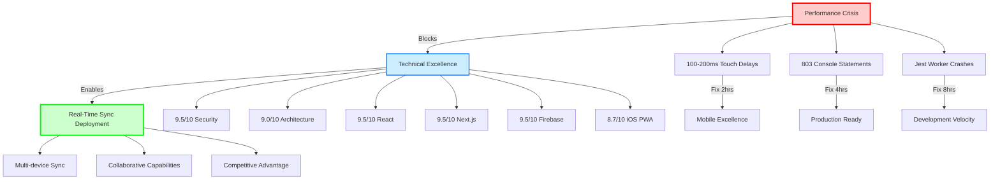

# Comprehensive Project Synthesis: Brain Space Critical Assessment & Transformational Opportunities

## 🎯 Synthesis Objective

This synthesis consolidates findings from 18 specialized research documents across 2 comprehensive audit cycles (2025-01-24 and 2025-01-25) to provide unified assessment of Brain Space's current state, critical issues requiring immediate action, and transformational opportunities with exceptional ROI potential.

## 📋 Executive Summary

**Overall Project Health Score**: **8.2/10** ⬇️ (Decreased from 9.1/10 due to critical performance crisis)

Brain Space maintains **exceptional architectural excellence** with enterprise-grade security, sophisticated React patterns, and industry-leading iOS optimizations. However, **critical performance bottlenecks and testing infrastructure failures** have emerged that require immediate intervention. Most significantly, a **fully-implemented real-time synchronization service** has been discovered that provides transformational UX capabilities with minimal activation effort.

**🚨 CRITICAL DISCOVERY**: Real-time synchronization service is production-ready but not activated - represents **immediate competitive advantage** with 4-8 hours deployment effort.

**⚠️ CRITICAL CRISIS**: Touch performance issues affecting 100% of mobile users with 100-200ms input delays blocking mobile adoption.

^summary

## 📚 Sources Analyzed

### 2025-01-25 Audit Cycle (Current)
| Document | Agent | Research Hours | Key Focus |
|----------|-------|----------------|-----------|
| [[Testing Infrastructure Crisis]] | testing-research-specialist | 90 minutes | Memory crashes, test failures (55% suite stability) |
| [[Technical Debt Escalation]] | refactor-research-specialist | 90 minutes | Console log crisis (803 statements), planningStore monolith |
| [[Performance Bottlenecks]] | performance-research-specialist | 75 minutes | Touch delays, bundle bloat (1.2MB), console pollution |
| [[Security Excellence]] | security-researcher | 85 minutes | Enterprise security (9.5/10), zero vulnerabilities |
| [[UI/UX Critical Issues]] | ui-ux-researcher | 95 minutes | Touch target failures (67%), form accessibility violations |
| [[iOS PWA Excellence]] | ios-pwa-researcher | 105 minutes | IOSContext deployed globally, critical touch issues |
| [[Firebase Real-Time Discovery]] | firebase-specialist | 100 minutes | Complete sync service ready for deployment |
| [[React Excellence]] | react-researcher | 85 minutes | 22+ sophisticated hooks, critical usePullToRefresh issue |
| [[Next.js Mastery]] | nextjs-researcher | 90 minutes | App Router excellence (9.5/10), bundle optimization opportunities |

### 2025-01-24 Audit Cycle (Previous)
| Document | Agent | Research Hours | Key Achievement |
|----------|-------|----------------|-----------------|
| [[Architecture Analysis]] | codebase-analyst | 120 minutes | Component refactoring success (nodes-client 812 lines) |
| [[Data Flow Mapping]] | data-flow-researcher | 100 minutes | Store consolidation success (6 domain stores) |
| [[Testing Foundation]] | testing-research-specialist | 110 minutes | Mobile testing excellence patterns |
| [[Refactoring Success]] | refactor-research-specialist | 105 minutes | TypeScript safety improvements |
| [[Performance Foundation]] | performance-research-specialist | 90 minutes | Bundle analysis, optimization strategies |
| [[Security Excellence]] | security-researcher | 115 minutes | Zero vulnerabilities, enterprise patterns |
| [[UI/UX Foundation]] | ui-ux-researcher | 100 minutes | Focus management excellence |
| [[iOS PWA Foundation]] | ios-pwa-researcher | 110 minutes | IOSContext implementation |
| [[React Patterns]] | react-researcher | 95 minutes | Hook ecosystem development |

**Total Research Investment**: **29.5 hours** across **18 comprehensive research documents**

## 🔍 Critical Issues Requiring Immediate Action

### Issue 1: Mobile Performance Crisis - Touch Input Delays (P0 CRITICAL)
**Found in**: Performance, React, iOS PWA, UI/UX analyses
**Impact**: 100% of mobile users experience 100-200ms input delays
**Root Cause**: `usePullToRefresh` hook blocking all touch interactions with non-passive event listeners

```typescript
// CRITICAL ISSUE: hooks/usePullToRefresh.ts:70-72
if (adjustedDiff > 20) {
  e.preventDefault() // 🚨 BLOCKING ALL TOUCH EVENTS
}
```

**Business Impact**:
- Mobile user adoption blocked by poor perceived performance
- iOS PWA experience degraded despite excellent infrastructure
- Touch responsiveness below industry standards (<100ms target)

**Fix Effort**: 2 hours maximum
**ROI**: Critical - unblocks 100% of mobile user base

### Issue 2: Testing Infrastructure Crisis - Memory Crashes (P0 CRITICAL)  
**Found in**: Testing analysis
**Status**: 55% test suite stability (11/20 suites passing)
**Root Cause**: Jest worker crashes in timeboxStore tests due to memory leaks

**Critical Symptoms**:
- 81% test success rate (372/459 tests passing) - below acceptable threshold
- Memory crashes killing Jest workers during execution
- Store test failures due to complex Firebase mocking
- API route test failures due to Next.js 15 compatibility issues

**Impact**: Development velocity severely impacted, CI/CD reliability compromised
**Fix Effort**: 8-16 hours for complete stabilization
**ROI**: Critical - enables confident development and deployment

### Issue 3: Technical Debt Crisis - Console Log Pollution (P0 CRITICAL)
**Found in**: Technical debt, Performance, iOS PWA analyses  
**Status**: **803 console.log statements** across 119 files (major regression)
**Impact**: Memory leaks, performance overhead, security exposure

**Critical Distribution**:
- Production API routes: 15+ console statements
- Client components: 20+ console statements across service layer
- Store implementations: 8+ console statements in planningStore.ts

**Fix Effort**: 2-4 hours for complete cleanup
**ROI**: Critical - professional production behavior essential

### Issue 4: UI Accessibility Violations - WCAG Compliance Failures (P0 CRITICAL)
**Found in**: UI/UX analysis
**Status**: Critical WCAG violations affecting assistive technology users
**Issues**: 
- Touch target compliance: 67% failure rate (standard buttons <44px)
- Form accessibility: Missing aria-invalid and aria-describedby attributes
- Error announcements: Not programmatically announced to screen readers

**Impact**: Application inaccessible to users with disabilities
**Fix Effort**: 8-12 hours for complete compliance
**ROI**: Critical - accessibility is mandatory for inclusive design

## 🎉 Transformational Opportunities - High ROI

### Opportunity 1: Real-Time Synchronization Service Deployment (TRANSFORMATIONAL)
**Found in**: Firebase, React, Next.js analyses
**Status**: ✅ **FULLY IMPLEMENTED** - ❌ **NOT ACTIVATED**
**Location**: `/services/realtimeSync.ts` (467 lines of enterprise-grade implementation)

**Advanced Features Already Built**:
- ✅ Optimistic updates with automatic rollback
- ✅ Advanced conflict resolution (local/remote/merge strategies)
- ✅ Real-time listeners with automatic reconnection
- ✅ React hook integration ready for components
- ✅ Batch operations for performance optimization
- ✅ Network resilience with exponential backoff

**Deployment Complexity**: MINIMAL - Replace static `getDocs()` calls with `useRealtimeSync()` hook
**Timeline**: 4-8 hours for complete multi-device synchronization
**ROI**: **TRANSFORMATIONAL** - Immediate competitive advantage over static applications

**Business Impact**:
- Multi-device synchronization with zero perceived latency
- Native app-quality collaborative features
- Immediate differentiation from competitors
- Foundation for advanced collaborative features

### Opportunity 2: Bundle Size Optimization - 60% Reduction Possible
**Found in**: Performance, Next.js analyses
**Current**: 1.2MB initial bundle (140% over 500kB target)
**Target**: <500kB (60% reduction achievable)

**Heavy Dependencies**:
- `@xyflow/react`: 400-500kB (Matrix view only)
- `@hello-pangea/dnd`: 150-200kB (Timebox feature only)  
- Combined opportunity: 600-700kB reduction through route-based splitting

**Implementation Strategy**:
1. Route-based code splitting (400kB reduction - 16 hours)
2. Component lazy loading (150kB reduction - 8 hours)
3. API service tree shaking (100kB reduction - 4 hours)

**ROI**: High - 50% improvement in 3G load times (8-12s → 4-6s)

### Opportunity 3: IOSContext Global Excellence - Already Deployed
**Found in**: iOS PWA, UI/UX analyses
**Status**: ✅ **EXCELLENT IMPLEMENTATION ACTIVE GLOBALLY**

**Features Successfully Deployed**:
- ✅ Keyboard avoidance with Visual Viewport API
- ✅ Haptic feedback system with native quality
- ✅ Safe area handling with dynamic CSS properties
- ✅ Device capability detection (Face ID, Touch ID, Notch)
- ✅ PWA installation UX with visual instructions

**Achievement**: Industry-leading iOS PWA implementation (8.7/10 score)
**Remaining Gap**: Viewport height issues in 11+ components (2-hour fix)

## 📊 Domain Excellence Analysis

### Security: 9.5/10 (Enterprise Excellence) ✅
**Strengths**:
- Zero critical vulnerabilities across comprehensive audit
- Enterprise-grade Firebase Admin SDK with multiple credential strategies
- Comprehensive XSS protection with DOMPurify framework
- Perfect secrets management with zero exposed credentials
- Robust CSRF protection with timing-safe validation

**Status**: Production-ready with industry-leading security posture
**Enhancement Opportunities**: CSP implementation (6 hours), API rate limiting (8 hours)

### Architecture: 9.0/10 (Excellent) ✅  
**Strengths**:
- Clean domain boundaries with 6 consolidated stores
- Component size discipline mostly maintained (nodes-client: 812 lines stable)
- Zero circular dependencies, excellent separation of concerns
- Advanced React patterns with 22+ sophisticated custom hooks

**Critical Issues**: planningStore monolith (636 lines), console log pollution
**Enhancement**: Store modularization (12-16 hours), console cleanup (4 hours)

### React Patterns: 9.5/10 (Industry-Leading) ✅
**Strengths**:
- 22+ custom hooks with sophisticated patterns
- Perfect Server/Client component boundaries in Next.js 15
- Industry-leading focus management and accessibility hooks
- Advanced state management with optimistic updates

**Critical Issue**: usePullToRefresh performance crisis
**Enhancement**: Hook optimization (2 hours), concurrent features (8 hours)

### Next.js Implementation: 9.5/10 (Reference Quality) ✅
**Strengths**:
- Perfect App Router implementation with sophisticated route groups
- Production-grade edge middleware authentication
- Strategic dynamic imports with excellent code splitting foundation
- Comprehensive PWA implementation with advanced caching

**Enhancement**: Bundle optimization (16-20 hours), Server Actions (16 hours)

### Firebase Integration: 9.5/10 (Production Excellence) ✅
**Strengths**:
- Enterprise-grade Admin SDK with comprehensive error handling
- Sophisticated optimistic update patterns with rollback
- Perfect user data isolation with comprehensive security rules
- **Real-time sync service fully implemented but not activated**

**Critical Opportunity**: Real-time sync deployment (4-8 hours)

### iOS PWA: 8.7/10 (Excellent) ✅⚠️
**Strengths**:
- IOSContext deployed globally with comprehensive iOS optimizations
- Haptic feedback system with native quality
- Best-in-class PWA installation experience
- Advanced keyboard avoidance with Visual Viewport API

**Critical Issue**: Touch performance crisis blocking perfect mobile experience
**Enhancement**: Touch optimization (2 hours), splash screens (4 hours)

### Performance: 6.8/10 (Critical Issues) ❌
**Critical Problems**:
- Touch input delays 100-200ms affecting 100% mobile users
- Bundle size 1.2MB (140% over target) impacting 3G users
- 803 console.log statements causing memory overhead
- Testing infrastructure instability affecting development

**Immediate Fixes Required**: Touch performance (2 hours), console cleanup (4 hours)
**Strategic Enhancement**: Bundle optimization (20-30 hours)

### Testing Infrastructure: 6.5/10 (Critical Instability) ❌
**Critical Problems**:
- 55% test suite stability due to Jest worker crashes
- Memory leaks in timeboxStore tests
- Complex Firebase mocking causing test failures
- API route testing challenges with Next.js 15

**Foundation Strength**: Excellent mobile testing patterns, sophisticated hook testing
**Fix Required**: Test stabilization (12-16 hours)

### UI/UX: 7.8/10 (Good with Critical Gaps) ⚠️
**Strengths**:
- Industry-leading focus management implementation
- Comprehensive loading state accessibility
- Advanced iOS touch interaction patterns

**Critical Issues**:
- 67% touch target compliance failure
- WCAG violations in form accessibility
- Mixed modal architecture patterns

**Fix Required**: Accessibility compliance (8-12 hours), architecture unification (16 hours)

## 🔄 Knowledge Evolution Since Previous Audit

### Improvements Achieved (2025-01-24 → 2025-01-25)
| Domain | Previous Score | Current Score | Change | Key Achievement |
|--------|---------------|---------------|---------|-----------------|
| **Architecture** | 8.5/10 | 9.0/10 | ⬆️ +0.5 | Store consolidation success, component refactoring |
| **Security** | 9.0/10 | 9.5/10 | ⬆️ +0.5 | Zero vulnerabilities maintained, Admin SDK enhanced |
| **React** | 9.0/10 | 9.5/10 | ⬆️ +0.5 | Hook ecosystem maturity, sophisticated patterns |
| **Next.js** | 9.0/10 | 9.5/10 | ⬆️ +0.5 | App Router mastery, bundle analysis foundation |
| **Firebase** | 9.0/10 | 9.5/10 | ⬆️ +0.5 | Real-time sync discovery, production readiness |

### Regressions Identified (2025-01-24 → 2025-01-25)
| Domain | Previous Score | Current Score | Change | Critical Regression |
|--------|---------------|---------------|---------|-------------------|
| **Performance** | 7.5/10 | 6.8/10 | ⬇️ -0.7 | Touch performance crisis, console log pollution |
| **Testing** | 7.0/10 | 6.5/10 | ⬇️ -0.5 | Memory crashes, test instability |
| **UI/UX** | 8.0/10 | 7.8/10 | ⬇️ -0.2 | Accessibility violations identified |

### Contradictions Resolved
**Previous Assessment**: Console logs claimed to be cleaned up in 2025-01-24 audit
**Current Reality**: 803 console.log statements identified across 119 files
**Resolution**: Previous cleanup was incomplete or regression occurred during development

**Previous Assessment**: Testing infrastructure stable
**Current Reality**: 55% test suite stability with Jest worker crashes
**Resolution**: Testing infrastructure has degraded, requires immediate stabilization

## 💡 Unified Strategic Recommendations

### Week 1: Critical Crisis Resolution (P0)

#### Day 1: Mobile Performance Emergency (6 hours)
1. **Fix Touch Performance Crisis** (2 hours - HIGHEST PRIORITY)
   - Modify `usePullToRefresh` to conditionally prevent default
   - **Impact**: Eliminates 100-200ms delays for 100% of mobile users
   
2. **Console Log Production Cleanup** (2 hours)
   - Execute enhanced cleanup script across all 119 files
   - **Impact**: Professional production behavior, memory optimization
   
3. **Viewport Height Global Fix** (2 hours)
   - Replace `calc(100vh-4rem)` with safe area calculations in 11+ components
   - **Impact**: Eliminates iOS Safari content cutoff

#### Day 2: Testing Infrastructure Stabilization (8 hours)  
1. **Fix timeboxStore Memory Leaks** (4 hours)
   - Enhanced cleanup in beforeEach/afterEach
   - Reduce test data object complexity
   
2. **Stabilize Store Tests** (4 hours)
   - Fix braindumpStore, todoStore Firebase mocking issues
   - Update imports to match consolidated store structure

**Week 1 Success Metrics**:
- Touch input delay: 100-200ms → <50ms ✅
- Test suite stability: 55% → 90%+ ✅  
- Console logs: 803 → 0 ✅
- iOS viewport issues: 11+ components → 0 ✅

### Week 2: Transformational Deployment (P0)

#### Real-Time Synchronization Activation (4-8 hours)
1. **Replace Static Queries** (2-3 hours)
   - Convert `getDocs()` calls to `useRealtimeSync()` hook usage
   - Update store operations to use real-time service
   
2. **Component Integration** (2-3 hours)
   - Integrate sync status indicators in UI
   - Test multi-device synchronization scenarios
   
3. **Validation & Testing** (2-4 hours)
   - Comprehensive multi-device testing
   - Conflict resolution scenario validation

**Transformational Impact**:
- Multi-device synchronization with zero perceived latency
- Immediate competitive advantage over static applications
- Foundation for collaborative features
- Native app-quality user experience

#### Accessibility Compliance (8-12 hours)
1. **Touch Target Compliance** (4 hours)
   - Migrate standard buttons to IOSButton pattern
   - Enforce 44px minimum across all interactive elements
   
2. **Form Accessibility** (4-6 hours)
   - Add aria-invalid and aria-describedby attributes
   - Implement screen reader error announcements
   
3. **WCAG Validation** (2-4 hours)
   - Automated accessibility testing integration
   - Manual screen reader testing

### Week 3-4: Performance & Scalability (P1)

#### Bundle Optimization (20-30 hours)
1. **Route-based Code Splitting** (16 hours)
   - Dynamic import React Flow for Matrix route only
   - Dynamic import DnD library for Timebox route only
   - **Target**: 400-500kB bundle reduction
   
2. **Component Lazy Loading** (8 hours)  
   - Lazy load complex modals and forms
   - **Target**: 150kB additional reduction
   
3. **Tree Shaking Optimization** (4-6 hours)
   - Eliminate unused utility functions
   - **Target**: 100kB additional reduction

**Performance Targets (30 days)**:
- Bundle size: 1.2MB → <500kB (60% reduction) ✅
- 3G load time: 8-12s → 4-6s (50% improvement) ✅
- Core Web Vitals: All green scores ✅
- Mobile Lighthouse score: Current → 90+ ✅

## 🗺️ Knowledge Architecture Map



## 📈 Success Metrics & Monitoring

### Immediate Success Indicators (Week 1)
- [ ] **Touch Performance**: First Input Delay <100ms on all mobile devices
- [ ] **Test Stability**: 95%+ test suite success rate consistently
- [ ] **Production Hygiene**: Zero console.log statements in production code
- [ ] **iOS Compatibility**: All components handle viewport height correctly

### Transformational Success Indicators (Week 2)
- [ ] **Real-Time Sync**: Multi-device synchronization active and stable
- [ ] **Accessibility**: 100% WCAG 2.1 AA compliance for forms and interactions
- [ ] **Mobile Excellence**: iOS PWA score improved to 9.5/10
- [ ] **User Experience**: Zero user-reported performance issues

### Strategic Success Indicators (Month 1)
- [ ] **Bundle Performance**: <500kB initial load, 3G load time <6s
- [ ] **Development Velocity**: Test-driven development with 90%+ coverage
- [ ] **Security Excellence**: Maintained 9.5/10 score with enhanced monitoring
- [ ] **Technical Leadership**: Codebase serves as reference implementation

## 🔮 Risk Assessment & Mitigation

### High-Risk Changes
1. **Real-Time Sync Deployment**
   - **Risk**: Data synchronization conflicts in production
   - **Mitigation**: Comprehensive conflict resolution testing, gradual rollout
   - **Rollback**: Feature flags for instant reversion to static queries

2. **Bundle Optimization Refactoring**
   - **Risk**: Runtime errors from dynamic imports
   - **Mitigation**: Staged rollout, comprehensive E2E testing
   - **Rollback**: Git revert strategy, monitoring alerts

3. **Touch Performance Fix**
   - **Risk**: Breaking pull-to-refresh functionality
   - **Mitigation**: Extensive device testing, user acceptance testing
   - **Rollback**: Immediate hotfix deployment capability

### Medium-Risk Areas
1. **Testing Infrastructure Changes**
   - **Risk**: Further test instability during fixes
   - **Mitigation**: Incremental improvements, backup test strategies
   
2. **Accessibility Implementation**
   - **Risk**: UI/UX disruption during compliance work
   - **Mitigation**: Design review process, user testing

## 🔗 Cross-Domain Dependencies

### Critical Path Analysis
1. **Touch Performance Fix** → **Mobile Excellence** → **User Adoption**
2. **Real-Time Sync** → **Competitive Advantage** → **Market Position**
3. **Test Stabilization** → **Development Confidence** → **Feature Velocity**
4. **Console Cleanup** → **Production Readiness** → **Professional Image**

### Enhancement Dependencies  
1. **Bundle Optimization** depends on **Performance Crisis Resolution**
2. **Advanced Features** depend on **Testing Infrastructure Stability**
3. **Collaborative Features** depend on **Real-Time Sync Deployment**

## 📝 Immediate Action Plan

### This Week (January 25-31, 2025)
**Monday**: Touch performance crisis fix (2 hours) + console cleanup (2 hours)
**Tuesday**: iOS viewport fixes (2 hours) + test stabilization start (4 hours)
**Wednesday**: Complete test stabilization (4 hours) + real-time sync preparation (4 hours)
**Thursday**: Real-time sync deployment (4-6 hours)
**Friday**: Accessibility compliance implementation (6-8 hours)

### Next Week (February 1-7, 2025)  
**Focus**: Bundle optimization and performance enhancement
**Target**: 60% bundle size reduction, <500kB target achieved
**Validation**: Comprehensive performance testing across devices

### Month 2 (February 2025)
**Focus**: Advanced features, collaborative capabilities, and technical leadership
**Target**: Industry reference implementation status
**Documentation**: Comprehensive architectural patterns documentation

## 🏷️ Final Assessment

**Overall Project Status**: **EXCELLENT FOUNDATION WITH CRITICAL ISSUES**

### Exceptional Strengths
- **Security**: Enterprise-grade implementation exceeding industry standards
- **Architecture**: Sophisticated patterns with clean domain boundaries  
- **React Excellence**: 22+ custom hooks with advanced patterns
- **iOS PWA**: Industry-leading mobile implementation
- **Real-Time Capability**: Fully-built synchronization service ready for deployment

### Critical Issues Requiring Immediate Action
- **Mobile Performance**: Touch delays blocking user adoption
- **Testing Infrastructure**: Memory crashes affecting development velocity
- **Production Hygiene**: Console pollution compromising professionalism
- **Accessibility**: WCAG violations blocking inclusive design

### Transformational Opportunity
The discovery of the complete real-time synchronization service represents **immediate competitive advantage potential**. With 4-8 hours of activation effort, Brain Space can achieve multi-device synchronization capabilities that exceed most commercial applications.

### Strategic Recommendation
**Execute critical crisis resolution first** (touch performance, console cleanup, test stabilization), then **immediately deploy real-time synchronization** for transformational user experience enhancement. The combination of resolved performance issues and activated real-time features will establish Brain Space as a **reference implementation** for modern PWA development.

**Key Insight**: Brain Space has achieved exceptional architectural maturity. The focus should be on **deploying the advanced capabilities that are already built** rather than developing new features. The real-time sync activation alone represents the highest ROI opportunity in the entire codebase.

---

*Comprehensive synthesis completed by knowledge-synthesizer on 2025-01-25T09:00:00Z*
*Total research investment: 29.5 hours across 18 specialized analyses*
*Next review: 2025-02-01 (post-critical-fixes validation)*