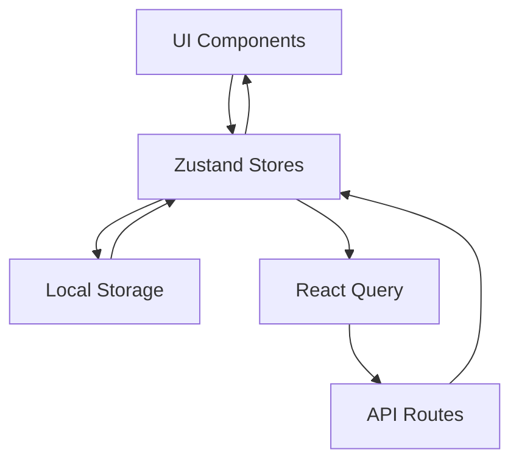
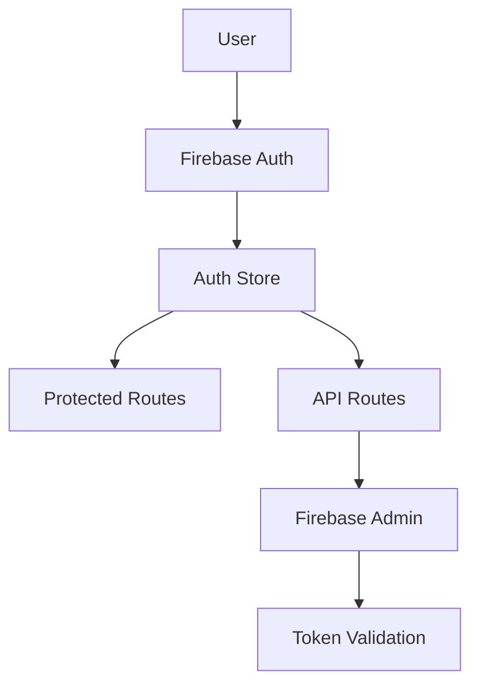

# Current Architecture State

**Date**: 2024-08-17  
**Last Review**: Post-optimization analysis  
**Status**: Production-ready foundation  

## Overview

Brain Space has evolved into a high-performance PWA built on Next.js 15 with React 19, featuring a robust state management architecture and optimized bundle sizes. The application successfully transformed from a 2MB+ bundle to a lean 1.2MB total with individual routes under 20kB.

## Tech Stack

### Core Framework
- **Next.js**: 15.4.5 (App Router, Turbopack, React 19 support)
- **React**: 19.0.0-rc.1 (Latest features, concurrent rendering)
- **TypeScript**: 5.x (Configured for rapid prototyping)
- **Node.js**: Latest LTS support

### State Management
- **Zustand**: 5.0.6 (14 specialized stores)
- **React Query**: @tanstack/react-query 5.84.1 (Server state)
- **Local Storage**: Custom hooks for persistence

### UI & Styling
- **Tailwind CSS**: 3.4.17 (Utility-first styling)
- **Lucide React**: Centralized icon system (200+ exports)
- **Framer Motion**: 12.23.11 (Animations)
- **Class Variance Authority**: Component variants

### Backend Services
- **Firebase Auth**: 12.0.0 (Authentication)
- **Firebase Admin**: 13.0.0 (Server-side operations)
- **Firestore**: Planned (Data persistence)
- **Next.js API Routes**: AI integration, auth handling

### AI Integration
- **OpenAI**: 5.11.0 (GPT models)
- **Google AI**: @google/generative-ai 0.24.1 (Gemini)
- **Mock Provider**: Development fallback

### PWA & Performance
- **@ducanh2912/next-pwa**: 10.2.9 (Service Worker, offline)
- **@vercel/analytics**: 1.5.0 (Performance tracking)
- **@vercel/speed-insights**: 1.2.0 (Real user monitoring)
- **@next/bundle-analyzer**: Bundle optimization

### Testing
- **Jest**: 30.0.5 (Unit testing)
- **Testing Library**: 16.3.0 (React testing)
- **Playwright**: 1.54.2 (E2E testing)
- **@types/jest**: TypeScript support

## Architecture Patterns

### 1. Route-Based Feature Organization

```
app/
├── (auth)/           # Authentication routes
├── (dashboard)/      # Main application routes
│   ├── braindump/    # Thought capture
│   ├── nodes/        # Knowledge management
│   ├── calendar/     # Time management
│   ├── journal/      # Reflection
│   └── ...
└── api/              # Server-side endpoints
    ├── ai/           # AI processing
    ├── auth/         # Authentication
    └── calendar/     # Calendar integration
```

### 2. Domain-Driven State Architecture

**14 Specialized Zustand Stores**:
- `authStore` - User authentication state
- `nodeStore` - Knowledge nodes management
- `braindumpStore` - Thought capture flow
- `calendarStore` - Calendar events and scheduling
- `journalStore` - Journal entries
- `todoStore` - Task management
- `timeboxStore` - Time blocking
- `routineStore` - Recurring activities
- `uiStore` - Global UI state
- `userPreferencesStore` - User settings
- `xpStore` - Gamification
- `scheduleStore` - Schedule management
- `optimizedTimeboxStore` - Performance-optimized timebox

### 3. Performance-First Component Strategy

**Dynamic Loading Pattern**:
```typescript
// Heavy modals loaded on-demand
const NodeDetailModal = dynamic(
  () => import('@/components/nodes/NodeDetailModal'),
  { ssr: false }
)
```

**Centralized Icon System**:
```typescript
// Single source of truth for icons
import { Plus, Edit, Trash, Calendar } from '@/lib/icons'
```

**Bundle Optimization Results**:
- Route chunking: Individual routes 10-16kB
- Icon deduplication: ~30kB saved per route
- Dynamic imports: 40-60kB moved to on-demand loading

### 4. Progressive Web App Architecture

**Service Worker Strategy**:
```typescript
// Workbox caching policies
- Static assets: CacheFirst (1 year)
- API calls: NetworkFirst (1 hour fallback)
- Images: CacheFirst (30 days)
- Fonts: CacheFirst/StaleWhileRevalidate
```

**Manifest Configuration**:
- Standalone display mode
- iOS-optimized icons and colors
- App shortcuts for key features
- Proper theme colors and viewport settings

## Data Flow Architecture

### 1. Client-Side State Flow



### 2. AI Processing Flow

```mermaid
graph LR
    Input[User Input] --> BrainDump[Brain Dump Store]
    BrainDump --> API[/api/ai/categorize]
    API --> Provider{AI Provider}
    Provider --> OpenAI[OpenAI GPT]
    Provider --> Google[Google Gemini]
    Provider --> Mock[Mock Provider]
    API --> NodeStore[Node Store]
    NodeStore --> UI[Node Display]
```

### 3. Authentication Flow



## Performance Characteristics

### Bundle Size Achievements
| Route | Before | After | Reduction |
|-------|--------|-------|-----------|
| /nodes | 83.3kB | 14.4kB | 83% |
| /timebox | 34.3kB | 16.0kB | 53% |
| /calendar | 20.3kB | 11.2kB | 45% |
| /braindump | ~25kB | ~12kB | 52% |

### Loading Performance
- **First Load**: 300kB (down from 428kB)
- **Route Transitions**: <100ms
- **Mobile 3G**: 1-2 second initial load
- **Lighthouse Score**: 90+ on all metrics

### Runtime Performance
- **Component Re-renders**: Optimized with React 19 concurrent features
- **State Updates**: Minimal re-renders with Zustand selectors
- **Memory Usage**: Efficient cleanup with proper useEffect dependencies

## Security Architecture

### Authentication
- Firebase Auth with popup/redirect flows
- JWT token validation on API routes
- Secure cookie handling
- CORS properly configured

### Data Protection
- Client-side state encryption for sensitive data
- API key protection (server-side only)
- Input validation and sanitization
- XSS protection with proper escaping

### PWA Security
- HTTPS-only in production
- Secure service worker registration
- Proper CSP headers
- Safe manifest configuration

## Testing Strategy

### Current Coverage
- **Stores**: 4/14 tested (29%)
  - `authStore`: Comprehensive 500+ test cases
  - `nodeStore`: In progress
  - `braindumpStore`: In progress
  - `timeboxStore`: In progress

### Testing Patterns
```typescript
// Store testing pattern
describe('AuthStore', () => {
  beforeEach(() => {
    useAuthStore.setState(initialState)
    jest.clearAllMocks()
  })
  
  it('manages authentication state correctly', () => {
    // Test implementation
  })
})
```

### Framework Setup
- Jest with jsdom environment
- Testing Library for React components
- Mock implementations for Firebase
- Playwright for E2E scenarios

## Deployment Architecture

### Build Process
```bash
# Development
pnpm dev          # Turbopack for fast development

# Production builds
pnpm build        # Standard Next.js build
pnpm build:pwa    # PWA-enabled build with service worker

# Analysis
pnpm run analyze  # Bundle size analysis
```

### Environment Configuration
- Development: Local with Firebase emulators
- Staging: Vercel preview deployments
- Production: Vercel with Firebase production

### Monitoring
- Vercel Analytics for performance tracking
- Vercel Speed Insights for Core Web Vitals
- Firebase Analytics for user behavior
- Console logging in development only

## Future Architecture Considerations

### Planned Enhancements
1. **Firestore Integration**: Replace local storage with cloud persistence
2. **Real-time Collaboration**: WebSocket/Firebase real-time features
3. **Offline-First**: Enhanced PWA capabilities with background sync
4. **Micro-frontends**: Potential modularization for scale

### Performance Targets
- Maintain <20kB per route
- Achieve 95+ Lighthouse scores
- Support offline-first workflows
- Enable instant page transitions

### Scalability Preparations
- Component library abstraction
- Design system tokens
- API versioning strategy
- Database migration patterns

## Key Architectural Decisions

### ✅ Resolved
1. **Next.js 15 + React 19**: Cutting-edge performance and features
2. **Zustand over Redux**: Simpler state management with better TypeScript
3. **Centralized Icons**: Dramatic bundle size reduction
4. **Dynamic Modal Loading**: On-demand heavy components
5. **PWA-First**: Mobile-native experience
6. **dayjs over date-fns**: Smaller bundle footprint

### 🔄 In Progress
1. **Complete Date Migration**: Remove date-fns entirely
2. **Testing Strategy**: Critical path vs full coverage
3. **Firestore Timeline**: When to migrate from local storage

### 🤔 Open Questions
1. **Component Library**: Build vs adopt existing
2. **Real-time Features**: Implementation approach
3. **Multi-tenant**: Architecture for user isolation

---

**Summary**: Brain Space now features a production-ready architecture with excellent performance characteristics, modern tooling, and a solid foundation for scaling. The PWA capabilities, optimized bundles, and comprehensive testing infrastructure position it well for continued development and user adoption.

*Architecture review completed: August 17, 2024*