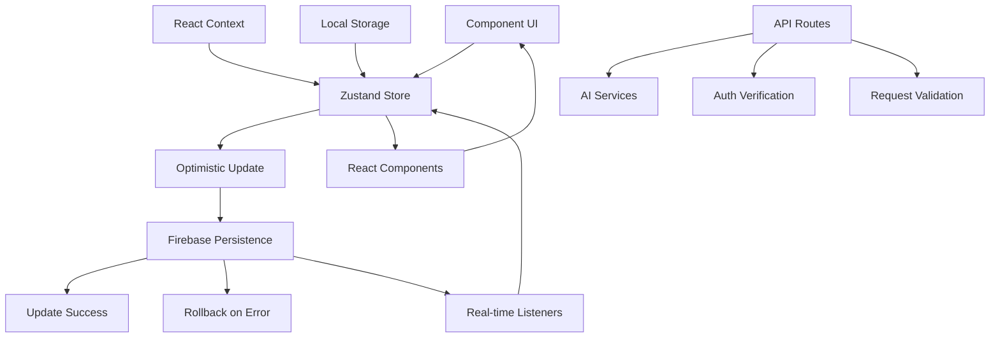

# Brain Space Data Flow Architecture

Date: 2025-01-17
Agent: data-flow-researcher

## Executive Summary

Brain Space is a PWA-first personal knowledge management system with a sophisticated data flow architecture built on Next.js 15, Zustand for state management, and Firebase for persistence. The application implements optimistic updates, real-time synchronization, and a layered architecture separating client state, server state, and persistent storage.

## Context

- **Project**: Brain Space - Personal Knowledge Management System
- **Architecture**: Next.js 15 App Router + Firebase + Zustand
- **Complexity Level**: Complex - Multi-layered state management with real-time sync
- **Related Research**: React developer patterns, Firebase integration patterns

## Current Data Flow Analysis

### Data Sources

**APIs**:
- `/api/ai/categorize` - AI thought categorization
- `/api/ai/enhance-node` - AI node enhancement 
- `/api/auth/session` - Authentication session management
- `/api/calendar/create-from-node` - Google Calendar integration
- `/api/ai/timebox-recommendations` - AI timebox suggestions

**Databases**:
- Firestore collections: `users/{userId}/nodes`, `users/{userId}/braindumps`, `users/{userId}/timeboxes`
- User profiles: `users/{userId}/profile/data`
- Settings: `users/{userId}/settings/googleCalendar`

**Local Storage**:
- Calendar preferences (persisted via Zustand middleware)
- AI provider selection
- User preferences and view modes

**Third-Party Services**:
- Google Calendar API
- OpenAI GPT-4 API
- Google Gemini API

### State Locations

```
Application State Map:
├── Global State (Zustand Stores)
│   ├── authStore - Authentication state
│   ├── nodeStore - Node data and operations
│   ├── braindumpStore - Brain dump sessions
│   ├── timeboxStore - Time scheduling data
│   ├── calendarStore - Calendar preferences
│   ├── uiStore - UI state and preferences
│   ├── journalStore - Journal entries
│   ├── routineStore - Routine management
│   └── userPreferencesStore - User settings
├── Context State
│   ├── AuthContext - Authentication flow
│   └── ToastProvider - Notification state
├── Component State
│   ├── Form data (local useState)
│   ├── Modal visibility states
│   └── Loading/error states
└── Server State
    ├── Firebase Auth tokens
    ├── Cached API responses
    └── Real-time Firestore subscriptions
```

### Data Flow Paths



## Key Findings

### Finding 1: Optimistic Update Pattern

**Current Implementation**:
```typescript
// From nodeStore.ts - Optimistic CRUD operations
createNode: async (nodeData: Partial<Node>) => {
  // 1. OPTIMISTIC UPDATE: Add to UI immediately
  const optimisticNodes = [...get().nodes, newNode]
  set({ nodes: optimisticNodes })

  try {
    // 2. PERSISTENCE: Save to Firestore
    await setDoc(doc(db, 'users', nodeData.userId, 'nodes', nodeId), firestoreData)
    
    // 3. SUCCESS: Remove optimistic flag
    set({ nodes: successNodes, error: null })
  } catch (error) {
    // 4. ROLLBACK: Remove failed node from UI
    const rollbackNodes = get().nodes.filter(n => n.id !== nodeId)
    set({ nodes: rollbackNodes, error: error.message })
  }
}
```

**Analysis**:
- **Strengths**: Immediate UI responsiveness, clear error handling, maintains data consistency
- **Weaknesses**: Complex rollback logic, potential for race conditions in high-frequency updates
- **Scalability**: Well-suited for single-user scenarios, may need conflict resolution for collaboration

**Recommended Approach**: Continue current pattern but consider adding optimistic update queuing for rapid successive operations.

### Finding 2: Dynamic Firebase Imports

**Current Implementation**:
```typescript
// From braindumpStore.ts - SSR-safe Firebase loading
loadEntries: async (userId: string) => {
  try {
    // Dynamically import Firebase
    const { db } = await import('@/lib/firebase')
    const { collection, query, orderBy, getDocs } = await import('firebase/firestore')
    
    const entriesQuery = query(
      collection(db, 'users', userId, 'braindumps'),
      orderBy('createdAt', 'desc')
    )
    const snapshot = await getDocs(entriesQuery)
    // Process results...
  } catch (error) {
    set({ error: error.message, isLoading: false })
  }
}
```

**Analysis**:
- **Strengths**: Prevents SSR hydration issues, reduces initial bundle size, lazy loading
- **Weaknesses**: Slight performance overhead on first call, complex import pattern
- **Scalability**: Excellent for SSR applications

**Recommended Approach**: Continue pattern, consider creating a Firebase service wrapper to simplify imports.

### Finding 3: Hierarchical State Management

**Current Implementation**:
```typescript
// From timeboxStore.ts - Complex nested state updates
addTaskToSlot: async (task: TimeboxTask, slotId: string) => {
  // Update nested state structure
  const updatedSlots = timeSlots.map(slot => {
    if (slot.id === slotId) {
      return {
        ...slot,
        tasks: [...slot.tasks, taskWithDate],
      }
    }
    return slot
  })
  set({ timeSlots: updatedSlots })
}
```

**Analysis**:
- **Strengths**: Immutable updates, clear data structure
- **Weaknesses**: Complex nested updates, potential performance issues with large datasets
- **Scalability**: May need optimization for large timebox schedules

**Recommended Approach**: Consider using Immer for complex nested updates or normalizing data structure.

## State Management Analysis

### Current Solution
- **Technology**: Zustand with middleware (persist for calendar store)
- **Complexity**: Moderate - Multiple specialized stores with clear boundaries
- **Performance**: Good - Minimal re-renders due to Zustand's subscription model

### Store Architecture

```typescript
// Store dependency relationships
authStore → userPreferencesStore
nodeStore ← braindumpStore (node creation)
timeboxStore ← nodeStore (task scheduling)
calendarStore ← authContext (Google Calendar auth)
uiStore → all components (UI preferences)
```

### Recommendations

1. **Short-term**: Add store composition utilities for related state operations
2. **Medium-term**: Implement state persistence hydration checks for all stores
3. **Long-term**: Consider migrating to normalized state structure for complex relationships

## API Integration Patterns

### Current Approach
```typescript
// From ai.ts - Client-side API wrapper
class AIService {
  async categorizeThoughts(text: string): Promise<CategorizationResult> {
    const response = await fetch('/api/ai/categorize', {
      method: 'POST',
      headers: {
        'Content-Type': 'application/json',
        ...(this.getAuthHeaders()),
      },
      body: JSON.stringify({ text, provider: this.provider }),
    })

    if (!response.ok) {
      const error = await response.json()
      throw new Error(error.error || 'Failed to categorize thoughts')
    }

    return response.json()
  }
}
```

### API Route Pattern
```typescript
// From /api/ai/categorize/route.ts
export async function POST(request: NextRequest) {
  try {
    // 1. Authentication verification
    const { user, error } = await verifyAuth(authHeader)
    
    // 2. Request validation with Zod
    const { data: validatedData, error: validationError } = await validateBody(
      request,
      CategorizeRequestSchema
    )
    
    // 3. Business logic execution
    const result = await callOpenAI(text)
    
    // 4. Response with error handling
    return NextResponse.json(result)
  } catch (error) {
    return NextResponse.json({ error: error.message }, { status: 500 })
  }
}
```

### Suggested Improvements
```typescript
// Enhanced API client with retry and caching
class EnhancedAPIClient {
  async request<T>(endpoint: string, options: RequestOptions): Promise<T> {
    // Add request queuing, retry logic, and response caching
    return this.withRetry(() => this.fetchWithAuth(endpoint, options))
  }
  
  private withRetry<T>(fn: () => Promise<T>, maxRetries = 3): Promise<T> {
    // Implement exponential backoff retry logic
  }
}
```

## Data Validation Strategy

### Input Validation
- **Approach**: Zod schemas for API route validation
- **Location**: `/lib/validations/` directory
- **Coverage**: AI requests, authentication, node data

### Schema Validation
```typescript
// Example from validations
export const CategorizeRequestSchema = z.object({
  text: z.string().min(1, 'Text is required'),
  provider: z.enum(['openai', 'google', 'gemini', 'mock']).optional(),
})
```

### Type Safety
- **TypeScript**: Comprehensive type definitions in `/types/`
- **Runtime Checks**: Zod validation at API boundaries
- **Store Types**: Strongly typed Zustand stores

### Error Boundaries
- **Client-side**: React Error Boundaries for component errors
- **API-side**: Centralized error handling in API routes
- **Store-side**: Error state management in each store

## Performance Considerations

### Bundle Size Impact
- **Dynamic Imports**: Firebase modules loaded on-demand
- **Code Splitting**: Components dynamically imported (BrainDumpFlow)
- **Tree Shaking**: Selective Zustand store imports

### Runtime Performance
- **Optimistic Updates**: Immediate UI feedback
- **Selective Re-renders**: Zustand subscription model
- **Memoization**: React.memo and useMemo in complex components

### Memory Usage
- **Store Cleanup**: clearNodes() methods for memory management
- **Event Listeners**: Proper cleanup in useEffect hooks
- **Firebase Listeners**: Unsubscribe patterns implemented

### Network Efficiency
- **Batched Operations**: bulkUpdateNodes() for multiple changes
- **Request Deduplication**: AI service provider caching
- **Firestore Queries**: Optimized with proper indexing

## Migration Path

### Phase 1: State Normalization (2-4 weeks)
1. Implement normalized state structure for nodes
2. Add state selectors for complex queries
3. Create store composition utilities

### Phase 2: Enhanced Caching (4-6 weeks)
1. Implement request/response caching layer
2. Add offline-first capabilities
3. Enhance optimistic update queuing

### Phase 3: Real-time Optimization (6-8 weeks)
1. Implement WebSocket connections for real-time updates
2. Add conflict resolution for concurrent edits
3. Optimize Firestore listener efficiency

## Testing Strategies

### Unit Testing State
```typescript
// Example store testing approach
describe('nodeStore', () => {
  it('should handle optimistic updates correctly', async () => {
    const { result } = renderHook(() => useNodesStore())
    
    // Test optimistic update
    await act(async () => {
      await result.current.createNode(mockNodeData)
    })
    
    // Verify immediate UI update
    expect(result.current.nodes).toContainEqual(
      expect.objectContaining({ isOptimistic: true })
    )
  })
})
```

### Integration Testing Data Flows
- API route testing with MSW (Mock Service Worker)
- Firestore emulator for database operations
- Component integration tests with React Testing Library

### Mocking Strategies
- Firebase emulator for development/testing
- AI service mocks for reliable testing
- Authentication mocks for isolated testing

### E2E Data Scenarios
- Complete brain dump → node creation → scheduling flow
- Authentication → data loading → offline scenarios
- Multi-store operations and state consistency

## Sources

### Documentation Reviewed
- Next.js 15 App Router documentation
- Zustand state management patterns
- Firebase Firestore best practices
- React optimization patterns

### Codebase Files Analyzed
- `/store/` directory (14 store files)
- `/app/api/` directory (16 API routes)
- `/services/` directory (6 service files)
- `/contexts/AuthContext.tsx`
- Component data fetching patterns

### Patterns Researched
- Optimistic updates in React applications
- SSR-safe state management
- Firebase dynamic imports
- API route authentication patterns

## Related Research
- **Framework State Management**: React Query/TanStack Query integration potential
- **Performance Research**: Bundle size optimization strategies
- **API/Backend Research**: Serverless function optimization patterns

## Recommendations Priority

### Critical
1. **Add request queuing** for optimistic updates to prevent race conditions
2. **Implement state persistence hydration checks** for all stores
3. **Add error boundaries** for better error isolation

### Important
1. **Create normalized state structure** for complex node relationships
2. **Implement request/response caching** for AI service calls
3. **Add comprehensive integration tests** for data flow scenarios

### Nice to Have
1. **WebSocket integration** for real-time collaboration
2. **Advanced conflict resolution** for concurrent edits
3. **Performance monitoring** and metrics collection

## Open Questions

1. **Collaboration Support**: How will real-time collaboration affect current optimistic update patterns?
2. **Offline Capabilities**: What's the strategy for offline-first functionality and sync conflict resolution?
3. **Data Migration**: How will schema changes be handled for existing user data in Firestore?
4. **Scalability Limits**: At what point would the current store architecture need refactoring for performance?
5. **State Persistence**: Should all stores use persistence middleware, or remain selective?