# Brain Space System Architecture Overview

*Date: 2025-01-17*  
*Synthesized from comprehensive research across all system domains*

## Executive Summary

Brain Space is a sophisticated personal knowledge management PWA built on Next.js 15, React 19, and Firebase, featuring AI-powered thought processing, real-time state management, and comprehensive offline capabilities. The architecture demonstrates excellent separation of concerns, progressive enhancement patterns, and scalable design principles.

## High-Level Architecture

```mermaid
graph TB
    User[👤 User] --> PWA[📱 PWA Frontend]
    PWA --> Auth[🔐 Firebase Auth]
    PWA --> State[📊 Zustand Stores]
    PWA --> API[🚀 Next.js API Routes]
    
    State --> Optimistic[⚡ Optimistic Updates]
    State --> Cache[💾 Local Cache]
    State --> Offline[📴 Offline Storage]
    
    API --> AIServices[🤖 AI Services]
    API --> Firestore[🔥 Firestore]
    API --> Validation[✅ Zod Validation]
    
    AIServices --> OpenAI[OpenAI GPT-4]
    AIServices --> Gemini[Google Gemini]
    AIServices --> Claude[Anthropic Claude]
    AIServices --> Mock[Mock Provider]
    
    Firestore --> UserData[(👤 User Collections)]
    Firestore --> RealTime[🔄 Real-time Listeners]
    
    PWA --> ServiceWorker[⚙️ Service Worker]
    ServiceWorker --> Push[📬 Push Notifications]
    ServiceWorker --> Sync[🔄 Background Sync]
```



## Core Technology Stack

### Frontend Layer
- **Framework**: Next.js 15 with App Router
- **Runtime**: React 19 RC with Server Components
- **TypeScript**: Strict typing with relaxed rules for rapid prototyping
- **State Management**: Zustand (14 specialized stores)
- **Styling**: Tailwind CSS with custom design system
- **PWA**: Service Worker + Web App Manifest

### Backend Layer
- **Authentication**: Firebase Auth with Google OAuth
- **Database**: Firestore with user-scoped collections
- **API Routes**: Next.js serverless functions
- **Validation**: Zod schemas for runtime type safety
- **AI Integration**: Multi-provider architecture

### Infrastructure
- **Hosting**: Vercel deployment
- **CDN**: Vercel Edge Network
- **Monitoring**: Firebase Performance + Custom metrics
- **Development**: Emulator suite for local development

## Data Architecture

### State Management Hierarchy

```typescript
// Global State Architecture
interface ApplicationState {
  // Authentication
  auth: AuthState
  userPreferences: UserPreferencesState
  
  // Core Data
  nodes: NodesState           // Knowledge nodes
  braindump: BraindumpState   // Thought capture
  journal: JournalState       // Daily journaling
  
  // Scheduling
  timebox: TimeboxState       // Time management
  calendar: CalendarState     // Google Calendar sync
  routines: RoutineState      // Recurring tasks
  
  // Features
  progress: ProgressState     // Goal tracking
  ui: UIState                 // Interface state
}
```

### Data Flow Patterns

#### 1. Optimistic Updates
```typescript
// Pattern used across all stores
async createEntity(data: EntityData) {
  // 1. Immediate UI update
  const optimisticEntity = { ...data, isOptimistic: true }
  set(state => ({ entities: [...state.entities, optimisticEntity] }))
  
  try {
    // 2. Persist to Firebase
    await persistToFirebase(data)
    
    // 3. Remove optimistic flag
    set(state => ({
      entities: state.entities.map(e => 
        e.id === optimisticEntity.id 
          ? { ...e, isOptimistic: undefined }
          : e
      )
    }))
  } catch (error) {
    // 4. Rollback on failure
    set(state => ({
      entities: state.entities.filter(e => e.id !== optimisticEntity.id),
      error: error.message
    }))
  }
}
```

#### 2. SSR-Safe Firebase Integration
```typescript
// Dynamic imports prevent SSR hydration issues
const loadData = async (userId: string) => {
  const { db } = await import('@/lib/firebase')
  const { collection, query, getDocs } = await import('firebase/firestore')
  
  const dataQuery = query(collection(db, 'users', userId, 'nodes'))
  const snapshot = await getDocs(dataQuery)
  return snapshot.docs.map(doc => ({ id: doc.id, ...doc.data() }))
}
```

## Component Architecture

### Server/Client Boundary

```typescript
// Server Component (Data Fetching)
export default async function ServerPage() {
  const user = await getUserFromHeaders()
  if (!user) return <AuthRedirect />
  
  return <ClientComponent userId={user.uid} />
}

// Client Component (Interactivity)
'use client'
export default function ClientComponent({ userId }: Props) {
  const { data, isLoading } = useStore()
  // All client-side logic here
}
```

### Component Patterns

#### 1. Compound Components
```typescript
const Modal = {
  Root: ({ children, ...props }) => <div {...props}>{children}</div>,
  Header: ({ children }) => <header>{children}</header>,
  Content: ({ children }) => <main>{children}</main>,
  Actions: ({ children }) => <footer>{children}</footer>
}

// Usage
<Modal.Root>
  <Modal.Header>Title</Modal.Header>
  <Modal.Content>Content</Modal.Content>
  <Modal.Actions>Actions</Modal.Actions>
</Modal.Root>
```

#### 2. Lazy Loading
```typescript
// Heavy components loaded on demand
const LazyNodeGraphView = dynamic(() => import('./NodeGraphView'), {
  loading: () => <GraphSkeleton />,
  ssr: false
})

// Used conditionally
{viewMode === 'graph' && <LazyNodeGraphView />}
```

### Bundle Optimization

Current analysis shows opportunity for significant optimization:
- **Nodes route**: 83.3 kB (target: <50 kB)
- **Icon optimization**: 75+ files importing lucide-react individually
- **Code splitting**: Limited implementation beyond Next.js defaults

## AI Integration Architecture

### Multi-Provider System

```typescript
interface AIProvider {
  categorize(text: string): Promise<CategorizationResult>
  enhance(node: Node): Promise<EnhancedNode>
  suggest(context: Context): Promise<Suggestion[]>
}

// Provider implementations
const providers = {
  openai: new OpenAIProvider(),
  gemini: new GeminiProvider(), 
  claude: new ClaudeProvider(),
  mock: new MockProvider()
}

// Dynamic provider selection
const getProvider = (preference?: string) => {
  return providers[preference] || providers.mock
}
```

### AI Processing Flow


## Security Architecture

### Authentication Flow
1. **Client**: Firebase Auth (Google OAuth, Email/Password)
2. **Server**: ID token verification via Firebase Admin
3. **Persistence**: HTTP-only secure cookies
4. **Authorization**: User-scoped Firestore security rules

### Data Protection
```javascript
// Firestore security rules
rules_version = '2';
service cloud.firestore {
  match /databases/{database}/documents {
    function isOwner(userId) {
      return request.auth != null && request.auth.uid == userId;
    }
    
    match /users/{userId}/nodes/{nodeId} {
      allow read, write: if isOwner(userId);
    }
  }
}
```

### API Security
- **Input validation**: Zod schemas on all endpoints
- **Authentication**: Firebase ID token verification
- **Rate limiting**: Planned implementation
- **CSRF protection**: SameSite cookies

## Performance Characteristics

### Current Metrics
- **Bundle size**: 83.3 kB (nodes route) - needs optimization
- **Rendering**: Optimistic updates provide immediate feedback
- **Caching**: Limited implementation - major opportunity
- **Offline**: Basic service worker planned

### Optimization Priorities
1. **Bundle size reduction**: Icon consolidation, code splitting
2. **Caching layer**: Request/response caching for AI services
3. **Performance monitoring**: Real User Monitoring implementation
4. **Memory management**: Object pooling for large datasets

## Scalability Patterns

### Horizontal Scaling
- **Serverless**: Next.js API routes scale automatically
- **CDN**: Static assets served via Vercel Edge
- **Database**: Firestore handles scaling transparently

### Vertical Scaling
- **Code splitting**: Route-level and component-level
- **State management**: Modular store architecture
- **Caching**: Multi-level caching strategy planned

### Data Scaling
- **User isolation**: User-scoped collections prevent cross-contamination
- **Indexing**: Optimized Firestore queries with proper indexes
- **Pagination**: Cursor-based pagination for large datasets

## Development Architecture

### Testing Strategy
- **Unit tests**: 70% of test pyramid (stores, utilities)
- **Integration tests**: 20% (API routes, store interactions)
- **E2E tests**: 10% (critical user journeys)
- **Accessibility**: Automated a11y testing with jest-axe

### Build Pipeline


### Development Experience
- **Fast refresh**: Turbopack in development
- **Type safety**: Comprehensive TypeScript coverage
- **Debugging**: Firebase emulator suite
- **Documentation**: Living knowledge base

## Integration Points

### External Services
- **Google Calendar**: OAuth scopes for calendar integration
- **AI Providers**: OpenAI, Google AI, Anthropic APIs
- **Firebase**: Auth, Firestore, Performance monitoring
- **Vercel**: Hosting, analytics, edge functions

### Internal Integrations
- **State synchronization**: Cross-store communication patterns
- **Event system**: Custom event bus for loosely coupled features
- **Plugin architecture**: Extensible AI provider system

## Monitoring and Observability

### Performance Monitoring
```typescript
// Performance tracking
class PerformanceMonitor {
  trackCoreWebVitals() {
    // LCP, FID, CLS monitoring
  }
  
  trackCustomMetrics(name: string, value: number) {
    // Application-specific metrics
  }
  
  trackUserJourneys(journey: string) {
    // End-to-end user flow monitoring
  }
}
```

### Error Handling
- **Error boundaries**: React error boundaries for graceful degradation
- **Store error states**: Consistent error handling across all stores
- **API error responses**: Structured error responses with fallbacks

## Future Architecture Considerations

### Planned Enhancements
1. **Real-time synchronization**: Firestore listeners for collaborative features
2. **Offline-first**: Comprehensive offline capabilities with sync
3. **Microservices**: Potential extraction of AI services
4. **Edge computing**: Move AI processing closer to users

### Technology Evolution
- **React 19**: Full stable release adoption
- **Next.js**: Ongoing framework improvements
- **AI advancements**: Integration of newer AI models and capabilities
- **PWA standards**: Enhanced PWA features as they become available

## Architectural Strengths

### Current Excellence
- **Separation of concerns**: Clear boundaries between layers
- **Type safety**: Comprehensive TypeScript coverage
- **State management**: Robust optimistic update patterns
- **Security**: Strong authentication and authorization
- **Developer experience**: Excellent tooling and documentation

### Competitive Advantages
- **Multi-provider AI**: Flexible AI integration with fallbacks
- **Progressive enhancement**: Works without JavaScript
- **Mobile-first**: Excellent mobile and PWA experience
- **Offline capability**: Graceful degradation and sync

## Areas for Improvement

### Performance
- **Bundle optimization**: 50%+ reduction opportunity
- **Caching strategy**: Comprehensive request/response caching
- **Memory management**: Object pooling and cleanup
- **Real User Monitoring**: Production performance visibility

### Scalability
- **Database optimization**: Query optimization and indexing
- **CDN strategy**: Better static asset management
- **Background processing**: Queue-based AI processing
- **Rate limiting**: Protection against abuse

### Developer Experience
- **Testing coverage**: Increase from current limited coverage
- **Documentation**: API documentation and component library
- **Debugging tools**: Better development debugging experience
- **Performance budgets**: Automated performance regression prevention

## Conclusion

Brain Space demonstrates a sophisticated, well-architected system with excellent patterns for state management, security, and user experience. The multi-layered architecture provides strong foundations for scaling while maintaining developer productivity.

The primary optimization opportunities lie in bundle size reduction, comprehensive caching implementation, and enhanced monitoring. The planned migration to real-time capabilities and offline-first architecture will position Brain Space as a leading personal knowledge management solution.

The architecture successfully balances rapid development needs with production-ready patterns, providing a sustainable foundation for long-term growth and feature development.

---

*This overview synthesizes findings from 18+ research documents across architecture, performance, security, and implementation patterns.*