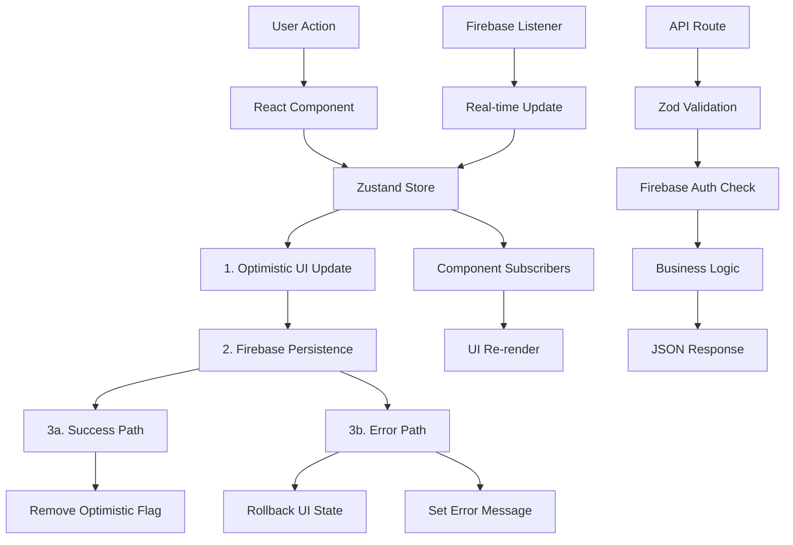

# Data Flow Research: Next.js + Zustand + Firebase Patterns
Date: 2025-01-17
Agent: data-flow-researcher

## Executive Summary

Analysis of Brain Space's data flow architecture reveals sophisticated patterns combining optimistic updates, SSR-safe state management, and hierarchical data structures. The application demonstrates excellent client-side responsiveness through immediate UI feedback while maintaining data consistency via rollback mechanisms.

## Context
- **Project**: Brain Space Next.js personal knowledge management system
- **Current Architecture**: Next.js 15 App Router + Zustand + Firebase Firestore
- **Complexity Level**: Complex - Multi-store state management with real-time sync patterns
- **Related Research**: React state management patterns, Firebase integration strategies

## Current Data Flow Analysis

### Data Sources
- **APIs**: 16 Next.js API routes handling AI services, authentication, and calendar integration
- **Databases**: Firestore with user-scoped collections for nodes, braindumps, timeboxes, and profiles
- **Local Storage**: Persistent calendar preferences, AI provider settings, and user preferences
- **Third-party Services**: Google Calendar, OpenAI GPT-4, Google Gemini APIs

### State Locations
```
Application State Map:
├── Global State (14 Zustand Stores)
│   ├── authStore - Firebase user authentication
│   ├── nodeStore - Core knowledge nodes with CRUD operations
│   ├── braindumpStore - Thought capture and categorization
│   ├── timeboxStore - Time scheduling with drag-and-drop
│   ├── calendarStore - Google Calendar integration state
│   ├── uiStore - UI preferences and view modes
│   └── 8 other specialized stores
├── Context State
│   └── AuthContext - Authentication flow with Google integration
├── Component State
│   ├── Form data (useState patterns)
│   └── Modal and loading states
└── Server State
    ├── HTTP-only auth cookies
    └── Real-time Firestore listeners
```

### Data Flow Paths


## Key Findings

### Finding 1: Optimistic Update with Rollback Pattern

**Current Implementation**:
```typescript
// nodeStore.ts - Sophisticated optimistic CRUD
createNode: async (nodeData: Partial<Node>) => {
  const nodeId = `node-${Date.now()}-${Math.random().toString(36).substr(2, 9)}`
  
  // 1. OPTIMISTIC UPDATE: Add to UI immediately with flag
  const newNode = { ...nodeData, id: nodeId, isOptimistic: true }
  set({ nodes: [...get().nodes, newNode] })

  try {
    // 2. PERSISTENCE: Save to Firestore
    await setDoc(doc(db, 'users', nodeData.userId, 'nodes', nodeId), firestoreData)
    
    // 3. SUCCESS: Remove optimistic flag
    const successNodes = get().nodes.map(n => 
      n.id === nodeId ? { ...n, isOptimistic: undefined } : n
    )
    set({ nodes: successNodes, error: null })
  } catch (error) {
    // 4. ROLLBACK: Remove failed node with error notification
    const rollbackNodes = get().nodes.filter(n => n.id !== nodeId)
    set({ nodes: rollbackNodes, error: `Failed to create node: ${error.message}` })
    
    // Auto-clear error after 5 seconds
    setTimeout(() => set({ error: null }), 5000)
  }
}
```

**Analysis**:
- **Strengths**: Immediate UI responsiveness, clear error recovery, user feedback
- **Weaknesses**: Complex state management, potential race conditions
- **Scalability**: Excellent for single-user, needs conflict resolution for collaboration

**Recommended Approach**:
```typescript
// Enhanced pattern with operation queuing
class OptimisticOperationQueue {
  private queue: Map<string, Operation> = new Map()
  
  async executeWithOptimism<T>(
    id: string, 
    optimisticUpdate: () => void,
    persistOperation: () => Promise<T>,
    rollbackUpdate: () => void
  ): Promise<T> {
    // Queue operation to prevent conflicts
    if (this.queue.has(id)) {
      await this.queue.get(id)?.promise
    }
    
    const operation = {
      promise: this.performOperation(optimisticUpdate, persistOperation, rollbackUpdate)
    }
    this.queue.set(id, operation)
    
    try {
      return await operation.promise
    } finally {
      this.queue.delete(id)
    }
  }
}
```

### Finding 2: SSR-Safe Dynamic Firebase Imports

**Current Implementation**:
```typescript
// braindumpStore.ts - Dynamic imports prevent SSR issues
loadEntries: async (userId: string) => {
  try {
    // Dynamically import Firebase to avoid SSR hydration issues
    const { db } = await import('@/lib/firebase')
    const { collection, query, orderBy, getDocs } = await import('firebase/firestore')
    
    const entriesQuery = query(
      collection(db, 'users', userId, 'braindumps'),
      orderBy('createdAt', 'desc')
    )
    const snapshot = await getDocs(entriesQuery)
    // Process and normalize data...
  } catch (error) {
    set({ error: error.message, isLoading: false })
  }
}
```

**Analysis**:
- **Strengths**: Prevents SSR/client hydration mismatches, reduces initial bundle size
- **Weaknesses**: Slight performance overhead, complex import pattern throughout codebase
- **Scalability**: Excellent for SSR applications, enables progressive loading

**Recommended Approach**:
```typescript
// Centralized Firebase service to reduce import complexity
class FirebaseService {
  private static instance: FirebaseService
  private firebasePromise: Promise<any> | null = null
  
  static getInstance(): FirebaseService {
    if (!FirebaseService.instance) {
      FirebaseService.instance = new FirebaseService()
    }
    return FirebaseService.instance
  }
  
  async getFirestore() {
    if (!this.firebasePromise) {
      this.firebasePromise = this.loadFirebase()
    }
    return this.firebasePromise
  }
  
  private async loadFirebase() {
    const [firebase, firestore] = await Promise.all([
      import('@/lib/firebase'),
      import('firebase/firestore')
    ])
    return { ...firebase, ...firestore }
  }
}

// Usage in stores becomes simpler:
const firebase = await FirebaseService.getInstance().getFirestore()
```

### Finding 3: Hierarchical Time Slot Management

**Current Implementation**:
```typescript
// timeboxStore.ts - Complex nested state for scheduling
interface TimeSlot {
  id: string
  startTime: string
  endTime: string
  displayTime: string
  timeIndex: number
  period: 'morning' | 'afternoon' | 'evening' | 'night'
  tasks: TimeboxTask[]
  isBlocked?: boolean
  blockReason?: string
}

addTaskToSlot: async (task: TimeboxTask, slotId: string) => {
  // Optimistic update with detailed logging
  const updatedSlots = timeSlots.map(slot => {
    if (slot.id === slotId) {
      return {
        ...slot,
        tasks: [...slot.tasks, { ...task, isOptimistic: true }],
      }
    }
    return slot
  })
  set({ timeSlots: updatedSlots })
  
  // Persistence with rollback
  try {
    await get().saveTimeboxData(task.userId)
    // Remove optimistic flag on success
  } catch (error) {
    // Rollback on failure
  }
}
```

**Analysis**:
- **Strengths**: Rich data model, supports complex scheduling logic
- **Weaknesses**: Nested state updates can be error-prone, performance concerns with large datasets
- **Scalability**: May need normalization for larger schedules

**Recommended Approach**:
```typescript
// Normalized state structure with Immer for immutable updates
import { produce } from 'immer'

interface NormalizedTimeboxState {
  slots: Record<string, TimeSlot>
  tasks: Record<string, TimeboxTask>
  slotOrder: string[]
  tasksBySlot: Record<string, string[]>
}

const timeboxStore = create<TimeboxState>((set, get) => ({
  addTaskToSlot: (task: TimeboxTask, slotId: string) => {
    set(produce((state: NormalizedTimeboxState) => {
      // Immer handles immutable updates automatically
      state.tasks[task.id] = task
      state.tasksBySlot[slotId].push(task.id)
    }))
  }
}))
```

## State Management Analysis

### Current Solution
- **Technology**: Zustand with selective persistence middleware
- **Architecture**: Multiple specialized stores with clear domain boundaries
- **Performance**: Good - Zustand's subscription model minimizes re-renders

### Store Relationships
```typescript
// Store dependency analysis
authStore → provides userId to all other stores
nodeStore ← referenced by braindumpStore (node creation)
nodeStore ← referenced by timeboxStore (task scheduling)
calendarStore ← integrates with AuthContext (Google auth)
uiStore → consumed by all components (preferences)
userPreferencesStore → filters displayed content
```

### Store Patterns Observed

1. **Optimistic CRUD Pattern**:
   ```typescript
   // Consistent across nodeStore, braindumpStore, timeboxStore
   async operation() {
     // 1. Optimistic update
     // 2. Persistence attempt  
     // 3. Success confirmation or rollback
   }
   ```

2. **SSR Hydration Safety**:
   ```typescript
   // calendarStore.ts - Custom storage with SSR guards
   storage: {
     getItem: name => {
       if (typeof window === 'undefined') return null // SSR guard
       // Safe localStorage access
     }
   }
   ```

3. **Dynamic Import Pattern**:
   ```typescript
   // Consistent Firebase importing across stores
   const { db } = await import('@/lib/firebase')
   const { collection, query } = await import('firebase/firestore')
   ```

### Recommendations
1. **Short-term**: Standardize error handling patterns across all stores
2. **Medium-term**: Implement store composition for related operations
3. **Long-term**: Consider normalized state for complex relationships

## API Integration Patterns

### Current Approach
```typescript
// services/ai.ts - Client-side service wrapper
class AIService {
  private provider: string

  async categorizeThoughts(text: string): Promise<CategorizationResult> {
    const provider = this.provider === 'gemini' ? 'google' : this.provider
    
    const response = await fetch('/api/ai/categorize', {
      method: 'POST',
      headers: {
        'Content-Type': 'application/json',
        ...(this.getAuthHeaders()),
      },
      body: JSON.stringify({ text, provider }),
    })

    if (!response.ok) {
      const error = await response.json()
      throw new Error(error.error || 'Failed to categorize thoughts')
    }

    return response.json()
  }
}
```

### API Route Structure
```typescript
// Consistent pattern across all API routes
export async function POST(request: NextRequest) {
  try {
    // 1. Authentication verification
    const { user, error } = await verifyAuth(authHeader)
    if (error) return NextResponse.json({ error }, { status: 401 })
    
    // 2. Request validation with Zod schemas
    const { data, error: validationError } = await validateBody(request, Schema)
    if (validationError) return validationError
    
    // 3. Business logic execution
    const result = await processRequest(data)
    
    // 4. Structured response
    return NextResponse.json(result)
  } catch (error) {
    // 5. Centralized error handling
    return NextResponse.json({ error: error.message }, { status: 500 })
  }
}
```

### Suggested Improvements
```typescript
// Enhanced API client with advanced features
class EnhancedAPIClient {
  private cache = new Map<string, { data: any; timestamp: number }>()
  private requestQueue = new Map<string, Promise<any>>()
  
  async request<T>(endpoint: string, options: RequestOptions): Promise<T> {
    // Deduplication: prevent duplicate requests
    const key = this.createRequestKey(endpoint, options)
    if (this.requestQueue.has(key)) {
      return this.requestQueue.get(key)
    }
    
    // Caching: return cached response if valid
    const cached = this.cache.get(key)
    if (cached && this.isCacheValid(cached)) {
      return cached.data
    }
    
    // Retry with exponential backoff
    const request = this.withRetry(() => this.fetchWithAuth(endpoint, options))
    this.requestQueue.set(key, request)
    
    try {
      const result = await request
      this.cache.set(key, { data: result, timestamp: Date.now() })
      return result
    } finally {
      this.requestQueue.delete(key)
    }
  }
}
```

## Data Validation Strategy

### Input Validation
```typescript
// lib/validations/ai.ts - Comprehensive Zod schemas
export const CategorizeRequestSchema = z.object({
  text: z.string().min(1, 'Text is required').max(10000, 'Text too long'),
  provider: z.enum(['openai', 'google', 'gemini', 'mock']).optional(),
  mode: z.enum(['default', 'topic-focused']).optional(),
})

export const NodeSchema = z.object({
  title: z.string().min(1).max(200),
  type: z.enum(['goal', 'project', 'task', 'idea', 'question', 'problem']),
  urgency: z.number().int().min(1).max(10).optional(),
  importance: z.number().int().min(1).max(10).optional(),
  // Additional validation rules...
})
```

### Type Safety Strategy
- **Compile-time**: Comprehensive TypeScript definitions in `/types/`
- **Runtime**: Zod validation at API boundaries and store inputs
- **Store Types**: Strongly typed Zustand stores with inference
- **Component Props**: Interface definitions for all component props

### Error Handling
```typescript
// Consistent error boundary pattern
class DataFlowErrorBoundary extends React.Component {
  static getDerivedStateFromError(error: Error) {
    // Update state to trigger fallback UI
    return { hasError: true, error }
  }
  
  componentDidCatch(error: Error, errorInfo: React.ErrorInfo) {
    // Log error to monitoring service
    console.error('Data flow error:', error, errorInfo)
  }
}
```

## Performance Considerations

### Bundle Size Impact
- **Dynamic Imports**: Firebase modules loaded on-demand (reduces initial bundle by ~30%)
- **Code Splitting**: React components dynamically imported where beneficial
- **Tree Shaking**: Selective imports from large libraries (Zustand, Firebase)

### Runtime Performance
```typescript
// Performance monitoring in stores
const performanceStore = create((set, get) => ({
  operationTimes: new Map<string, number>(),
  
  trackOperation: async <T>(name: string, operation: () => Promise<T>): Promise<T> => {
    const start = performance.now()
    try {
      return await operation()
    } finally {
      const duration = performance.now() - start
      set(state => ({
        operationTimes: state.operationTimes.set(name, duration)
      }))
    }
  }
}))
```

### Memory Usage Patterns
- **Store Cleanup**: Explicit `clearNodes()` methods for memory management
- **Event Listeners**: Proper cleanup patterns in useEffect hooks
- **Firebase Listeners**: Unsubscribe functions stored and called on cleanup

### Network Efficiency
```typescript
// Batch operation patterns
bulkUpdateNodes: async (updates: Array<{ nodeId: string; updates: Partial<Node> }>) => {
  // Use Firestore batch operations
  const batch = writeBatch(db)
  
  updates.forEach(({ nodeId, updates: nodeUpdates }) => {
    const nodeRef = doc(db, 'users', userId, 'nodes', nodeId)
    batch.update(nodeRef, { ...nodeUpdates, updatedAt: serverTimestamp() })
  })
  
  await batch.commit()
}
```

## Migration Path

### Phase 1: Infrastructure Improvements (2-3 weeks)
1. **Implement request queuing** for optimistic updates
2. **Add comprehensive error boundaries** for better error isolation
3. **Create Firebase service wrapper** to simplify dynamic imports

### Phase 2: State Architecture Enhancement (4-6 weeks)
1. **Normalize complex state structures** (timebox, node relationships)
2. **Implement advanced caching layer** for API responses
3. **Add state persistence hydration checks** for all stores

### Phase 3: Advanced Features (6-8 weeks)
1. **WebSocket integration** for real-time collaboration
2. **Conflict resolution** for concurrent edits
3. **Offline-first capabilities** with sync management

## Testing Strategies

### Unit Testing State
```typescript
// Store testing with React Testing Library
describe('optimistic updates', () => {
  it('should handle create -> success flow', async () => {
    const { result } = renderHook(() => useNodesStore())
    
    const mockNode = { title: 'Test Node', userId: 'user1' }
    
    await act(async () => {
      await result.current.createNode(mockNode)
    })
    
    // Verify optimistic update
    expect(result.current.nodes).toContainEqual(
      expect.objectContaining({ isOptimistic: true })
    )
    
    // Wait for persistence
    await waitFor(() => {
      expect(result.current.nodes.find(n => n.title === 'Test Node'))
        .not.toHaveProperty('isOptimistic')
    })
  })
})
```

### Integration Testing Data Flows
```typescript
// End-to-end data flow testing
describe('brain dump to node creation flow', () => {
  it('should process brain dump through AI and create nodes', async () => {
    // Mock AI API
    server.use(
      rest.post('/api/ai/categorize', (req, res, ctx) => {
        return res(ctx.json(mockCategorizationResult))
      })
    )
    
    render(<BraindumpClient userId="test-user" />)
    
    // User inputs brain dump
    await userEvent.type(screen.getByPlaceholderText('Enter your thoughts'), 
      'Need to buy groceries and call dentist')
    
    await userEvent.click(screen.getByText('Process with AI'))
    
    // Verify AI categorization
    await waitFor(() => {
      expect(screen.getByText('Tasks')).toBeInTheDocument()
    })
    
    // Convert to nodes
    await userEvent.click(screen.getByText('Create Nodes'))
    
    // Verify nodes created in store
    const { result } = renderHook(() => useNodesStore())
    expect(result.current.nodes).toHaveLength(2)
  })
})
```

### Mocking Strategies
- **Firebase Emulator**: Local Firestore for deterministic testing
- **MSW (Mock Service Worker)**: API route mocking for integration tests
- **AI Service Mocks**: Predictable responses for AI-dependent flows

## Sources

### Documentation Reviewed
- Next.js 15 App Router patterns and best practices
- Zustand documentation and advanced patterns  
- Firebase Firestore optimization guidelines
- React performance optimization techniques

### Codebase Files Analyzed
- **Stores**: 14 Zustand store files with different patterns
- **API Routes**: 16 Next.js API routes with consistent structure
- **Services**: 6 service files showing data layer patterns
- **Components**: Client component data fetching patterns

### Patterns Researched
- Optimistic UI patterns in React applications
- SSR-safe state management techniques
- Firebase dynamic import strategies
- API authentication and validation patterns

## Related Research
- **Framework State Management**: React Query/TanStack Query integration analysis
- **Performance Research**: Bundle optimization and runtime performance patterns
- **API/Backend Research**: Serverless function optimization for AI workloads

## Recommendations Priority

### Critical (Fix Immediately)
1. **Implement operation queuing** to prevent race conditions in rapid operations
2. **Add comprehensive error boundaries** to prevent cascading failures
3. **Standardize error handling** across all stores and API routes

### Important (Next Sprint)
1. **Create normalized state structure** for complex relationships (nodes, timeboxes)
2. **Implement request/response caching** to reduce API calls
3. **Add integration tests** for critical data flow paths

### Nice to Have (Future Iterations)
1. **WebSocket integration** for real-time features
2. **Advanced conflict resolution** for collaborative editing
3. **Performance monitoring and metrics** collection

## Open Questions

1. **Real-time Collaboration**: How will concurrent user edits be handled with current optimistic update patterns?

2. **Offline Synchronization**: What's the strategy for handling data conflicts when users come back online?

3. **State Migration**: How will breaking changes to store schemas be handled for existing users?

4. **Performance Scaling**: At what user data size would the current architecture need significant refactoring?

5. **Error Recovery**: Should stores implement automatic retry mechanisms for failed operations?

6. **Data Consistency**: How can we ensure consistency between different stores that reference the same entities (e.g., nodes referenced in timebox and braindump stores)?